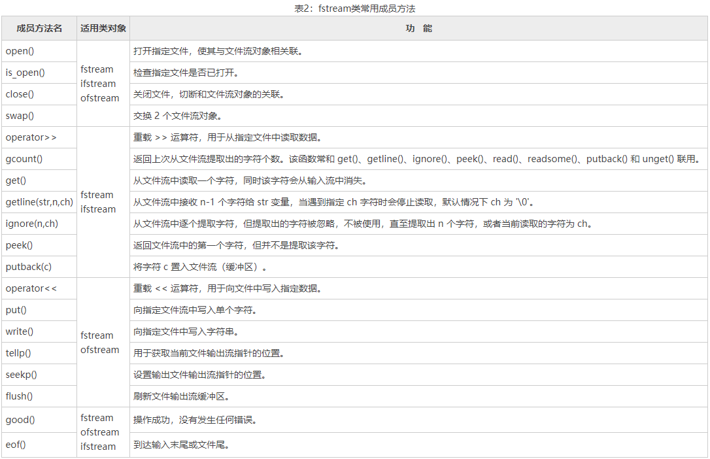

# 菜鸟教程 C++ 笔记

[toc]


[C++ 教程](https://www.runoob.com/cplusplus/cpp-tutorial.html)

[C++ 简介](https://www.runoob.com/cplusplus/cpp-intro.html)

## [C++ 环境设置](https://www.runoob.com/cplusplus/cpp-environment-setup.html)

对于上面的一闪而过，我这个 C++ 码龄 3 年的给出问题所在和解决方法。

一闪而过是因为你的程序没有输入，只有固定的输出。程序会在运行到 return 语句时退出程序。

之前给的三种解决办法我一一讲解：

第一种：

```C++
cin.clear();  // 清空缓存
cin.sync();   // 清空缓存
cin.get();    // 接收键盘输入
// From:本帖，"但对于太突然"
```

这种采用了输入方法来不让程序终止，他会在读入到数据后退出程序（cin.get）。

```C++
#include <stdio.h>
int main()
{
  getchar();
  return 0;
}
// From:本帖，"xuezy"
```

这种是采用了输入方法，但不同于上一种的是，这次是使用 getchar 函数获取一个 char 类型，但不将读入的数据存放于任何变量。

```C++
#include <stdlib.h>
int main()
{
  system("pause"); //注意：“system("pause")”;语句会显示“请按任意键继续……”
  return 0;
}
```

此方法是采用 system() 函数中的 pause 命令进行程序的暂停。

- win 使用命令行：

```C++
$ g++ 1.3.1.cpp
$ ./a.exe
```


## [C++ 基本语法](https://www.runoob.com/cplusplus/cpp-basic-syntax.html)

**在 C++ 中 main 函数前面为什么要加上数据类型，比如： int void?**

- **main** 函数的返回值是返回给主调进程，使主调进程得知被调用程序的运行结果。
- 标准规范中规定 **main** 函数的返回值为 **int**，一般约定返回 0 值时代表程序运行无错误，其它值均为错误号，但该约定并非强制。
- 如果程序的运行结果不需要返回给主调进程，或程序开发人员确认该状态并不重要，比如所有出错信息均在程序中有明确提示的情况下，可以不写 main 函数的返回值。在一些检查不是很严格的编译器中，比如 VC, VS 等，void 类型的 main 是允许的。不过在一些检查严格的编译器下，比如 g++, 则要求 main 函数的返回值必须为 int 型。
- 所以在编程时，区分程序运行结果并以 int 型返回，是一个良好的编程习惯。


### **标识符**

**定义：**变量、符号常量、函数、数组、类型、文件、标签和其他各种用户定义的对象的名称。

-  第一个字符必须是字母或下划线
-  后续字符可以是字母、数字或下划线
-  标识符的有效长度不超过247字符
-  标识符不能和关键字相同
-  标识符区分大小写
-  最好也不要和系统预定义标识符同名
-  标识符命名要做到“见名知义”
-  应该避免使用可能引起混淆的字母

C/C++可以使用带有 **$** 的标识符


### 为什么要使用 **using namespace std;** ?

- 有些名字容易冲突，所以会使用命名空间的方式进行区分，具体来说就是加个前缀。比如 C++ 标准库里面定义了 vector 容器，你自己也写了个 vector 类，这样名字就冲突了。于是标准库里的名字都加上 std:: 的前缀，你必须用 std::vector 来引用。同理，你自己的类也可以加个自定义的前缀。
- 但是经常写全名会很繁琐，所以在没有冲突的情况下你可以偷懒，写一句 using namespace std;，接下去的代码就可以不用写前缀直接写 vector 了。


## [C++ 注释](https://www.runoob.com/cplusplus/cpp-comments.html)

块注释符（/*...*/）是不可以嵌套使用的。

**#if 0 ... #endif** 属于条件编译，0 即为参数。

此外，我们还可以使用 **#if 0 ... #endif** 来实现注释，且可以实现嵌套，格式为：

```C++
#if 0
   code
#endif 
```

你可以把 **#if 0** 改成 **#if 1** 来执行 **code** 的代码。

这种形式对程序调试也可以帮助，测试时使用 **#if 1** 来执行测试代码，发布后使用 **#if 0** 来屏蔽测试代码。

**#if** 后可以是任意的条件语句。

下面的代码如果 condition 条件为 true 执行 code1 ，否则执行 code2。

```C++
#if condition
  code1
#else
  code2
#endif
```


## [C++ 数据类型](https://www.runoob.com/cplusplus/cpp-data-types.html)

下表显示了各种变量类型在内存中存储值时需要占用的内存，以及该类型的变量所能存储的最大值和最小值。

**注意：**不同系统会有所差异，一字节为 8 位。

**注意：**long int 8 个字节，int 都是 4 个字节，早期的 C 编译器定义了 long int 占用 4 个字节，int 占用 2 个字节，新版的 C/C++ 标准兼容了早期的这一设定。

| 类型               | 位            | 范围                                                         |
| :----------------- | :------------ | :----------------------------------------------------------- |
| char               | 1 个字节      | -128 到 127 或者 0 到 255                                    |
| unsigned char      | 1 个字节      | 0 到 255                                                     |
| signed char        | 1 个字节      | -128 到 127                                                  |
| int                | 4 个字节      | -2147483648 到 2147483647                                    |
| unsigned int       | 4 个字节      | 0 到 4294967295                                              |
| signed int         | 4 个字节      | -2147483648 到 2147483647                                    |
| short int          | 2 个字节      | -32768 到 32767                                              |
| unsigned short int | 2 个字节      | 0 到 65,535                                                  |
| signed short int   | 2 个字节      | -32768 到 32767                                              |
| long int           | 8 个字节      | -9,223,372,036,854,775,808 到 9,223,372,036,854,775,807      |
| signed long int    | 8 个字节      | -9,223,372,036,854,775,808 到 9,223,372,036,854,775,807      |
| unsigned long int  | 8 个字节      | 0 到 18,446,744,073,709,551,615                              |
| float              | 4 个字节      | 精度型占4个字节（32位）内存空间，+/- 3.4e +/- 38 (~7 个数字) |
| double             | 8 个字节      | 双精度型占8 个字节（64位）内存空间，+/- 1.7e +/- 308 (~15 个数字) |
| long double        | 16 个字节     | 长双精度型 16 个字节（128位）内存空间，可提供18-19位有效数字。 |
| wchar_t            | 2 或 4 个字节 | 1 个宽字符                                                   |

从上表可得知，变量的大小会根据编译器和所使用的电脑而有所不同。

下面实例会输出您电脑上各种数据类型的大小。

### 实例

```C++
#include<iostream>  
#include <limits>
 
using namespace std;  
  
int main()  
{  
    cout << "type: \t\t" << "************size**************"<< endl;  
    cout << "bool: \t\t" << "所占字节数：" << sizeof(bool);  
    cout << "\t最大值：" << (numeric_limits<bool>::max)();  
    cout << "\t\t最小值：" << (numeric_limits<bool>::min)() << endl;  
    cout << "char: \t\t" << "所占字节数：" << sizeof(char);  
    cout << "\t最大值：" << (numeric_limits<char>::max)();  
    cout << "\t\t最小值：" << (numeric_limits<char>::min)() << endl;  
    cout << "signed char: \t" << "所占字节数：" << sizeof(signed char);  
    cout << "\t最大值：" << (numeric_limits<signed char>::max)();  
    cout << "\t\t最小值：" << (numeric_limits<signed char>::min)() << endl;  
    cout << "unsigned char: \t" << "所占字节数：" << sizeof(unsigned char);  
    cout << "\t最大值：" << (numeric_limits<unsigned char>::max)();  
    cout << "\t\t最小值：" << (numeric_limits<unsigned char>::min)() << endl;  
    cout << "wchar_t: \t" << "所占字节数：" << sizeof(wchar_t);  
    cout << "\t最大值：" << (numeric_limits<wchar_t>::max)();  
    cout << "\t\t最小值：" << (numeric_limits<wchar_t>::min)() << endl;  
    cout << "short: \t\t" << "所占字节数：" << sizeof(short);  
    cout << "\t最大值：" << (numeric_limits<short>::max)();  
    cout << "\t\t最小值：" << (numeric_limits<short>::min)() << endl;  
    cout << "int: \t\t" << "所占字节数：" << sizeof(int);  
    cout << "\t最大值：" << (numeric_limits<int>::max)();  
    cout << "\t最小值：" << (numeric_limits<int>::min)() << endl;  
    cout << "unsigned: \t" << "所占字节数：" << sizeof(unsigned);  
    cout << "\t最大值：" << (numeric_limits<unsigned>::max)();  
    cout << "\t最小值：" << (numeric_limits<unsigned>::min)() << endl;  
    cout << "long: \t\t" << "所占字节数：" << sizeof(long);  
    cout << "\t最大值：" << (numeric_limits<long>::max)();  
    cout << "\t最小值：" << (numeric_limits<long>::min)() << endl;  
    cout << "unsigned long: \t" << "所占字节数：" << sizeof(unsigned long);  
    cout << "\t最大值：" << (numeric_limits<unsigned long>::max)();  
    cout << "\t最小值：" << (numeric_limits<unsigned long>::min)() << endl;  
    cout << "double: \t" << "所占字节数：" << sizeof(double);  
    cout << "\t最大值：" << (numeric_limits<double>::max)();  
    cout << "\t最小值：" << (numeric_limits<double>::min)() << endl;  
    cout << "long double: \t" << "所占字节数：" << sizeof(long double);  
    cout << "\t最大值：" << (numeric_limits<long double>::max)();  
    cout << "\t最小值：" << (numeric_limits<long double>::min)() << endl;  
    cout << "float: \t\t" << "所占字节数：" << sizeof(float);  
    cout << "\t最大值：" << (numeric_limits<float>::max)();  
    cout << "\t最小值：" << (numeric_limits<float>::min)() << endl;  
    cout << "size_t: \t" << "所占字节数：" << sizeof(size_t);  
    cout << "\t最大值：" << (numeric_limits<size_t>::max)();  
    cout << "\t最小值：" << (numeric_limits<size_t>::min)() << endl;  
    cout << "string: \t" << "所占字节数：" << sizeof(string) << endl;  
    // << "\t最大值：" << (numeric_limits<string>::max)() << "\t最小值：" << (numeric_limits<string>::min)() << endl;  
    cout << "type: \t\t" << "************size**************"<< endl;  
    return 0;  
}
```

本实例使用了 **endl**，这将在每一行后插入一个换行符，**<<** 运算符用于向屏幕传多个值，**sizeof()** 函数用来获取各种数据类型的大小。

当上面的代码被编译和执行时，它会产生以下的结果，结果会根据所使用的计算机而有所不同：

```C++
type:         ************size**************
bool:         所占字节数：1    最大值：1        最小值：0
char:         所占字节数：1    最大值：        最小值：?
signed char:     所占字节数：1    最大值：        最小值：?
unsigned char:     所占字节数：1    最大值：?        最小值：
wchar_t:     所占字节数：4    最大值：2147483647        最小值：-2147483648
short:         所占字节数：2    最大值：32767        最小值：-32768
int:         所占字节数：4    最大值：2147483647    最小值：-2147483648
unsigned:     所占字节数：4    最大值：4294967295    最小值：0
long:         所占字节数：8    最大值：9223372036854775807    最小值：-9223372036854775808
unsigned long:     所占字节数：8    最大值：18446744073709551615    最小值：0
double:     所占字节数：8    最大值：1.79769e+308    最小值：2.22507e-308
long double:     所占字节数：16    最大值：1.18973e+4932    最小值：3.3621e-4932
float:         所占字节数：4    最大值：3.40282e+38    最小值：1.17549e-38
size_t:     所占字节数：8    最大值：18446744073709551615    最小值：0
string:     所占字节数：24
type:         ************size**************
```

### typedef 声明

您可以使用 **typedef** 为一个已有的类型取一个新的名字。下面是使用 typedef 定义一个新类型的语法：

```C++
typedef type newname; 
```

例如，下面的语句会告诉编译器，feet 是 int 的另一个名称：

```C++
typedef int feet;
```

现在，下面的声明是完全合法的，它创建了一个整型变量 distance：

```C++
feet distance;
```

### 枚举类型

枚举类型(enumeration)是C++中的一种派生数据类型，它是由用户定义的若干枚举常量的集合。

如果一个变量只有几种可能的值，可以定义为枚举(enumeration)类型。所谓"枚举"是指将变量的值一一列举出来，变量的值只能在列举出来的值的范围内。

创建枚举，需要使用关键字 **enum**。枚举类型的一般形式为：

```c++
enum 枚举名{ 
     标识符[=整型常数], 
     标识符[=整型常数], 
... 
    标识符[=整型常数]
} 枚举变量;
    
```

如果枚举没有初始化, 即省掉"=整型常数"时, 则从第一个标识符开始。

- 每个枚举元素在声明时被分配一个整型值，**默认从 0 开始，逐个加 1。**
- 也可以在定义枚举类型时对枚举元素赋值，此时，赋值的枚举值为所赋的值，而其他没有赋值的枚举值在为**前一个枚举值加 1**。

例如，下面的代码定义了一个颜色枚举，变量 c 的类型为 color。最后，c 被赋值为 "blue"。

```C++
enum color { red, green, blue } c;
c = blue;
```

默认情况下，第一个名称的值为 0，第二个名称的值为 1，第三个名称的值为 2，以此类推。但是，您也可以给名称赋予一个特殊的值，只需要添加一个初始值即可。例如，在下面的枚举中，**green** 的值为 5。

```C++
enum color { red, green=5, blue };
```

在这里，**blue** 的值为 6，因为默认情况下，每个名称都会比它前面一个名称大 1，但 red 的值依然为 0。

### 枚举实例测试：

```C++
#include <iostream>
using namespace std;

int main(){
    enum days{one, two, three}day;
    day = one;
    switch(day){
        case one:
            cout << "one" << endl;
            break;
        case two:
            cout << "two" << endl;
            break;
        default:
            cout << "three" << endl;
            break;
    }
    return 0;
}
```


### typedef 和 using

可以使用 **typedef** 为类型添加別名：

```C++
typedef int Int;
```

当然，也可以使用 **using**：

```C++
using Int=int;
```

可以看到，第二种可读性更高。

另外，using 在模板环境中会更加强大。

假设有一个模板参数是 int 的类 grid，那么可以这么做：

```C++
using grid1=grid<1>;
```

那要声明一个指向返回 void，有一个 int 参数的函数的函数指针呢？

或许可以使用 **typedef**：

```C++
typedef void(*f1)(int);
```

可以看到，可读性很低，那使用 using 呢？

```C++
using f1=void(*)(int);
```

使用 using 明显更好理解：

所以，始终优先使用 using。

那如果将函数指针作参数呢？

```C++
void func(void(*f1)(int)){
//...
}
```

这无法使用 using 完成。

但是，使用 `<functional>` 中的 function 可以更好地完成任务：

```C++
void func(function<void(int)>f1){
//...
}
```

所以，尽量不去使用 **typedef**。


## [C++ 变量类型](https://www.runoob.com/cplusplus/cpp-variable-types.html)

基于前一章讲解的基本类型，有以下几种基本的变量类型，将在下一章中进行讲解：

| 类型    | 描述                                                         |
| :------ | :----------------------------------------------------------- |
| bool    | 存储值 true 或 false。                                       |
| char    | 通常是一个字符（八位）。这是一个整数类型。                   |
| int     | 对机器而言，整数的最自然的大小。                             |
| float   | 单精度浮点值。单精度是这样的格式，1位符号，8位指数，23位小数。 |
| double  | 双精度浮点值。双精度是1位符号，11位指数，52位小数。 |
| void    | 表示类型的缺失。                                             |
| wchar_t | 宽字符类型。                                                 |

### **C++ 中的变量声明**

变量声明向编译器保证变量以给定的类型和名称存在，这样编译器在不需要知道变量完整细节的情况下也能继续进一步的编译。变量声明只在编译时有它的意义，在程序连接时编译器需要实际的变量声明。

用 extern 声明外部变量是不能进行初始化： **extern int a;** 只是声明而不是定义，声明是不会为变量开辟内存空间的，自然无法对其进行初始化的操作。

### **C++ 中的左值和右值**

C++ 中有两种类型的表达式：

- **左值（lvalue）：**指向**内存位置**的表达式被称为左值（lvalue）表达式。左值可以出现在赋值号的左边或右边。
- **右值（rvalue）：**术语右值（rvalue）指的是存储在内存中某些地址的**数值**。右值是不能对其进行赋值的表达式，也就是说，右值可以出现在赋值号的右边，但不能出现在赋值号的左边。


### 自动转换和强制转换。

**自动转换规则：**

- 1、若参与运算量的类型不同，则先转换成同一类型，然后进行运算。
- 2、转换按数据长度增加的方向进行，以保证精度不降低。如int型和long型运算时，先把int量转成long型后再进行运算。   a、若两种类型的字节数不同，转换成字节数高的类型   b、若两种类型的字节数相同，且一种有符号，一种无符号，则转换成无符号类型
-  3、所有的浮点运算都是以双精度进行的，即使仅含float单精度量运算的表达式，也要先转换成double型，再作运算。
-  4、char型和short型参与运算时，必须先转换成int型。
-  5、在赋值运算中，赋值号两边量的数据类型不同时，赋值号右边量的类型将转换为左边量的类型。如果右边量的数据类型长度比左边长时，将丢失一部分数据，这样会降低精度:

```C++
int a=1;
double b=2.5;
a=b;
cout << a; //输出为 2，丢失小数部分
int a = 1;
double b = 2.1;
cout << "a + b = " << a + b << endl;  //输出为a + b = 3.1
```

**强制转换规则：**

强制类型转换是通过类型转换运算来实现的。其一般形式为：（类型说明符）（表达式）其功能是把表达式的运算结果强制转换成类型说明符所表示的类型

```C++
int a = 1;
double b = 2.1;
cout << "a + b = " << a + (int)b << endl;  //输出为a + b = 3
```


## [C++ 变量作用域](https://www.runoob.com/cplusplus/cpp-variable-scope.html)

作用域是程序的一个区域，一般来说有三个地方可以定义变量：

- 在函数或一个代码块内部声明的变量，称为局部变量。
- 在函数参数的定义中声明的变量，称为形式参数。
- 在所有函数外部声明的变量，称为全局变量。

### 全局变量和 static 变量

**C++ 全局变量、局部变量、静态全局变量、静态局部变量的区别**

C++ 变量根据定义的位置的不同的生命周期，具有不同的作用域，作用域可分为 6 种：**全局作用域**，**局部作用域**，**语句作用域**，**类作用域**，**命名空间作用域和文件作用域**。

**从作用域看：**

全局变量具有全局作用域。全局变量只需在一个源文件中定义，就可以作用于所有的源文件。当然，其他不包含全局变量定义的源文件需要用extern 关键字再次声明这个全局变量。

静态局部变量具有局部作用域，它只被初始化一次，自从第一次被初始化直到程序运行结束都一直存在，它和全局变量的区别在于全局变量对所有的函数都是可见的，而静态局部变量只对定义自己的函数体始终可见。

局部变量也只有局部作用域，它是自动对象（auto），它在程序运行期间不是一直存在，而是只在函数执行期间存在，函数的一次调用执行结束后，变量被撤销，其所占用的内存也被收回。

静态全局变量也具有全局作用域，它与全局变量的区别在于如果程序包含多个文件的话，它作用于定义它的文件里，不能作用到其它文件里，即被static关键字修饰过的变量具有文件作用域。这样即使两个不同的源文件都定义了相同名字的静态全局变量，它们也是不同的变量。

**从分配内存空间看：**

全局变量，静态局部变量，静态全局变量都在静态存储区分配空间，而局部变量在栈里分配空间。

全局变量本身就是静态存储方式， 静态全局变量当然也是静态存储方式。这两者在存储方式上并无不同。这两者的区别虽在于非静态全局变量的作用域是整个源程序，当一个源程序由多个源文件组成时，非静态的全局变量在各个源文件中都是有效的。 而静态全局变量则限制了其作用域， 即只在定义该变量的源文件内有效，在同一源程序的其它源文件中不能使用它。由于静态全局变量的作用域局限于一个源文件内，只能为该源文件内的函数公用，因此可以避免在其它源文件中引起错误。

-  1)、静态变量会被放在程序的静态数据存储区（数据段）(全局可见)中，这样可以在下一次调用的时候还可以保持原来的赋值。这一点是它与堆栈变量和堆变量的区别。
-  2)、变量用static告知编译器，自己仅仅在变量的作用范围内可见。这一点是它与全局变量的区别。

从以上分析可以看出， 把局部变量改变为静态变量后是改变了它的存储方式即改变了它的生存期。把全局变量改变为静态变量后是改变了它的作用域，限制了它的使用范围。因此static 这个说明符在不同的地方所起的作用是不同的。应予以注意。

**Tips:**

- A、若全局变量仅在单个C文件中访问，则可以将这个变量修改为静态全局变量，以降低模块间的耦合度；
- B、若全局变量仅由单个函数访问，则可以将这个变量改为该函数的静态局部变量，以降低模块间的耦合度；
- C、设计和使用访问动态全局变量、静态全局变量、静态局部变量的函数时，需要考虑重入问题，因为他们都放在静态数据存储区，全局可见；
- D、如果我们需要一个可重入的函数，那么，我们一定要避免函数中使用static变量(这样的函数被称为：带“内部存储器”功能的的函数)
- E、函数中必须要使用static变量情况:比如当某函数的返回值为指针类型时，则必须是static的局部变量的地址作为返回值，若为auto类型，则返回为错指针。

\-----------------------------------------------------------------------------------------------------------

**static 全局变量**:改变作用范围，不改变存储位置

**static 局部变量**：改变存储位置，不改变作用范围

**静态函数** ：在函数的返回类型前加上static关键字,函数即被定义为静态函数。静态函数与普通函数不同，它只能在声明它的文件当中可见，不能被其它文件使用。

如果在一个源文件中定义的函数，只能被本文件中的函数调用，而不能被同一程序其它文件中的函数调用，这种函数也称为内部函数。定义一个内部函数，只需在函数类型前再加一个“static”关键字即可。

## [C++ 常量](https://www.runoob.com/cplusplus/cpp-constants-literals.html)

### 整数常量

整数常量可以是十进制、八进制或十六进制的常量。前缀指定基数：0x 或 0X 表示十六进制，0 表示八进制，不带前缀则默认表示十进制。

整数常量也可以带一个后缀，后缀是 U 和 L 的组合，U 表示无符号整数（unsigned），L 表示长整数（long）。后缀可以是大写，也可以是小写，U 和 L 的顺序任意。

下面列举几个整数常量的实例：

```C++
212         // 合法的
215u        // 合法的
0xFeeL      // 合法的
078         // 非法的：8 不是八进制的数字
032UU       // 非法的：不能重复后缀
```

以下是各种类型的整数常量的实例：

```C++
85         // 十进制
0213       // 八进制 
0x4b       // 十六进制 
30         // 整数 
30u        // 无符号整数 
30l        // 长整数 
30ul       // 无符号长整数
```


### 浮点常量

浮点常量由整数部分、小数点、小数部分和指数部分组成。您可以使用小数形式或者指数形式来表示浮点常量。

当使用小数形式表示时，必须包含整数部分、小数部分，或同时包含两者。当使用指数形式表示时， 必须包含小数点、指数，或同时包含两者。带符号的指数是用 e 或 E 引入的。

下面列举几个浮点常量的实例：

```C++
3.14159       // 合法的 
314159E-5L    // 合法的 
510E          // 非法的：不完整的指数
210f          // 非法的：没有小数或指数
.e55          // 非法的：缺少整数或分数
```

### 字符常量

字符常量是括在单引号中。如果常量以 L（仅当大写时）开头，则表示它是一个宽字符常量（例如 L'x'），此时它必须存储在 **wchar_t** 类型的变量中。否则，它就是一个窄字符常量（例如 'x'），此时它可以存储在 **char** 类型的简单变量中。

字符常量可以是一个普通的字符（例如 'x'）、一个转义序列（例如 '\t'），或一个通用的字符（例如 '\u02C0'）。

在 C++ 中，有一些特定的字符，当它们前面有反斜杠时，它们就具有特殊的含义，被用来表示如换行符（\n）或制表符（\t）等。下表列出了一些这样的转义序列码：

| 转义序列  | 含义                         |
| :-------- | :--------------------------- |
| `\\`      | `\ 字符`                     |
| `\'`      | `' 字符`                     |
| `\"`      | `" 字符`                     |
| `\?`      | `? 字符`                     |
| `\a`      | `警报铃声`                   |
| `\b`      | `退格键`                     |
| `\f`      | `换页符`                     |
| `\n`      | `换行符`                     |
| `\r`      | `回车`                       |
| `\t`      | `水平制表符`                 |
| `\v`      | `垂直制表符`                 |
| `\ooo`    | `一到三位的八进制数`         |
| `\xhh...` | `一个或多个数字的十六进制数` |

### 定义常量

在 C++ 中，有两种简单的定义常量的方式：

- 使用 **#define** 预处理器。
- 使用 **const** 关键字。

### #define 预处理器

下面是使用 #define 预处理器定义常量的形式：

```C++
#define identifier value
```

### 宏定义 #define 和常量 const 的区别

**类型和安全检查不同**

宏定义是字符替换，没有数据类型的区别，同时这种替换没有类型安全检查，可能产生边际效应等错误；

const常量是常量的声明，有类型区别，需要在编译阶段进行类型检查

**编译器处理不同**

宏定义是一个"编译时"概念，在预处理阶段展开，不能对宏定义进行调试，生命周期结束与编译时期；

const常量是一个"运行时"概念，在程序运行使用，类似于一个只读行数据

**存储方式不同**

宏定义是直接替换，不会分配内存，存储与程序的代码段中；

const常量需要进行内存分配，存储与程序的数据段中

**定义域不同**

```C++
void f1 ()
{
    #define N 12
    const int n 12;
}
void f2 ()
{
    cout<<N <<endl; //正确，N已经定义过，不受定义域限制
    cout<<n <<endl; //错误，n定义域只在f1函数中
}
```

**定义后能否取消**

宏定义可以通过#undef来使之前的宏定义失效

const常量定义后将在定义域内永久有效

```C++
void f1()
{
  #define N 12
  const int n = 12;

  #undef N //取消宏定义后，即使在f1函数中，N也无效了
  #define N 21//取消后可以重新定义
}
```

**是否可以做函数参数**

宏定义不能作为参数传递给函数

const常量可以在函数的参数列表中出现


预处理 **#define** 变量定义值以后，不能用分号，分号终止宏定义。


## [C++ 修饰符类型](https://www.runoob.com/cplusplus/cpp-modifier-types.html)

C++ 允许在 **char、int 和 double** 数据类型前放置修饰符。修饰符用于改变基本类型的含义，所以它更能满足各种情境的需求。

下面列出了数据类型修饰符：

- signed
- unsigned
- long
- short

修饰符 **signed、unsigned、long 和 short** 可应用于整型，**signed** 和 **unsigned** 可应用于字符型，**long** 可应用于双精度型。

修饰符 **signed** 和 **unsigned** 也可以作为 **long** 或 **short** 修饰符的前缀。例如：**unsigned long int**。

C++ 允许使用速记符号来声明**无符号短整数**或**无符号长整数**。您可以不写 int，只写单词 **unsigned、short** 或 **unsigned、long**，int 是隐含的。例如，下面的两个语句都声明了无符号整型变量。


## [C++ 存储类](https://www.runoob.com/cplusplus/cpp-storage-classes.html)

存储类定义 C++ 程序中变量/函数的范围（可见性）和生命周期。这些说明符放置在它们所修饰的类型之前。下面列出 C++ 程序中可用的存储类：

- auto
- register
- static
- extern
- mutable
- thread_local (C++11)

从 C++ 17 开始，auto 关键字不再是 C++ 存储类说明符，且 register 关键字被弃用。

### auto 存储类

自 C++ 11 以来，**auto** 关键字用于两种情况：声明变量时根据初始化表达式自动推断该变量的类型、声明函数时函数返回值的占位符。

C++98标准中auto关键字用于自动变量的声明，但由于使用极少且多余，在C++11中已删除这一用法。

根据初始化表达式自动推断被声明的变量的类型，如：

```C++
auto f=3.14;      //double
auto s("hello");  //const char*
auto z = new auto(9); // int*
auto x1 = 5, x2 = 5.0, x3='r';//错误，必须是初始化为同一类型
```

### register 存储类

**register** 存储类用于定义存储在寄存器中而不是 RAM 中的局部变量。这意味着变量的最大尺寸等于寄存器的大小（通常是一个词），且不能对它应用一元的 '&' 运算符（因为它没有内存位置）。

`{   register int  miles; }`

寄存器只用于需要快速访问的变量，比如计数器。还应注意的是，定义 'register' 并不意味着变量将被存储在寄存器中，它意味着变量可能存储在寄存器中，这取决于硬件和实现的限制。

### static 存储类

**static** 存储类指示编译器在程序的生命周期内保持局部变量的存在，而不需要在每次它进入和离开作用域时进行创建和销毁。因此，使用 static 修饰局部变量可以在函数调用之间保持局部变量的值。

static 修饰符也可以应用于全局变量。当 static 修饰全局变量时，会使变量的作用域限制在声明它的文件内。

在 C++ 中，当 static 用在类数据成员上时，会导致仅有一个该成员的副本被类的所有对象共享。

### static、const 和 static const 类型成员变量声明以及初始化

const 定义的常量在超出其作用域之后其空间会被释放，而 static 定义的静态常量在函数执行后不会释放其存储空间。

static 表示的是静态的。类的静态成员函数、静态成员变量是和类相关的，而不是和类的具体对象相关的。即使没有具体对象，也能调用类的静态成员函数和成员变量。一般类的静态函数几乎就是一个全局函数，只不过它的作用域限于包含它的文件中。

在 C++ 中，static 静态成员变量不能在类的内部初始化。在类的内部只是声明，定义必须在类定义体的外部，通常在类的实现文件中初始化，如：**double Account::Rate = 2.25;**

static 关键字只能用于类定义体内部的声明中，定义时不能标示为 static。

在 C++ 中，const 成员变量也不能在类定义处初始化，只能通过构造函数初始化列表进行，并且必须有构造函数。

const 数据成员 只在某个对象生存期内是常量，而对于整个类而言却是可变的。因为类可以创建多个对象，不同的对象其 const 数据成员的值可以不同。所以不能在类的声明中初始化 const 数据成员，因为类的对象没被创建时，编译器不知道 const 数据成员的值是什么。

const 数据成员的初始化只能在类的构造函数的初始化列表中进行。要想建立在整个类中都恒定的常量，应该用类中的枚举常量来实现，或者static cosnt。

```C++
class Test{
public:
    Test():a(0){}
    enum {size1=100,size2=200};
private:
    const int a;//只能在构造函数初始化列表中初始化
    static int b;//在类的实现文件中定义并初始化
    const static int c;//与 static const int c;相同。
};
 
int Test::b=0;//static成员变量不能在构造函数初始化列表中初始化，因为它不属于某个对象。
const int Test::c=0;//注意：给静态成员变量赋值时，不需要加static修饰符，但要加const。
```

cosnt 成员函数主要目的是防止成员函数修改对象的内容。即 const 成员函数不能修改成员变量的值，但可以访问成员变量。当方法成员函数时，该函数只能是 const 成员函数。

static 成员函数主要目的是作为类作用域的全局函数。不能访问类的非静态数据成员。类的静态成员函数没有 this 指针，这导致：

- 1、不能直接存取类的非静态成员变量，调用非静态成员函数。
- 2、不能被声明为 virtual。

#### 关于 static、const、static cosnt、const static 成员的初始化问题

**1、类里的const成员初始化：**

在一个类里建立一个 const 时，不能给他初值。

```C++
class foo{
public:
    foo():i(100){}
private:
    const int i=100;//error!!!
};
//或者通过这样的方式来进行初始化
foo::foo():i(100){}
```

**2、类里的 static 成员初始化：**

类中的 static 变量是属于类的，不属于某个对象，它在整个程序的运行过程中只有一个副本，因此不能在定义对象时 对变量进行初始化，就是不能用构造函数进行初始化，其正确的初始化方法是：

```
数据类型 类名::静态数据成员名=值；
```

```C++
class foo{
public:
    foo();
private:
staticint i;
};
 
int foo::i=20;
```

这表明：

- 1、初始化在类体外进行，而前面不加static，以免与一般静态变量或对象相混淆
- 2、初始化时不加该成员的访问权限控制符private、public等

3、初始化时使用作用域运算符来表明它所属的类，因此，静态数据成员是类的成员而不是对象的成员。

**3、类里的 static cosnt 和 const static 成员初始化**

这两种写法的作用一样，为了便于记忆，在此值说明一种通用的初始化方法：

```C++
class Test{
public:
    static const int mask1;
    const static int mask2;
};
const Test::mask1=0xffff;
const Test::mask2=0xffff;
//它们的初始化没有区别，虽然一个是静态常量一个是常量静态。静态都将存储在全局变量区域，其实最后结果都一样。可能在不同编译器内，不同处理，但最后结果都一样。
```

```C++
#ifdef A_H_
#define A_H_
#include <iostream>
usingnamespace std;
class A{
    public:
        A(int a);
        staticvoid print();//静态成员函数
    private:
        static int aa;//静态数据成员的声明
        staticconst int count;//常量静态数据成员（可以在构造函数中初始化）
        const int bb;//常量数据成员
};
 
int A::aa=0;//静态成员的定义+初始化
const int A::count=25;//静态常量成员定义+初始化
 
A::A(int a):bb(a){//常量成员的初始化
    aa+=1;
}
 
void A::print(){
    cout<<"count="<<count<<endl;
    cout<<"aa="<<aa<<endl;
}
 
#endif
 
void main(){
    A a(10);
    A::print();//通过类访问静态成员函数
    a.print();//通过对象访问静态成员函数
}
```

#### 初始化位置

静态成员不能在类的定义里初始化（除int外）。不能在头文件里初始化。

比如定义了 myclass.h，一般放到 myclass.cpp 里初始化它。

------

### C++ 类的静态成员(static)

静态成员的提出是为了解决数据共享的问题。实现共享有许多方法，如：设置全局性的变量或对象是一种方法。但是，全局变量或对象是有局限性的。这一章里，我们主要讲述类的静态成员来实现数据的共享。

#### 静态数据成员

在类中，静态成员可以实现多个对象之间的数据共享，并且使用静态数据成员还不会破坏隐藏的原则，即保证了安全性。因此，静态成员是类的所有对象中共享的成员，而不是某个对象的成员。

使用静态数据成员可以节省内存，因为它是所有对象所公有的，因此，对多个对象来说，静态数据成员只存储一处，供所有对象共用。静态数据成员的值对每个对象都是一样，但它的值是可以更新的。只要对静态数据成员的值更新一次，保证所有对象存取更新后的相同的值，这样可以提高时间效率。

静态数据成员的使用方法和注意事项如下：

1、静态数据成员在定义或说明时前面加关键字 static。

2、静态成员初始化与一般数据成员初始化不同。静态数据成员初始化的格式如下：

　

```
<数据类型><类名>::<静态数据成员名>=<值>
```

这表明：

- (1) 初始化在类体外进行，而前面不加static，以免与一般静态变量或对象相混淆。
- (2) 初始化时不加该成员的访问权限控制符private，public等。
- (3) 初始化时使用作用域运算符来标明它所属类，因此，静态数据成员是类的成员，而不是对象的成员。

3、静态数据成员是静态存储的，它是静态生存期，必须对它进行初始化。

4、引用静态数据成员时，采用如下格式：

```
<类名>::<静态成员名>
```

如果静态数据成员的访问权限允许的话(即public的成员)，可在程序中，按上述格式来引用静态数据成员。

下面举一例子，说明静态数据成员的应用：

```C++
#include …
class Myclass{
public:
    Myclass(int a, int b, int c);
    void GetNumber();
    void GetSum();
private:
    int A, B, C;
    static int Sum;
};
 
int Myclass::Sum = 0;
 
Myclass::Myclass(int a, int b, int c){
    A = a;
    B = b;
    C = c;
    Sum += A+B+C;
}
 
void Myclass::GetNumber(){
    cout<<"Number="<<a<<","<<b<<","<<c<<endl;
 }
 
void Myclass::GetSum(){
    cout<<"Sum="<<sum<<endl;
 }
 
void main(){
    Myclass M(3, 7, 10),N(14, 9, 11);
    M.GetNumber();
    N.GetNumber();
    M.GetSum();
    N.GetSum();
}
```

从输出结果可以看到Sum的值对M对象和对N对象都是相等的。这是因为在初始化M对象时，将M对象的三个int型数据成员的值求和后赋给了Sum，于是Sum保存了该值。在初始化N对象时，对将N对象的三个int型数据成员的值求和后又加到Sum已有的值上，于是Sum将保存另后的值。所以，不论是通过对象M还是通过对象N来引用的值都是一样的，即为54。

#### 静态成员函数

静态成员函数和静态数据成员一样，它们都属于类的静态成员，它们都不是对象成员。因此，对静态成员的引用不需要用对象名。

在静态成员函数的实现中不能直接引用类中说明的非静态成员，可以引用类中说明的静态成员。如果静态成员函数中要引用非静态成员时，可通过对象来引用。下面通过例子来说明这一点。

```C++
#include …
class M{
public:
    M(int a){
        A=a;
        B+=a;
    }
    
    static void f1(M m);
private:
    int A;
    static int B;
};
 
void M::f1(M m)
{
    cout<<"A="<<m.a<<endl;
    cout<<"B="<<b<<endl;
}
 
int M::B=0;
 
void main()
{
    M P(5),Q(10);
    M::f1(P); //调用时不用对象名
    M::f1(Q);
}
```

读者可以自行分析其结果。从中可看出，调用静态成员函数使用如下格式：

　　

```
<类名>::<静态成员函数名>(<参数表>);
```

------

#### C++ 中各种类型的成员变量的初始化方法

C++各种不同类型成员根据是否static、时候const类型的初始化方法不尽相同，java的语法就没有这么复杂，怪的得那么多人都跑去学Java了。以前面试时被人问到这个问题回答不出来，写代码时也经常搞乱了，这里翻了下书，总结一下。

```C++
//-----------------Test.h----------------------------
#pragma once
class Test
{
private :
    int var1;
    // int var11= 4; 错误的初始化方法
    const int var2 ;
    // const int var22 =22222; 错误的初始化方法
    static int var3;
    // static int var3333=33333; 错误，只有静态常量int成员才能直接赋值来初始化
    static const int var4=4444; //正确，静态常量成员可以直接初始化    
    static const int var44;
public:
    Test(void);
    ~Test(void);
};
//--------------------Test.cpp-----------------------------------
#include ".\test.h"
 
int Test::var3 = 3333333; //静态成员的正确的初始化方法
 
// int Test::var1 = 11111;; 错误静态成员才能初始化
// int Test::var2 = 22222; 错误
// int Test::var44 = 44444; // 错误的方法，提示重定义
Test::Test(void)：var1(11111),var2(22222)正确的初始化方法//var3(33333)不能在这里初始化
{
    var1 =11111; //正确, 普通变量也可以在这里初始化
    //var2 = 222222; 错误，因为常量不能赋值，只能在 "constructor initializer （构造函数的初始化列表）" 那里初始化
          
    var3 =44444; //这个赋值是正确的，不过因为所有对象一个静态成员，所以会影响到其他的，这不能叫做初始化了吧
}
Test::~Test(void){}
//^^^^^^^^^^^^^^^^^^^^^^^^^^^^^^^^^^^^^^^^^^^^^^^^^^^^^^^^^^^^^^^^^^^^^^^^^^^^^^^^^^^^^^^^^^^^^^^^^^^^^^^^^^^^
```

有些成员变量的数据类型比较特别，它们的初始化方式也和普通数据类型的成员变量有所不同。这些特殊的类型的成员变量包括：

- a. 常量型成员变量
- b. 引用型成员变量
- c. 静态成员变量
- d. 整型静态常量成员变量
- e. 非整型静态常量成员变量

对于常量型成员变量和引用型成员变量的初始化，必须通过构造函数初始化列表的方式进行。在构造函数体内给常量型成员变量和引用型成员变量赋值的方式是行不通的。

静态成员变量的初始化也颇有点特别。

参考下面的代码以及其中注释：

```C++
// Initialization of Special Data Member
#include <iostream>
using namespace std;     
 
class BClass
{
public:
    BClass() : i(1),ci(2), ri(i) // 对于常量型成员变量和引用型成员变量，必须通过    
    {                // 参数化列表的方式进行初始化。在构造函数体内进行赋值的方式，是行不通的。
    } 
 
    voidprint_values()
    {
        cout<< "i =\t" << i << endl;
        cout<< "ci =\t" << ci << endl;
        cout<< "ri =\t" << ri << endl;
        cout<< "si =\t" << si << endl;
        cout<< "csi =\t" << csi << endl;
        cout<< "csi2 =\t" << csi2 << endl;
        cout<< "csd =\t" << csd << endl;
    }
 
private:
    int i; // 普通成员变量
    const int ci; // 常量成员变量
    int&ri; // 引用成员变量
    static int si; // 静态成员变量
    //staticint si2 = 100; // error: 只有静态常量成员变量，才可以这样初始化
    static const int csi; // 静态常量成员变量
    static const int csi2 = 100; // 静态常量成员变量的初始化(Integral type) (1)
    static const double csd; // 静态常量成员变量(non-Integral type)
    //static const double csd2 = 99.9; // error: 只有静态常量整型数据成员才可以在类中初始化
};
// 静态成员变量的初始化(Integral type)
int BClass::si = 0;
// 静态常量成员变量的初始化(Integral type)
const int BClass::csi = 1;
// 静态常量成员变量的初始化(non-Integral type)
const double BClass::csd = 99.9;
 
// 在初始化(1)中的csi2时，根据Stanley B. Lippman的说法下面这行是必须的。
// 但在VC2003中如果有下面一行将会产生错误，而在VC2005中，下面这行则可有可无，这个和编译器有关。
const int BClass::csi2;
 
int main(void)
{
    BClassb_class;
    b_class.print_values(); 
    return0;
}
```

### c++ 静态成员小结,c++,static

类中的静态成员真是个让人爱恨交加的特性。我曾经在面试时，被主考官抓住这个问题一阵穷追猛打，直把我问的面红耳赤，败下阵来。所以回来之

后，我痛定思痛，决定好好总结一下静态类成员的知识点，以便自己在以后面试中，在此类问题上不在被动。 

静态类成员包括静态数据成员和静态函数成员两部分。 

#### 静态数据成员

类体中的数据成员的声明前加上static关键字，该数据成员就成为了该类的静态数据成员。和其他数据成员一样，静态数据成员也遵守public/protected/private访问规则。同时，静态数据成员还具有以下特点： 

**1.静态数据成员的定义。** 

静态数据成员实际上是类域中的全局变量。所以，静态数据成员的定义(初始化)不应该被放在头文件中。 （声明vs.定义（初始化）） 其定义方式与全局变量相同。举例如下： 

```C++
xxx.h文件 
class base{ 
private: 
    static const int _i;//声明，标准c++支持有序类型在类体中初始化,但vc6不支持。 
}; 
 
xxx.cpp文件 
const int base::_i=10;//定义(初始化)时不受private和protected访问限制.
```

**注：**不要试图在头文件中定义(初始化)静态数据成员。在大多数的情况下，这样做会引起重复定义这样的错误。即使加上**#ifndef #define #endif** 或者 **#pragma once** 也不行。 

2.静态数据成员被类的所有对象所共享，包括该类派生类的对象。即派生类对象与基类对象共享基类的静态数据成员。举例如下： 

```C++
class base{ 
public : 
    static int _num;//声明 
}; 
int base::_num=0;//静态数据成员的真正定义 
 
class derived:public base{ }; 
 
main() 
{ 
    base a; 
    derived b; 
    a._num++; 
    cout<<"base class static data number_num is"<<a._num<<endl; 
    b._num++; 
    cout<<"derived class static datanumber _num is"<<b._num<<endl; 
} 
// 结果为1,2;可见派生类与基类共用一个静态数据成员。
```

3.静态数据成员可以成为成员函数的可选参数，而普通数据成员则不可以。举例如下：

```C++
class base{ 
public : 
    static int _staticVar; 
    int _var; 
    void foo1(int i=_staticVar);//正确,_staticVar为静态数据成员 
    void foo2(int i=_var);//错误,_var为普通数据成员 
};
```

4.静态数据成员的类型可以是所属类的类型，而普通数据成员则不可以。普通数据成员的只能声明为所属类类型的指针或引用。举例如下：

```C++
class base{ 
public : 
    static base_object1;//正确，静态数据成员 
    base _object2;//错误 
    base *pObject;//正确，指针 
    base &mObject;//正确，引用 
};
```

5.这个特性，我不知道是属于标准c++中的特性，还是vc6自己的特性。

静态数据成员的值在const成员函数中可以被合法的改变。举例如下：

```C++
class base{ 
public: 
    base(){
        _i=0;
        _val=0;
    } 
 
    mutable int _i; 
    static int _staticVal; 
    int _val; 
    void test() const{//const 成员函数 
        _i++;//正确，mutable数据成员 
        _staticVal++;//正确，static数据成员 
        _val++;//错误 
    } 
}; 
int base::_staticVal=0;
```

#### 静态成员函数

静态成员函数没有什么太多好讲的。

1.静态成员函数的地址可用普通函数指针储存，而普通成员函数地址需要用类成员函数指针来储存。举例如下：

```C++
class base{ 
    static int func1(); 
    int func2(); 
}; 
 
int (*pf1)()=&base::func1;//普通的函数指针 
int (base::*pf2)()=&base::func2;//成员函数指针
```

2.静态成员函数不可以调用类的非静态成员。因为静态成员函数不含this指针。

3.静态成员函数不可以同时声明为 virtual、const、volatile函数。举例如下：

```C++
class base{ 
    virtual static void func1();//错误 
    static void func2() const;//错误 
    static void func3() volatile;//错误 
};
```

最后要说的一点是，静态成员是可以独立访问的，也就是说，无须创建任何对象实例就可以访问。


### extern 存储类

**extern** 存储类用于提供一个全局变量的引用，全局变量对所有的程序文件都是可见的。当您使用 'extern' 时，对于无法初始化的变量，会把变量名指向一个之前定义过的存储位置。

当您有多个文件且定义了一个可以在其他文件中使用的全局变量或函数时，可以在其他文件中使用 *extern* 来得到已定义的变量或函数的引用。可以这么理解，*extern* 是用来在另一个文件中声明一个全局变量或函数。

extern 修饰符通常用于当有两个或多个文件共享相同的全局变量或函数的时候，如下所示：

第一个文件：main.cpp

```C++
#include <iostream>
 
int count ;
extern void write_extern();
 
int main()
{
   count = 5;
   write_extern();
}
```

第二个文件：support.cpp

```C++
#include <iostream>
 
extern int count;
 
void write_extern(void)
{
   std::cout << "Count is " << count << std::endl;
}
```

在这里，第二个文件中的 *extern* 关键字用于声明已经在第一个文件 main.cpp 中定义的 count。现在 ，编译这两个文件，如下所示：

```shell
$ g++ main.cpp support.cpp -o write
```

这会产生 **write** 可执行程序，尝试执行 **write**，它会产生下列结果：

```shell
$ ./write
Count is 5
```


### mutable 存储类

**mutable** 说明符仅适用于类的对象，这将在本教程的最后进行讲解。它允许对象的成员替代常量。也就是说，mutable 成员可以通过 const 成员函数修改。

### thread_local 存储类

使用 thread_local 说明符声明的变量仅可在它在其上创建的线程上访问。 变量在创建线程时创建，并在销毁线程时销毁。 每个线程都有其自己的变量副本。

thread_local 说明符可以与 static 或 extern 合并。

可以将 thread_local 仅应用于数据声明和定义，thread_local 不能用于函数声明或定义。

以下演示了可以被声明为 thread_local 的变量：

```C++
thread_local int x;  // 命名空间下的全局变量
class X
{
    static thread_local std::string s; // 类的static成员变量
};
static thread_local std::string X::s;  // X::s 是需要定义的
 
void foo()
{
    thread_local std::vector<int> v;  // 本地变量
}
```


在前面的学习中我们看到的输出没有 **std::**，而这一节出现了上面的代码。

```C++
std::cout << "Count is " << count << std::endl;
```

**std** 是标准库函数使用的命名空间，是 standard（标准）的缩写。

**using namespace std** ，它声明了命名空间 **std**，后续如果有未指定命名空间的符号，那么默认使用 **std**，这样就可以使用 **cin、cout、vector** 等。

假设你不使用预处理 **using namespace std;**,就要加上 **std::cin** 或者 **std::cout**。

**cin** 用于从控制台获取用户输入，**cout** 用于将数据输出到控制台。

**cin** 是输入流对象，**cout** 是输出流对象，它们分别可以用 **>>** 和 **<<**，是因为分别在其类中对相应运算符进行了重载。


## [C++ 运算符](https://www.runoob.com/cplusplus/cpp-operators.html)

### 杂项运算符

下表列出了 C++ 支持的其他一些重要的运算符。

| 运算符                 | 描述                                                         |
| :--------------------- | :----------------------------------------------------------- |
| `sizeof`               | [sizeof 运算符](https://www.runoob.com/cplusplus/cpp-sizeof-operator.html)返回变量的大小。例如，sizeof(a) 将返回 4，其中 a 是整数。 |
| `Condition ? X : Y`    | [条件运算符](https://www.runoob.com/cplusplus/cpp-conditional-operator.html)。如果 Condition 为真 ? 则值为 X : 否则值为 Y。 |
| `,`                    | [逗号运算符](https://www.runoob.com/cplusplus/cpp-comma-operator.html)会顺序执行一系列运算。整个逗号表达式的值是以逗号分隔的列表中的最后一个表达式的值。 |
| `.（点）和 ->（箭头）` | [成员运算符](https://www.runoob.com/cplusplus/cpp-member-operators.html)用于引用类、结构和共用体的成员。 |
| `Cast`                 | [强制转换运算符](https://www.runoob.com/cplusplus/cpp-casting-operators.html)把一种数据类型转换为另一种数据类型。例如，int(2.2000) 将返回 2。 |
| `&`                    | [指针运算符 &](https://www.runoob.com/cplusplus/cpp-pointer-operators.html) 返回变量的地址。例如 &a; 将给出变量的实际地址。 |
| `*`                    | [指针运算符 *](https://www.runoob.com/cplusplus/cpp-pointer-operators.html) 指向一个变量。例如，*var; 将指向变量 var。 |

### C++ 中的运算符优先级

运算符的优先级确定表达式中项的组合。这会影响到一个表达式如何计算。某些运算符比其他运算符有更高的优先级，例如，乘除运算符具有比加减运算符更高的优先级。

例如 x = 7 + 3 * 2，在这里，x 被赋值为 13，而不是 20，因为运算符 * 具有比 + 更高的优先级，所以首先计算乘法 3*2，然后再加上 7。

下表将按运算符优先级从高到低列出各个运算符，具有较高优先级的运算符出现在表格的上面，具有较低优先级的运算符出现在表格的下面。在表达式中，较高优先级的运算符会优先被计算。

| 类别         | 运算符                             | 结合性     |
| :----------- | :--------------------------------- | :--------- |
| `后缀`       | `() [] -> . ++ - -`                | `从左到右` |
| `一元`       | `+ - ! ~ ++ - - (type)* & sizeof`  | `从右到左` |
| `乘除`       | `* / %`                            | `从左到右` |
| `加减`       | `+ -`                              | `从左到右` |
| `移位`       | `<< >>`                            | `从左到右` |
| `关系`       | `< <= > >=`                        | `从左到右` |
| `相等`       | `== !=`                            | `从左到右` |
| `位与 AND`   | `&`                                | `从左到右` |
| `位异或 XOR` | `^`                                | `从左到右` |
| `位或 OR`    | `|`                                | `从左到右` |
| `逻辑与 AND` | `&&`                               | `从左到右` |
| `逻辑或 OR`  | `||`                               | `从左到右` |
| `条件`       | `?:`                               | `从右到左` |
| `赋值`       | `= += -= *= /= %=>>= <<= &= ^= |=` | `从右到左` |
| `逗号`       | `,`                                | `从左到右` |

## [C++ 循环](https://www.runoob.com/cplusplus/cpp-loops.html)

### 循环类型

C++ 编程语言提供了以下几种循环类型。点击链接查看每个类型的细节。

| 循环类型                                                     | 描述                                                         |
| :----------------------------------------------------------- | :----------------------------------------------------------- |
| [while 循环](https://www.runoob.com/cplusplus/cpp-while-loop.html) | 当给定条件为真时，重复语句或语句组。它会在执行循环主体之前测试条件。 |
| [for 循环](https://www.runoob.com/cplusplus/cpp-for-loop.html) | 多次执行一个语句序列，简化管理循环变量的代码。               |
| [do...while 循环](https://www.runoob.com/cplusplus/cpp-do-while-loop.html) | 除了它是在循环主体结尾测试条件外，其他与 while 语句类似。    |
| [嵌套循环](https://www.runoob.com/cplusplus/cpp-nested-loops.html) | 您可以在 while、for 或 do..while 循环内使用一个或多个循环。  |


### 循环控制语句

循环控制语句更改执行的正常序列。当执行离开一个范围时，所有在该范围中创建的自动对象都会被销毁。

C++ 提供了下列的控制语句。点击链接查看每个语句的细节。

| 控制语句                                                     | 描述                                                         |
| :----------------------------------------------------------- | :----------------------------------------------------------- |
| [break 语句](https://www.runoob.com/cplusplus/cpp-break-statement.html) | 终止 **loop** 或 **switch** 语句，程序流将继续执行紧接着 loop 或 switch 的下一条语句。 |
| [continue 语句](https://www.runoob.com/cplusplus/cpp-continue-statement.html) | 引起循环跳过主体的剩余部分，立即重新开始测试条件。           |
| [goto 语句](https://www.runoob.com/cplusplus/cpp-goto-statement.html) | 将控制转移到被标记的语句。但是不建议在程序中使用 goto 语句。 |


## [C++ 判断](https://www.runoob.com/cplusplus/cpp-decision.html)

### 判断语句

C++ 编程语言提供了以下类型的判断语句。点击链接查看每个语句的细节。

| 语句                                                         | 描述                                                         |
| :----------------------------------------------------------- | :----------------------------------------------------------- |
| [if 语句](https://www.runoob.com/cplusplus/cpp-if.html)      | 一个 **if 语句** 由一个布尔表达式后跟一个或多个语句组成。    |
| [if...else 语句](https://www.runoob.com/cplusplus/cpp-if-else.html) | 一个 **if 语句** 后可跟一个可选的 **else 语句**，else 语句在布尔表达式为假时执行。 |
| [嵌套 if 语句](https://www.runoob.com/cplusplus/cpp-nested-if.html) | 您可以在一个 **if** 或 **else if** 语句内使用另一个 **if** 或 **else if** 语句。 |
| [switch 语句](https://www.runoob.com/cplusplus/cpp-switch.html) | 一个 **switch** 语句允许测试一个变量等于多个值时的情况。     |
| [嵌套 switch 语句](https://www.runoob.com/cplusplus/cpp-nested-switch.html) | 您可以在一个 **switch** 语句内使用另一个 **switch** 语句。   |

### ? : 运算符

```
Exp1 ? Exp2 : Exp3;
```

## [C++ 函数](https://www.runoob.com/cplusplus/cpp-functions.html)

### Lambda 函数与表达式

C++11 提供了对匿名函数的支持,称为 Lambda 函数(也叫 Lambda 表达式)。

Lambda 表达式把函数看作对象。Lambda 表达式可以像对象一样使用，比如可以将它们赋给变量和作为参数传递，还可以像函数一样对其求值。

Lambda 表达式本质上与函数声明非常类似。Lambda 表达式具体形式如下:

```C++
[capture](parameters)->return-type{body}
```

例如：

```C++
[](int x, int y){ return x < y ; }
```

如果没有返回值可以表示为：

```C++
[capture](parameters){body}
```

例如：

```C++
[]{ ++global_x; } 
```

在一个更为复杂的例子中，返回类型可以被明确的指定如下：

```C++
[](int x, int y) -> int { int z = x + y; return z + x; }
```

本例中，一个临时的参数 z 被创建用来存储中间结果。如同一般的函数，z 的值不会保留到下一次该不具名函数再次被调用时。

如果 lambda 函数没有传回值（例如 void），其返回类型可被完全忽略。

在Lambda表达式内可以访问当前作用域的变量，这是Lambda表达式的闭包（Closure）行为。 与JavaScript闭包不同，C++变量传递有传值和传引用的区别。可以通过前面的[]来指定：

```C++
[]      // 沒有定义任何变量。使用未定义变量会引发错误。
[x, &y] // x以传值方式传入（默认），y以引用方式传入。
[&]     // 任何被使用到的外部变量都隐式地以引用方式加以引用。
[=]     // 任何被使用到的外部变量都隐式地以传值方式加以引用。
[&, x]  // x显式地以传值方式加以引用。其余变量以引用方式加以引用。
[=, &z] // z显式地以引用方式加以引用。其余变量以传值方式加以引用。
```

另外有一点需要注意。对于[=]或[&]的形式，lambda 表达式可以直接使用 this 指针。但是，对于[]的形式，如果要使用 this 指针，必须显式传入：

```C++
[this]() { this->someFunc(); }();
```


**Lambda 函数与表达式**

Lambda函数的语法定义如下：

```C++
[capture](parameters) mutable ->return-type{statement}
```

**其中：**

-  **[capture]**：捕捉列表。捕捉列表总是出现在 lambda 表达式的开始处。事实上，[] 是 lambda 引出符。编译器根据该引出符判断接下来的代码是否是 lambda 函数。捕捉列表能够捕捉上下文中的变量供 lambda 函数使用。
-  (parameters)：参数列表。与普通函数的参数列表一致。如果不需要参数传递，则可以连同括号 () 一起省略。
-  **mutable**：mutable 修饰符。默认情况下，lambda 函数总是一个 const 函数，mutable 可以取消其常量性。在使用该修饰符时，参数列表不可省略（即使参数为空）。
-  **->return_type**：返回类型。用追踪返回类型形式声明函数的返回类型。出于方便，不需要返回值的时候也可以连同符号 -> 一起省略。此外，在返回类型明确的情况下，也可以省略该部分，让编译器对返回类型进行推导。
-  **{statement}**：函数体。内容与普通函数一样，不过除了可以使用参数之外，还可以使用所有捕获的变量。

在 lambda 函数的定义式中，参数列表和返回类型都是可选部分，而捕捉列表和函数体都可能为空，C++ 中最简单的 lambda 函数只需要声明为：

```C++
[]{};
```

- []：默认不捕获任何变量；
- [=]：默认以值捕获所有变量；
- [&]：默认以引用捕获所有变量；
- [x]：仅以值捕获x，其它变量不捕获；
- [&x]：仅以引用捕获x，其它变量不捕获；
- [=, &x]：默认以值捕获所有变量，但是x是例外，通过引用捕获；
- [&, x]：默认以引用捕获所有变量，但是x是例外，通过值捕获；
- [this]：通过引用捕获当前对象（其实是复制指针）；
- [*this]：通过传值方式捕获当前对象；


## [C++ 数字](https://www.runoob.com/cplusplus/cpp-numbers.html)

### C++ 数学运算

在 C++ 中，除了可以创建各种函数，还包含了各种有用的函数供您使用。这些函数写在标准 C 和 C++ 库中，叫做**内置**函数。您可以在程序中引用这些函数。

C++ 内置了丰富的数学函数，可对各种数字进行运算。下表列出了 C++ 中一些有用的内置的数学函数。

为了利用这些函数，您需要引用数学头文件 `<cmath>`。

| 序号 | 函数 & 描述                                                  |
| :--- | :----------------------------------------------------------- |
| 1    | **double cos(double);** 该函数返回弧度角（double 型）的余弦。 |
| 2    | **double sin(double);** 该函数返回弧度角（double 型）的正弦。 |
| 3    | **double tan(double);** 该函数返回弧度角（double 型）的正切。 |
| 4    | **double log(double);** 该函数返回参数的自然对数。           |
| 5    | **double pow(double, double);** 假设第一个参数为 x，第二个参数为 y，则该函数返回 x 的 y 次方。 |
| 6    | **double hypot(double, double);** 该函数返回两个参数的平方总和的平方根，也就是说，参数为一个直角三角形的两个直角边，函数会返回斜边的长度。 |
| 7    | **double sqrt(double);** 该函数返回参数的平方根。            |
| 8    | **int abs(int);** 该函数返回整数的绝对值。                   |
| 9    | **double fabs(double);** 该函数返回任意一个浮点数的绝对值。  |
| 10   | **double floor(double);** 该函数返回一个小于或等于传入参数的最大整数。 |

### C++ 随机数

在许多情况下，需要生成随机数。关于随机数生成器，有两个相关的函数。一个是 **rand()**，该函数只返回一个伪随机数。生成随机数之前必须先调用 **srand()** 函数。

下面是一个关于生成随机数的简单实例。实例中使用了 **time()** 函数来获取系统时间的秒数，通过调用 rand() 函数来生成随机数：

```C++
#include <iostream>
#include <ctime>
#include <cstdlib>
 
using namespace std;
 
int main ()
{
   int i,j;
 
   // 设置种子
   srand( (unsigned)time( NULL ) );
 
   /* 生成 10 个随机数 */
   for( i = 0; i < 10; i++ )
   {
      // 生成实际的随机数
      j= rand();
      cout <<"随机数： " << j << endl;
   }
 
   return 0;
}
```

当上面的代码被编译和执行时，它会产生下列结果：

```
随机数： 1748144778
随机数： 630873888
随机数： 2134540646
随机数： 219404170
随机数： 902129458
随机数： 920445370
随机数： 1319072661
随机数： 257938873
随机数： 1256201101
随机数： 580322989
```

**srand函数是随机数发生器的初始化函数。**

**原型：** **void srand(unsigned seed);**

**用法：**它需要提供一个种子，这个种子会对应一个随机数，如果使用相同的种子后面的rand()函数会出现一样的随机数。如： **srand(1);** 直接使用 1 来初始化种子。不过为了防止随机数每次重复，常常使用系统时间来初始化，即使用 time 函数来获得系统时间，它的返回值为从 00:00:00 GMT, January 1, 1970 到现在所持续的秒数，然后将 time_t 型数据转化为(unsigned)型再传给 srand 函数，即： srand((unsigned) time(&t)); 还有一个经常用法，不需要定义time_t型t变量,即： srand((unsigned) time(NULL)); 直接传入一个空指针，因为你的程序中往往并不需要经过参数获得的t数据。

例子：

```C++
#include <stdlib.h>
#include <stdio.h>
#include <time.h> /*用到了time函数，所以要有这个头文件*/
#define MAX 10
 
int main( void)
{
    int number[MAX] = {0};
    int i;
    srand((unsigned) time(NULL)); /*播种子*/
    for(i = 0; i < MAX; i++)
    {
        number[i] = rand() % 100; /*产生100以内的随机整数*/
        printf("%d ", number[i]);
    }
    printf("\n");
    return 0;
}
```

**建议使用random库生成真随机数**，如下：

```C++
#include <random>
#include <iostream>

using namespace std;

int main()
{
    random_device rd;   // non-deterministic generator
    mt19937 gen(rd());  // to seed mersenne twister.
    uniform_int_distribution<> dist(1,6); // distribute results between 1 and 6 inclusive.

    for (int i = 0; i < 5; ++i) {
        cout << dist(gen) << " "; // pass the generator to the distribution.
    }
    cout << endl;
}
```

输出如下：

```
5 1 6 1 2
```


## [C++ 数组](https://www.runoob.com/cplusplus/cpp-arrays.html)

C++ 支持**数组**数据结构，它可以存储一个固定大小的相同类型元素的顺序集合。数组是用来存储一系列数据，但它往往被认为是一系列相同类型的变量。

所有的数组都是由连续的内存位置组成。最低的地址对应第一个元素，最高的地址对应最后一个元素。

### 声明数组

在 C++ 中要声明一个数组，需要指定元素的类型和元素的数量，如下所示：

```
type arrayName [ arraySize ];
```

这叫做一维数组。**arraySize** 必须是一个大于零的整数常量，**type** 可以是任意有效的 C++ 数据类型。例如，要声明一个类型为 double 的包含 10 个元素的数组 **balance**，声明语句如下：

```C++
double balance[10];
```

现在 *balance* 是一个可用的数组，可以容纳 10 个类型为 double 的数字。

### 初始化数组

在 C++ 中，您可以逐个初始化数组，也可以使用一个初始化语句，如下所示：

```C++
double balance[5] = {1000.0, 2.0, 3.4, 7.0, 50.0};
```

大括号 { } 之间的值的数目不能大于我们在数组声明时在方括号 [ ] 中指定的元素数目。

如果您省略掉了数组的大小，数组的大小则为初始化时元素的个数。因此，如果：

```C++
double balance[] = {1000.0, 2.0, 3.4, 7.0, 50.0};
```

您将创建一个数组，它与前一个实例中所创建的数组是完全相同的。下面是一个为数组中某个元素赋值的实例：

```C++
balance[4] = 50.0;
```

上述的语句把数组中第五个元素的值赋为 50.0。所有的数组都是以 0 作为它们第一个元素的索引，也被称为基索引，数组的最后一个索引是数组的总大小减去 1。以下是上面所讨论的数组的的图形表示：


### 访问数组元素

数组元素可以通过数组名称加索引进行访问。元素的索引是放在方括号内，跟在数组名称的后边。例如：

```
double salary = balance[9];
```

上面的语句将把数组中第 10 个元素的值赋给 salary 变量。下面的实例使用了上述的三个概念，即，声明数组、数组赋值、访问数组：

### C++ 中数组详解

在 C++ 中，数组是非常重要的，我们需要了解更多有关数组的细节。下面列出了 C++ 程序员必须清楚的一些与数组相关的重要概念：

| 概念                                                         | 描述                                                         |
| :----------------------------------------------------------- | :----------------------------------------------------------- |
| [多维数组](https://www.runoob.com/cplusplus/cpp-multi-dimensional-arrays.html) | C++ 支持多维数组。多维数组最简单的形式是二维数组。           |
| [指向数组的指针](https://www.runoob.com/cplusplus/cpp-pointer-to-an-array.html) | 您可以通过指定不带索引的数组名称来生成一个指向数组中第一个元素的指针。 |
| [传递数组给函数](https://www.runoob.com/cplusplus/cpp-passing-arrays-to-functions.html) | 您可以通过指定不带索引的数组名称来给函数传递一个指向数组的指针。 |
| [从函数返回数组](https://www.runoob.com/cplusplus/cpp-return-arrays-from-function.html) | C++ 允许从函数返回数组。                                     |

**Array 是固定大小的，不能额外增加元素.当我们想定义不固定大小的字符时,可以使用 vector(向量) 标准库。**

**实例**

```C++
#include <iostream>
#include <vector>
using namespace std;
 
int main() {
   // 创建向量用于存储整型数据
   vector<int> vec; 
   int i;

   // 显示 vec 初始大小
   cout << "vector size = " << vec.size() << endl;

   // 向向量 vec 追加 5 个整数值
   for(i = 0; i < 5; i++){
      vec.push_back(i);
   }

   // 显示追加后 vec 的大小
   cout << "extended vector size = " << vec.size() << endl;

   return 0;
}
```

vec 的大小随着 for 循环的输入而增大。

执行以上代码，输出结果：

```C++
vector size = 0
extended vector size = 5
```

### **Vector(向量):** 

C++ 中的一种数据结构，确切的说是一个类。它相当于一个动态的数组，当程序员无法知道自己需要的数组的规模多大时，用其来解决问题可以达到最大节约空间的目的。

用法:

**1.文件包含:**

首先在程序开头处加上 **`#include<vector>`** 以包含所需要的类文件 **vector**。

还有一定要加上 **using namespace std;**

**2.变量声明:**

2.1 例: 声明一个 **int** 向量以替代一维的数组: **`vector <int> a;`** (等于声明了一个 int 数组 a[]，大小没有指定，可以动态的向里面添加删除)。

2.2 例: 用 **vector** 代替二维数组.其实只要声明一个一维数组向量即可，而一个数组的名字其实代表的是它的首地址,所以只要声明一个地址的向量即可，即: **`vector <int *> a`** 。同理想用向量代替三维数组也是一样，**`vector <int **>a;`** 再往上面依此类推。

**3.具体的用法以及函数调用:**

3.1 得到向量中的元素和数组一样，例如:

```C++
vector <int *> a
int b = 5;
a.push_back(b);//该函数下面有详解
cout<<a[0];       //输出结果为5
```

使用数组给向量赋值：

```C++
vector<int> v( a, a+sizeof(a)/sizeof(a[0]) );
```

或者：

```C++
int a[]={1,2,3,4,5,6,7,8,9};
typedef vector<int> vec_int;
vec_int vecArray(a,a+9);
```


在C++中，setw(int n)用来控制输出间隔,（n-1个空格）。

setw()默认填充的内容为空格，可以setfill()配合使用设置其他字符填充。

```C++
cout<<setfill('*')<<setw(5)<<'a'<<endl;
```

则输出：

```C++
****a //4个*和字符a共占5个位置。
```


数组在使用时可以是一个含有变量的表达式，但是，**在数组声明时必须用常量表达式。**例如：

```C++
// 合法
const int a=19;
long b[a];

// 合法
const int a=19;
long b[a+5];

// 不合法
int a=19;
long b[a+5];
```

如果想声明一个任意长度的数组，可以用显式的类型转换，例如：

```C++
int a=19;
int b[(const int)a];
```


## [C++ 字符串](https://www.runoob.com/cplusplus/cpp-strings.html)

C++ 提供了以下两种类型的字符串表示形式：

- C 风格字符串
- C++ 引入的 string 类类型

### C 风格字符串

C 风格的字符串起源于 C 语言，并在 C++ 中继续得到支持。字符串实际上是使用 **null** 字符 **\0** 终止的一维字符数组。因此，一个以 null 结尾的字符串，包含了组成字符串的字符。

下面的声明和初始化创建了一个 **RUNOOB** 字符串。由于在数组的末尾存储了空字符，所以字符数组的大小比单词 **RUNOOB** 的字符数多一个。

```C++
char site[7] = {'R', 'U', 'N', 'O', 'O', 'B', '\0'};
```

依据数组初始化规则，您可以把上面的语句写成以下语句：

```C++
char site[] = "RUNOOB";
```

以下是 C/C++ 中定义的字符串的内存表示：


其实，您不需要把 **null** 字符放在字符串常量的末尾。C++ 编译器会在初始化数组时，自动把 **\0** 放在字符串的末尾。

### C 字符串函数

C++ 中有大量的函数用来操作以 null 结尾的字符串:

| 序号 | 函数 & 目的                                                  |
| :--- | :----------------------------------------------------------- |
| 1    | **strcpy(s1, s2);** 复制字符串 s2 到字符串 s1。              |
| 2    | **strcat(s1, s2);** 连接字符串 s2 到字符串 s1 的末尾。连接字符串也可以用 **+** 号，例如: `string str1 = "runoob"; string str2 = "google"; string str = str1 + str2;` |
| 3    | **strlen(s1);** 返回字符串 s1 的长度。                       |
| 4    | **strcmp(s1, s2);** 如果 s1 和 s2 是相同的，则返回 0；如果 s1<s2 则返回值小于 0；如果 s1>s2 则返回值大于 0。 |
| 5    | **strchr(s1, ch);** 返回一个指针，指向字符串 s1 中字符 ch 的第一次出现的位置。 |
| 6    | **strstr(s1, s2);** 返回一个指针，指向字符串 s1 中字符串 s2 的第一次出现的位置。 |

下面的实例使用了上述的一些函数：

```C++
#include <iostream>
#include <cstring>
 
using namespace std;
 
int main ()
{
   char str1[13] = "runoob";
   char str2[13] = "google";
   char str3[13];
   int  len ;
 
   // 复制 str1 到 str3
   strcpy( str3, str1);
   cout << "strcpy( str3, str1) : " << str3 << endl;
 
   // 连接 str1 和 str2
   strcat( str1, str2);
   cout << "strcat( str1, str2): " << str1 << endl;
 
   // 连接后，str1 的总长度
   len = strlen(str1);
   cout << "strlen(str1) : " << len << endl;
 
   return 0;
}
```

当上面的代码被编译和执行时，它会产生下列结果：

```C++
strcpy( str3, str1) : runoob
strcat( str1, str2): runoobgoogle
strlen(str1) : 12
```

### C++ 中的 String 类

C++ 标准库提供了 **string** 类类型，支持上述所有的操作，另外还增加了其他更多的功能。我们将学习 C++ 标准库中的这个类，现在让我们先来看看下面这个实例：

现在您可能还无法透彻地理解这个实例，因为到目前为止我们还没有讨论类和对象。所以现在您可以只是粗略地看下这个实例，等理解了面向对象的概念之后再回头来理解这个实例。

```C++
#include <iostream>
#include <string>
 
using namespace std;
 
int main ()
{
   string str1 = "runoob";
   string str2 = "google";
   string str3;
   int  len ;
 
   // 复制 str1 到 str3
   str3 = str1;
   cout << "str3 : " << str3 << endl;
 
   // 连接 str1 和 str2
   str3 = str1 + str2;
   cout << "str1 + str2 : " << str3 << endl;
 
   // 连接后，str3 的总长度
   len = str3.size();
   cout << "str3.size() :  " << len << endl;
 
   return 0;
}
```

当上面的代码被编译和执行时，它会产生下列结果：

```C++
str3 : runoob
str1 + str2 : runoobgoogle
str3.size() :  12
```

**string类提供了一系列针对字符串的操作**，比如：

- append() -- 在字符串的末尾添加字符
- find() -- 在字符串中查找字符串
- insert() -- 插入字符
- length() -- 返回字符串的长度
- replace() -- 替换字符串
- substr() -- 返回某个子字符串


### **C++ 输入字符串：**

cin、cin.get()、cin.getline()、getline()、gets()、getchar()

#### 1. cin>>

用法一：最常用、最基本的用法，输入一个数字：

```C++
#include <iostream>
using namespace std;
int main ()
{
  int a,b;
  cin>>a>>b;
  cout<<a+b<<endl;
}

//输入：2[回车]3[回车]
//输出：5

```

用法二：接受一个字符串，遇“空格”、“Tab”、“回车”都结束

```C++
#include <iostream>
using namespace std;
int main ()
{
  char a[20];
  cin>>a;
  cout<<a<<endl;
}

//输入：jkljkljkl
//输出：jkljkljkl

//输入：jkljkl jkljkl //遇空格结束，所以不能输入多个单词
//输出：jkljkl
```

#### 2. cin.get()

用法一：cin.get(字符变量名)可以用来接收字符

```C++
#include <iostream>
using namespace std;
int main ()
{
char ch;
ch=cin.get(); //或者cin.get(ch);只能获取一个字符
cout<<ch<<endl;
}

//输入：jljkljkl
//输出：j
```

用法二：cin.get(字符数组名，接收字符数)用来接收一行字符串，可以接收空格

```C++
#include <iostream>
using namespace std;
int main ()
{
char a[20];
cin.get(a,20); //有些类似getline。可以输入多个单词，中间空格隔开。
cout<<a<<endl;
}

//输入：jkl jkl jkl
//输出：jkl jkl jkl

//输入：abcdeabcdeabcdeabcdeabcde （输入25个字符）
//输出：abcdeabcdeabcdeabcd （接收19个字符+1个'\0'）

```


用法三：cin.get(无参数)没有参数主要是用于舍弃输入流中的不需要的字符, 或者舍弃回车, 弥补cin.get(字符数组名,接收字符数目)的不足.

```C++
#include <iostream>
using namespace std;
 
int main(void)
{
     
    char arr[10];
    cin.get(arr,10);
    cin.get();//用于吃掉回车，相当于getchar();
    cout<<arr<<endl;
    cin.get(arr,5);
    cout<<arr<<endl;
    system("pause");
    return 0;
}
 
//输入abcdefghi
//输出abcdefghi
//输入abcde
//输出abcd
//请按任意键继续
#include <iostream>
using namespace std;
 
int main(void)
{
     
    char arr[10];
    cin.get(arr,10);
    //cin.get();//用于吃掉回车，相当于getchar(); 现在把这行注释掉试试看
    cout<<arr<<endl;
    cin.get(arr,5);
    cout<<arr<<endl;
    system("pause");
    return 0;
}
 
//输入abcdefghi
//输出abcdefghi
//请按任意键继续
```

#### 3.cin.getline()

cin.getline(): 接受一个字符串，可以接收空格并输出

```C++
#include <iostream>
using namespace std;
int main ()
{
char m[20];
cin.getline(m,5); //与上面基本相同。
cout<<m<<endl;
}

//输入：jkljkljkl
//输出：jklj
```

接受5个字符到m中，其中最后一个为'\0'，所以只看到4个字符输出；

如果把5改成20：

```C++
输入：jkljkljkl
输出：jkljkljkl

输入：jklf fjlsjf fjsdklf
输出：jklf fjlsjf fjsdklf
```

延伸：

cin.getline()实际上有三个参数，cin.getline(接受字符串到m,接受个数5,结束字符)

当第三个参数省略时，系统默认为'\0' 是‘/n’吧。

如果将例子中cin.getline()改为cin.getline(m,5,'a');当输入jlkjkljkl时输出jklj，输入jkaljkljkl时，输出jk

当用在多维数组中的时候，也可以用cin.getline(m[i],20)之类的用法：

```C++
#include<iostream>
#include<string>
using namespace std;

int main ()
{
char m[3][20];
for(int i=0;i<3;i++)
{
cout<<"\n请输入第"<<i+1<<"个字符串："<<endl;
cin.getline(m[i],20);
}

cout<<endl;
for(int j=0;j<3;j++)
cout<<"输出m["<<j<<"]的值:"<<m[j]<<endl;

}
```


测试：

```C++
请输入第1个字符串：
kskr1

请输入第2个字符串：
kskr2

请输入第3个字符串：
kskr3

输出m[0]的值:kskr1
输出m[1]的值:kskr2
输出m[2]的值:kskr3
```


#### 4. getline()

getline() ：接受一个字符串，可以接收空格并输出，需包含 **`#include<string>`**。

```C++
#include<iostream>
#include<string>
using namespace std;
int main ()
{
    string str;
    getline(cin,str);
    cout<<str<<endl;
}

```

测试：

```C++
输入：jkljkljkl //VC6中有个bug,需要输入两次回车。
输出：jkljkljkl

输入：jkl jfksldfj jklsjfl
输出：jkl jfksldfj jklsjfl
```


和cin.getline()类似，但是cin.getline()属于istream流，而getline()属于string流，是不一样的两个函数

#### 5. gets()

gets()： 接受一个字符串，可以接收空格并输出，需包含 **`#include<string>`**。

```C++
#include<iostream>
#include<string>
using namespace std;
int main ()
{
    char m[20];
    gets(m); //不能写成m=gets();
    cout<<m<<endl;
}
```

测试：

```C++
输入：jkljkljkl
输出：jkljkljkl

输入：jkl jkl jkl
输出：jkl jkl jkl
```


类似cin.getline()里面的一个例子，gets()同样可以用在多维数组里面：

```C++
#include<iostream>
#include<string>
using namespace std;

int main ()
{
    char m[3][20];
    for(int i=0;i<3;i++)
    {
        cout<<"\n请输入第"<<i+1<<"个字符串："<<endl;
        gets(m[i]);
    }

    cout<<endl;
    for(int j=0;j<3;j++)
        cout<<"输出m["<<j<<"]的值:"<<m[j]<<endl;
}
```

测试：

```C++
请输入第1个字符串：
kskr1

请输入第2个字符串：
kskr2

请输入第3个字符串：
kskr3

输出m[0]的值:kskr1
输出m[1]的值:kskr2
输出m[2]的值:kskr3
```


自我感觉gets()和cin.getline()的用法很类似，只不过cin.getline()多一个参数罢了；

这里顺带说明一下，对于本文中的这个kskr1,kskr2,kskr3的例子，对于cin>>也可以适用，原因是这里输入的没有空格，如果输入了空格，比如“ks kr jkl[回车]”那么cin就会已经接收到3个字符串，“ks,kr,jkl”；再如“kskr 1[回车]kskr 2[回车]”，那么则接收“kskr,1,kskr”；这不是我们所要的结果！而cin.getline()和gets()因为可以接收空格，所以不会产生这个错误；

#### 6.getchar()

getchar() ：接受一个字符，需包含 **`#include<string>`**。

```C++
#include<iostream>
using namespace std;
int main ()
{
    char ch;
    ch=getchar(); //不能写成getchar(ch);
    cout<<ch<<endl;
}

```

测试：

```C++
输入：jkljkljkl
输出：j
```


getchar()是C语言的函数，C++也可以兼容，但是尽量不用或少用；


## [C++ 指针](https://www.runoob.com/cplusplus/cpp-pointers.html)

### C++ 指针详解

在 C++ 中，有很多指针相关的概念，这些概念都很简单，但是都很重要。下面列出了 C++ 程序员必须清楚的一些与指针相关的重要概念：

| 概念                                                         | 描述                                                         |
| :----------------------------------------------------------- | :----------------------------------------------------------- |
| [C++ Null 指针](https://www.runoob.com/cplusplus/cpp-null-pointers.html) | C++ 支持空指针。NULL 指针是一个定义在标准库中的值为零的常量。 |
| [C++ 指针的算术运算](https://www.runoob.com/cplusplus/cpp-pointer-arithmetic.html) | 可以对指针进行四种算术运算：++、--、+、-                     |
| [C++ 指针 vs 数组](https://www.runoob.com/cplusplus/cpp-pointers-vs-arrays.html) | 指针和数组之间有着密切的关系。                               |
| [C++ 指针数组](https://www.runoob.com/cplusplus/cpp-array-of-pointers.html) | 可以定义用来存储指针的数组。                                 |
| [C++ 指向指针的指针](https://www.runoob.com/cplusplus/cpp-pointer-to-pointer.html) | C++ 允许指向指针的指针。                                     |
| [C++ 传递指针给函数](https://www.runoob.com/cplusplus/cpp-passing-pointers-to-functions.html) | 通过引用或地址传递参数，使传递的参数在调用函数中被改变。     |
| [C++ 从函数返回指针](https://www.runoob.com/cplusplus/cpp-return-pointer-from-functions.html) | C++ 允许函数返回指针到局部变量、静态变量和动态内存分配。     |


## [C++ 引用](https://www.runoob.com/cplusplus/cpp-references.html)

### C++ 引用 vs 指针

引用很容易与指针混淆，它们之间有三个主要的不同：

- 不存在空引用。引用必须连接到一块合法的内存。
- 一旦引用被初始化为一个对象，就不能被指向到另一个对象。指针可以在任何时候指向到另一个对象。
- 引用必须在创建时被初始化。指针可以在任何时间被初始化。

引用通常用于函数参数列表和函数返回值。下面列出了 C++ 程序员必须清楚的两个与 C++ 引用相关的重要概念：

| 概念                                                         | 描述                                                     |
| :----------------------------------------------------------- | :------------------------------------------------------- |
| [把引用作为参数](https://www.runoob.com/cplusplus/passing-parameters-by-references.html) | C++ 支持把引用作为参数传给函数，这比传一般的参数更安全。 |
| [把引用作为返回值](https://www.runoob.com/cplusplus/returning-values-by-reference.html) | 可以从 C++ 函数中返回引用，就像返回其他数据类型一样。    |


## [C++ 日期 & 时间](https://www.runoob.com/cplusplus/cpp-date-time.html)

C++ 标准库没有提供所谓的日期类型。C++ 继承了 C 语言用于日期和时间操作的结构和函数。为了使用日期和时间相关的函数和结构，需要在 C++ 程序中引用 `<ctime>` 头文件。

有四个与时间相关的类型：**clock_t、time_t、size_t** 和 **tm**。类型 clock_t、size_t 和 time_t 能够把系统时间和日期表示为某种整数。

结构类型 **tm** 把日期和时间以 C 结构的形式保存，tm 结构的定义如下：

```C++
struct tm {
  int tm_sec;   // 秒，正常范围从 0 到 59，但允许至 61
  int tm_min;   // 分，范围从 0 到 59
  int tm_hour;  // 小时，范围从 0 到 23
  int tm_mday;  // 一月中的第几天，范围从 1 到 31
  int tm_mon;   // 月，范围从 0 到 11
  int tm_year;  // 自 1900 年起的年数
  int tm_wday;  // 一周中的第几天，范围从 0 到 6，从星期日算起
  int tm_yday;  // 一年中的第几天，范围从 0 到 365，从 1 月 1 日算起
  int tm_isdst; // 夏令时
};
```

### 日期和时间的重要函数

下面是 C/C++ 中关于日期和时间的重要函数。所有这些函数都是 C/C++ 标准库的组成部分，您可以在 C++ 标准库中查看一下各个函数的细节。

| 序号 | 函数 & 描述                                                  |
| :--- | :----------------------------------------------------------- |
| 1    | [**time_t time(time_t \*time);**](https://www.runoob.com/cplusplus/c-function-time.html) 该函数返回系统的当前日历时间，自 1970 年 1 月 1 日以来经过的秒数。如果系统没有时间，则返回 -1。 |
| 2    | [**char \*ctime(const time_t \*time);**](https://www.runoob.com/cplusplus/c-function-ctime.html) 该返回一个表示当地时间的字符串指针，字符串形式 *day month year hours:minutes:seconds year\n\0*。 |
| 3    | [**struct tm \*localtime(const time_t \*time);**](https://www.runoob.com/cplusplus/c-function-localtime.html) 该函数返回一个指向表示本地时间的 **tm** 结构的指针。 |
| 4    | [**clock_t clock(void);**](https://www.runoob.com/cplusplus/c-function-clock.html) 该函数返回程序执行起（一般为程序的开头），处理器时钟所使用的时间。如果时间不可用，则返回 -1。 |
| 5    | [**char \* asctime ( const struct tm \* time );**](https://www.runoob.com/cplusplus/c-function-asctime.html) 该函数返回一个指向字符串的指针，字符串包含了 time 所指向结构中存储的信息，返回形式为：day month date hours:minutes:seconds year\n\0。 |
| 6    | [**struct tm \*gmtime(const time_t \*time);**](https://www.runoob.com/cplusplus/c-function-gmtime.html) 该函数返回一个指向 time 的指针，time 为 tm 结构，用协调世界时（UTC）也被称为格林尼治标准时间（GMT）表示。 |
| 7    | [**time_t mktime(struct tm \*time);**](https://www.runoob.com/cplusplus/c-function-mktime.html) 该函数返回日历时间，相当于 time 所指向结构中存储的时间。 |
| 8    | [**double difftime ( time_t time2, time_t time1 );**](https://www.runoob.com/cplusplus/c-function-difftime.html) 该函数返回 time1 和 time2 之间相差的秒数。 |
| 9    | [**size_t strftime();**](https://www.runoob.com/cplusplus/c-function-strftime.html) 该函数可用于格式化日期和时间为指定的格式。 |

### 当前日期和时间

下面的实例获取当前系统的日期和时间，包括本地时间和协调世界时（UTC）。

```C++
#include <ctime>
#include <iostream>

using namespace std;

int main(void)
{
  // 基于当前系统的当前日期/时间
  time_t now = time(NULL);
  // 把 now 转换为字符串形式
  char *str = ctime(&now);
  cout << "本地日期和时间：" << str << endl;
  // 把 now 转换为 tm 结构
  tm *t = gmtime(&now);
  // 返回形式为：day month date hours:minutes:seconds year
  char *tt = asctime(t);
  cout << "UTC 日期和时间：" << tt << endl;
  return 0;
}
```


## [C++ 基本的输入输出](https://www.runoob.com/cplusplus/cpp-basic-input-output.html)

C++ 标准库提供了一组丰富的输入/输出功能，我们将在后续的章节进行介绍。本章将讨论 C++ 编程中最基本和最常见的 I/O 操作。

C++ 的 I/O 发生在流中，流是字节序列。如果字节流是从设备（如键盘、磁盘驱动器、网络连接等）流向内存，这叫做**输入操作**。如果字节流是从内存流向设备（如显示屏、打印机、磁盘驱动器、网络连接等），这叫做**输出操作**。

### I/O 库头文件

下列的头文件在 C++ 编程中很重要。

| 头文件       | 函数和描述                                                   |
| :----------- | :----------------------------------------------------------- |
| `<iostream>` | 该文件定义了 **cin、cout、cerr** 和 **clog** 对象，分别对应于标准输入流、标准输出流、非缓冲标准错误流和缓冲标准错误流。 |
| `<iomanip>`  | 该文件通过所谓的参数化的流操纵器（比如 **setw** 和 **setprecision**），来声明对执行标准化 I/O 有用的服务。 |
| `<fstream>`  | 该文件为用户控制的文件处理声明服务。我们将在文件和流的相关章节讨论它的细节。 |



### 标准输出流（cout）

预定义的对象 **cout** 是 **iostream** 类的一个实例。cout 对象"连接"到标准输出设备，通常是显示屏。**cout** 是与流插入运算符 << 结合使用的，如下所示：

实例

```C++
#include <iostream>
 
using namespace std;
 
int main( )
{
   char str[] = "Hello C++";
 
   cout << "Value of str is : " << str << endl;
}
```

当上面的代码被编译和执行时，它会产生下列结果：

```C++
Value of str is : Hello C++
```

C++ 编译器根据要输出变量的数据类型，选择合适的流插入运算符来显示值。<< 运算符被重载来输出内置类型（整型、浮点型、double 型、字符串和指针）的数据项。

流插入运算符 << 在一个语句中可以多次使用，如上面实例中所示，**endl** 用于在行末添加一个换行符。

### 标准输入流（cin）

预定义的对象 **cin** 是 **iostream** 类的一个实例。cin 对象附属到标准输入设备，通常是键盘。**cin** 是与流提取运算符 >> 结合使用的，如下所示：

C++ 编译器根据要输入值的数据类型，选择合适的流提取运算符来提取值，并把它存储在给定的变量中。

流提取运算符 >> 在一个语句中可以多次使用，如果要求输入多个数据，可以使用如下语句：

```
cin >> name >> age;
```

这相当于下面两个语句：

```
cin >> name;
cin >> age;
```

### 标准错误流（cerr）

预定义的对象 **cerr** 是 **iostream** 类的一个实例。cerr 对象附属到标准错误设备，通常也是显示屏，但是 **cerr** 对象是非缓冲的，且每个流插入到 cerr 都会立即输出。


### 标准日志流（clog）

预定义的对象 **clog** 是 **iostream** 类的一个实例。clog 对象附属到标准错误设备，通常也是显示屏，但是 **clog** 对象是缓冲的。这意味着每个流插入到 clog 都会先存储在缓冲区，直到缓冲填满或者缓冲区刷新时才会输出。


通过这些小实例，我们无法区分 cout、cerr 和 clog 的差异，但在编写和执行大型程序时，它们之间的差异就变得非常明显。所以良好的编程实践告诉我们，使用 cerr 流来显示错误消息，而其他的日志消息则使用 clog 流来输出。


### 输入输出流中的函数（模板）：

```C++
#include <iostream>
#include <iomanip>
using namespace std;
int main()
{
    cout<<setiosflags(ios::left|ios::showpoint);  // 设左对齐，以一般实数方式显示
    cout.precision(5);       // 设置除小数点外有五位有效数字 
    cout<<123.456789<<endl;
    cout.width(10);          // 设置显示域宽10 
    cout.fill('*');          // 在显示区域空白处用*填充
    cout<<resetiosflags(ios::left);  // 清除状态左对齐
    cout<<setiosflags(ios::right);   // 设置右对齐
    cout<<123.456789<<endl;
    cout<<setiosflags(ios::left|ios::fixed);    // 设左对齐，以固定小数位显示
    cout.precision(3);    // 设置实数显示三位小数
    cout<<999.123456<<endl; 
    cout<<resetiosflags(ios::left|ios::fixed);  //清除状态左对齐和定点格式
    cout<<setiosflags(ios::left|ios::scientific);    //设置左对齐，以科学技术法显示 
    cout.precision(3);   //设置保留三位小数
    cout<<123.45678<<endl;
    return 0; 
}
```

测试输出结果：

```
123.46
****123.46
999.123
1.235e+02
```

其中 cout.setf 跟 setiosflags 一样，cout.precision 跟 setprecision 一样，cout.unsetf 跟 resetiosflags 一样。

```C++
setiosflags(ios::fixed) 固定的浮点显示 
setiosflags(ios::scientific) 指数表示 
setiosflags(ios::left) 左对齐 
setiosflags(ios::right) 右对齐 
setiosflags(ios::skipws 忽略前导空白 
setiosflags(ios::uppercase) 16进制数大写输出 
setiosflags(ios::lowercase) 16进制小写输出 
setiosflags(ios::showpoint) 强制显示小数点 
setiosflags(ios::showpos) 强制显示符号 
```

### cout.setf 常见的标志：

| 标志       | 功能                                                        |
| :--------- | :---------------------------------------------------------- |
| boolalpha  | 可以使用单词”true”和”false”进行输入/输出的布尔值.           |
| oct        | 用八进制格式显示数值.                                       |
| dec        | 用十进制格式显示数值.                                       |
| hex        | 用十六进制格式显示数值.                                     |
| left       | 输出调整为左对齐.                                           |
| right      | 输出调整为右对齐.                                           |
| scientific | 用科学记数法显示浮点数.                                     |
| fixed      | 用正常的记数方法显示浮点数(与科学计数法相对应).             |
| showbase   | 输出时显示所有数值的基数.                                   |
| showpoint  | 显示小数点和额外的零，即使不需要.                           |
| showpos    | 在非负数值前面显示”＋（正号）”.                             |
| skipws     | 当从一个流进行读取时，跳过空白字符(spaces, tabs, newlines). |
| unitbuf    | 在每次插入以后，清空缓冲区.                                 |
| internal   | 将填充字符回到符号和数值之间.                               |
| uppercase  | 以大写的形式显示科学记数法中的”e”和十六进制格式的”x”.       |

### iostream 中定义的操作符：

| 操作符      | 描述                       | 输入 | 输出 |
| :---------- | :------------------------- | :--- | :--- |
| boolalpha   | 启用boolalpha标志          | √    | √    |
| dec         | 启用dec标志                | √    | √    |
| endl        | 输出换行标示，并清空缓冲区 |      | √    |
| ends        | 输出空字符                 |      | √    |
| fixed       | 启用fixed标志              |      | √    |
| flush       | 清空流                     |      | √    |
| hex         | 启用 hex 标志              | √    | √    |
| internal    | 启用 internal 标志         |      | √    |
| left        | 启用 left 标志             |      | √    |
| noboolalpha | 关闭boolalpha 标志         | √    | √    |
| noshowbase  | 关闭showbase 标志          |      | √    |
| noshowpoint | 关闭showpoint 标志         |      | √    |
| noshowpos   | 关闭showpos 标志           |      | √    |
| noskipws    | 关闭skipws 标志            | √    |      |
| nounitbuf   | 关闭unitbuf 标志           |      | √    |
| nouppercase | 关闭uppercase 标志         |      | √    |
| oct         | 启用 oct 标志              | √    | √    |
| right       | 启用 right 标志            |      | √    |
| scientific  | 启用 scientific 标志       |      | √    |
| showbase    | 启用 showbase 标志         |      | √    |
| showpoint   | 启用 showpoint 标志        |      | √    |
| showpos     | 启用 showpos 标志          |      | √    |
| skipws      | 启用 skipws 标志           | √    |      |
| unitbuf     | 启用 unitbuf 标志          |      | √    |
| uppercase   | 启用 uppercase 标志        |      | √    |
| ws          | 跳过所有前导空白字符       | √    |      |

### iomanip 中定义的操作符：

| 操作符                | 描述                     | 输入 | 输出 |
| :-------------------- | :----------------------- | :--- | :--- |
| resetiosflags(long f) | 关闭被指定为f的标志      | √    | √    |
| setbase(int base)     | 设置数值的基本数为base   |      | √    |
| setfill(int ch)       | 设置填充字符为ch         |      | √    |
| setiosflags(long f)   | 启用指定为f的标志        | √    | √    |
| setprecision(int p)   | 设置数值的精度(四舍五入) |      | √    |
| setw(int w)           | 设置域宽度为w            |      | √    |


## [C++ 数据结构](https://www.runoob.com/cplusplus/cpp-data-structures.html)

C/C++ 数组允许定义可存储相同类型数据项的变量，但是**结构**是 C++ 中另一种用户自定义的可用的数据类型，它允许您存储不同类型的数据项。

结构用于表示一条记录，假设您想要跟踪图书馆中书本的动态，您可能需要跟踪每本书的下列属性：

- Title ：标题
- Author ：作者
- Subject ：类目
- Book ID ：书的 ID

### 定义结构

为了定义结构，您必须使用 **struct** 语句。struct 语句定义了一个包含多个成员的新的数据类型，struct 语句的格式如下：

```C++
struct type_name {
member_type1 member_name1;
member_type2 member_name2;
member_type3 member_name3;
.
.
} object_names;
```

**type_name** 是结构体类型的名称，**member_type1 member_name1** 是标准的变量定义，比如 **int i;** 或者 **float f;** 或者其他有效的变量定义。在结构定义的末尾，最后一个分号之前，您可以指定一个或多个结构变量，这是可选的。下面是声明一个结构体类型 **Books**，变量为 **book**：

```C++
struct Books
{
   char  title[50];
   char  author[50];
   char  subject[100];
   int   book_id;
} book;
```


### 访问结构成员

为了访问结构的成员，我们使用**成员访问运算符（.）**。成员访问运算符是结构变量名称和我们要访问的结构成员之间的一个句号。

下面的实例演示了结构的用法：

实例

```C++
#include <iostream>
#include <cstring>
 
using namespace std;
 
// 声明一个结构体类型 Books 
struct Books
{
   char  title[50];
   char  author[50];
   char  subject[100];
   int   book_id;
};
 
int main( )
{
   Books Book1;        // 定义结构体类型 Books 的变量 Book1
   Books Book2;        // 定义结构体类型 Books 的变量 Book2
 
   // Book1 详述
   strcpy( Book1.title, "C++ 教程");
   strcpy( Book1.author, "Runoob"); 
   strcpy( Book1.subject, "编程语言");
   Book1.book_id = 12345;
 
   // Book2 详述
   strcpy( Book2.title, "CSS 教程");
   strcpy( Book2.author, "Runoob");
   strcpy( Book2.subject, "前端技术");
   Book2.book_id = 12346;
 
   // 输出 Book1 信息
   cout << "第一本书标题 : " << Book1.title <<endl;
   cout << "第一本书作者 : " << Book1.author <<endl;
   cout << "第一本书类目 : " << Book1.subject <<endl;
   cout << "第一本书 ID : " << Book1.book_id <<endl;
 
   // 输出 Book2 信息
   cout << "第二本书标题 : " << Book2.title <<endl;
   cout << "第二本书作者 : " << Book2.author <<endl;
   cout << "第二本书类目 : " << Book2.subject <<endl;
   cout << "第二本书 ID : " << Book2.book_id <<endl;
 
   return 0;
}
```

实例中定义了结构体类型 Books 及其两个变量 Book1 和 Book2。当上面的代码被编译和执行时，它会产生下列结果：

```
第一本书标题 : C++ 教程
第一本书作者 : Runoob
第一本书类目 : 编程语言
第一本书 ID : 12345
第二本书标题 : CSS 教程
第二本书作者 : Runoob
第二本书类目 : 前端技术
第二本书 ID : 12346
```

### 结构作为函数参数

您可以把结构作为函数参数，传参方式与其他类型的变量或指针类似。您可以使用上面实例中的方式来访问结构变量：

实例

```C++
#include <iostream>
#include <cstring>
 
using namespace std;
void printBook( struct Books book );
 
// 声明一个结构体类型 Books 
struct Books
{
   char  title[50];
   char  author[50];
   char  subject[100];
   int   book_id;
};
 
int main( )
{
   Books Book1;        // 定义结构体类型 Books 的变量 Book1
   Books Book2;        // 定义结构体类型 Books 的变量 Book2
 
    // Book1 详述
   strcpy( Book1.title, "C++ 教程");
   strcpy( Book1.author, "Runoob"); 
   strcpy( Book1.subject, "编程语言");
   Book1.book_id = 12345;
 
   // Book2 详述
   strcpy( Book2.title, "CSS 教程");
   strcpy( Book2.author, "Runoob");
   strcpy( Book2.subject, "前端技术");
   Book2.book_id = 12346;
 
   // 输出 Book1 信息
   printBook( Book1 );
 
   // 输出 Book2 信息
   printBook( Book2 );
 
   return 0;
}
void printBook( struct Books book )
{
   cout << "书标题 : " << book.title <<endl;
   cout << "书作者 : " << book.author <<endl;
   cout << "书类目 : " << book.subject <<endl;
   cout << "书 ID : " << book.book_id <<endl;
}
```

当上面的代码被编译和执行时，它会产生下列结果：

```
书标题 : C++ 教程
书作者 : Runoob
书类目 : 编程语言
书 ID : 12345
书标题 : CSS 教程
书作者 : Runoob
书类目 : 前端技术
书 ID : 12346
```

### 指向结构的指针

您可以定义指向结构的指针，方式与定义指向其他类型变量的指针相似，如下所示：

```C++
struct Books *struct_pointer;
```

现在，您可以在上述定义的指针变量中存储结构变量的地址。为了查找结构变量的地址，请把 & 运算符放在结构名称的前面，如下所示：

```C++
struct_pointer = &Book1;
```

为了使用指向该结构的指针访问结构的成员，您必须使用 -> 运算符，如下所示：

```C++
struct_pointer->title;
```

让我们使用结构指针来重写上面的实例，这将有助于您理解结构指针的概念：

实例

```C++
#include <iostream>
#include <cstring>
 
using namespace std;
void printBook( struct Books *book );
 
struct Books
{
   char  title[50];
   char  author[50];
   char  subject[100];
   int   book_id;
};
 
int main( )
{
   Books Book1;        // 定义结构体类型 Books 的变量 Book1
   Books Book2;        // 定义结构体类型 Books 的变量 Book2
 
    // Book1 详述
   strcpy( Book1.title, "C++ 教程");
   strcpy( Book1.author, "Runoob"); 
   strcpy( Book1.subject, "编程语言");
   Book1.book_id = 12345;
 
   // Book2 详述
   strcpy( Book2.title, "CSS 教程");
   strcpy( Book2.author, "Runoob");
   strcpy( Book2.subject, "前端技术");
   Book2.book_id = 12346;
 
   // 通过传 Book1 的地址来输出 Book1 信息
   printBook( &Book1 );
 
   // 通过传 Book2 的地址来输出 Book2 信息
   printBook( &Book2 );
 
   return 0;
}
// 该函数以结构指针作为参数
void printBook( struct Books *book )
{
   cout << "书标题  : " << book->title <<endl;
   cout << "书作者 : " << book->author <<endl;
   cout << "书类目 : " << book->subject <<endl;
   cout << "书 ID : " << book->book_id <<endl;
}
```

当上面的代码被编译和执行时，它会产生下列结果：

```
书标题  : C++ 教程
书作者 : Runoob
书类目 : 编程语言
书 ID : 12345
书标题  : CSS 教程
书作者 : Runoob
书类目 : 前端技术
书 ID : 12346
```

### typedef 关键字

下面是一种更简单的定义结构的方式，您可以为创建的类型取一个"别名"。例如：

```C++
typedef struct Books
{
   char  title[50];
   char  author[50];
   char  subject[100];
   int   book_id;
}Books;
```

现在，您可以直接使用 *Books* 来定义 *Books* 类型的变量，而不需要使用 struct 关键字。下面是实例：

```
Books Book1, Book2;
```

您可以使用 **typedef** 关键字来定义非结构类型，如下所示：

```
typedef long int *pint32;
 
pint32 x, y, z;
```

x, y 和 z 都是指向长整型 long int 的指针。

### 类与结构体的区别

- （1）class 中默认的成员访问权限是 private 的，而 struct 中则是 public 的。
- （2）从 class 继承默认是 private 继承，而从 struct 继承默认是 public 继承。
- （3）class 可以定义模板，而 struct 不可以。
-  C99 标准和 C11 及以上的标准，typedef 可以省略或者强制省略。
- struct 能包含成员函数
- struct 能继承
- struct 能实现多态
  - struct是默认public的class
  - struct和class的“唯一”区别就是访问控制。

```C++
#include <iostream>
using namespace std;

class Book
{
public:
  int a = 0, b = 1, c = 2;
  Book()
  {
    cout << a << b << c << endl;
  };
  void print()
  {
    cout << "Print:" << a << endl;
  };
};

struct Food
{
  char a[10];
  int b;
};

struct Rice : Book
{
};
int main()
{
  // class
  Book book;
  book.print();
  cout << book.a << endl;
  book.a = 999;
  cout << book.a << endl;

  // struct
  Food food;
  // food.a = "ljoujo"; 字符串数组，不能直接赋值
  // 使用复制字符串函数
  strcpy(food.a, "milk");
  cout << food.a << endl;
  // 数字可以赋值
  food.b = 1;
  cout << food.b << endl;

  // 结构体继承类
  Rice rice;
  rice.print();
  cout << rice.a << endl;
  rice.a = 999;
  cout << rice.a << endl;

  return 0;
}
```


# C++ 面向对象


## [C++ 类 & 对象](https://www.runoob.com/cplusplus/cpp-classes-objects.html)

### C++ 类定义

定义一个类，本质上是定义一个数据类型的蓝图。这实际上并没有定义任何数据，但它定义了类的名称意味着什么，也就是说，它定义了类的对象包括了什么，以及可以在这个对象上执行哪些操作。


类定义是以关键字 **class** 开头，后跟类的名称。类的主体是包含在一对花括号中。类定义后必须跟着一个分号或一个声明列表。例如，我们使用关键字 **class** 定义 Box 数据类型，如下所示：

```C++
class Box
{
   public:
      double length;   // 盒子的长度
      double breadth;  // 盒子的宽度
      double height;   // 盒子的高度
};
```

### 定义 C++ 对象

类提供了对象的蓝图，所以基本上，对象是根据类来创建的。声明类的对象，就像声明基本类型的变量一样。下面的语句声明了类 Box 的两个对象：

```C++
Box Box1;          // 声明 Box1，类型为 Box
Box Box2;          // 声明 Box2，类型为 Box
```

### 访问数据成员

类的对象的公共数据成员可以使用直接成员访问运算符 **.** 来访问。


为了更好地理解这些概念，让我们尝试一下下面的实例：

```C++
#include <iostream>
 
using namespace std;
 
class Box
{
   public:
      double length;   // 长度
      double breadth;  // 宽度
      double height;   // 高度
      // 成员函数声明
      double get(void);
      void set( double len, double bre, double hei );
};
// 成员函数定义
double Box::get(void)
{
    return length * breadth * height;
}
 
void Box::set( double len, double bre, double hei)
{
    length = len;
    breadth = bre;
    height = hei;
}
int main( )
{
   Box Box1;        // 声明 Box1，类型为 Box
   Box Box2;        // 声明 Box2，类型为 Box
   Box Box3;        // 声明 Box3，类型为 Box
   double volume = 0.0;     // 用于存储体积
 
   // box 1 详述
   Box1.height = 5.0; 
   Box1.length = 6.0; 
   Box1.breadth = 7.0;
 
   // box 2 详述
   Box2.height = 10.0;
   Box2.length = 12.0;
   Box2.breadth = 13.0;
 
   // box 1 的体积
   volume = Box1.height * Box1.length * Box1.breadth;
   cout << "Box1 的体积：" << volume <<endl;
 
   // box 2 的体积
   volume = Box2.height * Box2.length * Box2.breadth;
   cout << "Box2 的体积：" << volume <<endl;
 
 
   // box 3 详述
   Box3.set(16.0, 8.0, 12.0); 
   volume = Box3.get(); 
   cout << "Box3 的体积：" << volume <<endl;
   return 0;
}
```

当上面的代码被编译和执行时，它会产生下列结果：

```
Box1 的体积：210
Box2 的体积：1560
Box3 的体积：1536
```

需要注意的是，私有的成员和受保护的成员不能使用直接成员访问运算符 (.) 来直接访问。我们将在后续的教程中学习如何访问私有成员和受保护的成员。

### 类 & 对象详解

到目前为止，我们已经对 C++ 的类和对象有了基本的了解。下面的列表中还列出了其他一些 C++ 类和对象相关的概念，可以点击相应的链接进行学习。

| 概念                                                         | 描述                                                         |
| :----------------------------------------------------------- | :----------------------------------------------------------- |
| [类成员函数](https://www.runoob.com/cplusplus/cpp-class-member-functions.html) | 类的成员函数是指那些把定义和原型写在类定义内部的函数，就像类定义中的其他变量一样。 |
| [类访问修饰符](https://www.runoob.com/cplusplus/cpp-class-access-modifiers.html) | 类成员可以被定义为 public、private 或 protected。默认情况下是定义为 private。 |
| [构造函数 & 析构函数](https://www.runoob.com/cplusplus/cpp-constructor-destructor.html) | 类的构造函数是一种特殊的函数，在创建一个新的对象时调用。类的析构函数也是一种特殊的函数，在删除所创建的对象时调用。可使用带参数的构造函数，初始化列表。 |
| [C++ 拷贝构造函数](https://www.runoob.com/cplusplus/cpp-copy-constructor.html) | 拷贝构造函数，是一种特殊的构造函数，它在创建对象时，是使用同一类中之前创建的对象来初始化新创建的对象。 |
| [C++ 友元函数](https://www.runoob.com/cplusplus/cpp-friend-functions.html) | **友元函数**可以访问类的 private 和 protected 成员。         |
| [C++ 内联函数](https://www.runoob.com/cplusplus/cpp-inline-functions.html) | 通过内联函数，编译器试图在调用函数的地方扩展函数体中的代码。 |
| [C++ 中的 this 指针](https://www.runoob.com/cplusplus/cpp-this-pointer.html) | 每个对象都有一个特殊的指针 **this**，它指向对象本身。        |
| [C++ 中指向类的指针](https://www.runoob.com/cplusplus/cpp-pointer-to-class.html) | 指向类的指针方式如同指向结构的指针。实际上，类可以看成是一个带有函数的结构。 |
| [C++ 类的静态成员](https://www.runoob.com/cplusplus/cpp-static-members.html) | 类的数据成员和函数成员都可以被声明为静态的。                 |

### C++ 类成员函数

**::** 叫作用域区分符，指明一个函数属于哪个类或一个数据属于哪个类。

**::** 可以不跟类名，表示全局数据或全局函数（即非成员函数）。

```C++
int month;//全局变量
int day;
int year;
void Set(int m,int d,int y)
{
    ::year=y; //给全局变量赋值，此处可省略
    ::day=d;
    ::month=m;
}

Class Tdate
{
    public:
        void Set(int m,int d,int y) //成员函数
        {
            ::Set(m,d,y); //非成员函数
        }
    private:
        int month;
        int day;
        int year;
}
```

#### 学生成绩录入实例：

```C++
#include <iostream> 
#include <iomanip>
#include <string>
#include <cstdio>
#include <cstring>
using namespace std;

class student
{
    public:
        char name[20];
        char sex[10];
        float math;
        float english;
        float cprogram;
        void input_name();
        void input_sex();
        void input_math();
        void input_english();
        void input_cprogram();
        void input(class student *stu);
        void show_student_massage(class student *stu);
};

void student::input_name()
{
    cout << "输入学生姓名： " << endl;
    cin.getline(name,sizeof(name));
    cout << "学生姓名 ： "<< name << endl;
}

void student::input_sex()
{
    cout << "输入学生性别： " << endl;
    cin.getline(sex,sizeof(sex));
}

void student::input_math()
{
    cout << "输入学生数学： " << endl;
    cin >> math;
}

void student::input_english()
{
    cout << "输入学生英语： " << endl;
    cin >> english;
}

void student::input_cprogram()
{
    cout << "输入学生C语言： " << endl;
    cin >> cprogram;
}

void student::show_student_massage(class student *stu)
{
    cout << "学生姓名 ： "<< stu->name << endl;
    cout << "学生性别 ： "<< stu->sex << endl;
    cout << "学生数学 ： "<< stu->math << endl;
    cout << "学生英语 ： "<< stu->english << endl;
    cout << "学生C语言： "<< stu->cprogram << endl;
}

void student::input(class student *stu)
{
    stu->input_name();
    stu->input_sex();
    stu->input_math();
    stu->input_english();
    stu->input_cprogram();
}

int main()
{
    student xiaoming;
    student *xiaoming_point = &xiaoming;
    xiaoming.input(xiaoming_point);
    xiaoming.show_student_massage(xiaoming_point);
    return 0;
}
```


### C++ 拷贝构造函数

**拷贝构造函数**是一种特殊的构造函数，它在创建对象时，是使用同一类中之前创建的对象来初始化新创建的对象。拷贝构造函数通常用于：

- 通过使用另一个同类型的对象来初始化新创建的对象。
- 复制对象把它作为参数传递给函数。
- 复制对象，并从函数返回这个对象。

如果在类中没有定义拷贝构造函数，编译器会自行定义一个。如果类带有指针变量，并有动态内存分配，则它必须有一个拷贝构造函数。拷贝构造函数的最常见形式如下：

```C++
classname (const classname &obj) {
   // 构造函数的主体
}
```

#### 初始化列表的成员初始化顺序:

C++ 初始化类成员时，是按照声明的顺序初始化的，而不是按照出现在初始化列表中的顺序。

```C++
class CMyClass {
    CMyClass(int x, int y);
    int m_x;
    int m_y;
};

CMyClass::CMyClass(int x, int y) : m_y(y), m_x(m_y)
{
};
```

你可能以为上面的代码将会首先做 m_y=I，然后做 m_x=m_y，最后它们有相同的值。但是编译器先初始化 m_x，然后是 m_y,，因为它们是按这样的顺序声明的。结果是 m_x 将有一个不可预测的值。有两种方法避免它，

1. 一个是总是按照你希望它们被初始化的顺序声明成员，
2. 第二个是，如果你决定使用初始化列表，**总是按照它们声明的顺序罗列这些成员**。这将有助于消除混淆。


### protected（受保护）成员

**protected（受保护）**成员变量或函数与私有成员十分相似，但有一点不同，protected（受保护）成员在派生类（即子类）中是可访问的。

#### 继承中的特点

有public, protected, private三种继承方式，它们相应地改变了基类成员的访问属性。

| 继承方式      | 基类的public成员  | 基类的protected成员 | 基类的private成员 | 继承引起的访问控制关系变化概括         |
| :------------ | :---------------- | :------------------ | :---------------- | :------------------------------------- |
| public继承    | 仍为public成员    | 仍为protected成员   | 不可见            | 基类的非私有成员在子类的访问属性不变   |
| protected继承 | 变为protected成员 | 变为protected成员   | 不可见            | 基类的非私有成员都为子类的保护成员     |
| private继承   | 变为private成员   | 变为private成员     | 不可见            | 基类中的非私有成员都称为子类的私有成员 |

但无论哪种继承方式，上面两点都没有改变：

- 1.private 成员只能被本类成员（类内）和友元访问，不能被派生类访问；
- 2.protected 成员可以被派生类访问。

### C++ 友元函数

类的友元函数是定义在类外部，但有权访问类的所有私有（private）成员和保护（protected）成员。尽管友元函数的原型有在类的定义中出现过，但是友元函数并不是成员函数。

友元可以是一个函数，该函数被称为友元函数；友元也可以是一个类，该类被称为友元类，在这种情况下，整个类及其所有成员都是友元。

如果要声明函数为一个类的友元，需要在类定义中该函数原型前使用关键字 **friend**，如下所示：

```C++
class Box
{
   double width;
public:
   double length;
   friend void printWidth( Box box );
   void setWidth( double wid );
};
```

声明类 ClassTwo 的所有成员函数作为类 ClassOne 的友元，需要在类 ClassOne 的定义中放置如下声明：

```C++
friend class ClassTwo;
```

```C++
#include <iostream>
 
using namespace std;
 
class Box
{
   double width;
public:
   friend void printWidth( Box box );
   void setWidth( double wid );
};
 
// 成员函数定义
void Box::setWidth( double wid )
{
    width = wid;
}
 
// 请注意：printWidth() 不是任何类的成员函数
void printWidth( Box box )
{
   /* 因为 printWidth() 是 Box 的友元，它可以直接访问该类的任何成员 */
   cout << "Width of box : " << box.width <<endl;
}
 
// 程序的主函数
int main( )
{
   Box box;
 
   // 使用成员函数设置宽度
   box.setWidth(10.0);
   
   // 使用友元函数输出宽度
   printWidth( box );
 
   return 0;
}
```

当上面的代码被编译和执行时，它会产生下列结果：

```
Width of box : 10
```

#### **友元函数的使用**

因为友元函数没有this指针，则参数要有三种情况： 

要访问非static成员时，需要对象做参数；

要访问static成员或全局变量时，则不需要对象做参数；

如果做参数的对象是全局对象，则不需要对象做参数.

可以直接调用友元函数，不需要通过对象或指针

实例代码：

```C++
class INTEGER
{
    friend void Print(const INTEGER& obj);//声明友元函数
};

void Print(const INTEGER& obj）
{
    //函数体
}

void main()
{
    INTEGER obj;
    Print(obj);//直接调用
}
```

### C++ 内联函数

C++ **内联函数**是通常与类一起使用。如果一个函数是内联的，那么在编译时，编译器会把该函数的代码副本放置在每个调用该函数的地方。

对内联函数进行任何修改，都需要重新编译函数的所有客户端，因为编译器需要重新更换一次所有的代码，否则将会继续使用旧的函数。

如果想把一个函数定义为内联函数，则需要在函数名前面放置关键字 **inline**，在调用函数之前需要对函数进行定义。如果已定义的函数多于一行，编译器会忽略 inline 限定符。

在类定义中的定义的函数都是内联函数，即使没有使用 **inline** 说明符。

**内联函数inline：**引入内联函数的目的是为了解决程序中函数调用的效率问题，这么说吧，程序在编译器编译的时候，编译器将程序中出现的内联函数的调用表达式用内联函数的函数体进行替换，而对于其他的函数，都是在运行时候才被替代。这其实就是个空间代价换时间的i节省。所以内联函数一般都是1-5行的小函数。在使用内联函数时要留神：

- 1.在内联函数内不允许使用循环语句和开关语句；
- 2.内联函数的定义必须出现在内联函数第一次调用之前；
- 3.类结构中所在的类说明内部定义的函数是内联函数。

```C++
#include <iostream>
 
using namespace std;

inline int Max(int x, int y)
{
   return (x > y)? x : y;
}

// 程序的主函数
int main( )
{

   cout << "Max (20,10): " << Max(20,10) << endl;
   cout << "Max (0,200): " << Max(0,200) << endl;
   cout << "Max (100,1010): " << Max(100,1010) << endl;
   return 0;
}
```


### [C++ 中的 this 指针](https://www.runoob.com/cplusplus/cpp-this-pointer.html)

在 C++ 中，每一个对象都能通过 **this** 指针来访问自己的地址。**this** 指针是所有成员函数的隐含参数。因此，在成员函数内部，它可以用来指向调用对象。

友元函数没有 **this** 指针，因为友元不是类的成员。只有成员函数才有 **this** 指针。

```C++
#include <iostream>
 
using namespace std;
 
class Box
{
   public:
      // 构造函数定义
      Box(double l=2.0, double b=2.0, double h=2.0)
      {
         cout <<"Constructor called." << endl;
         length = l;
         breadth = b;
         height = h;
      }
      double Volume()
      {
         return length * breadth * height;
      }
      int compare(Box box)
      {
         return this->Volume() > box.Volume();
      }
   private:
      double length;     // Length of a box
      double breadth;    // Breadth of a box
      double height;     // Height of a box
};
 
int main(void)
{
   Box Box1(3.3, 1.2, 1.5);    // Declare box1
   Box Box2(8.5, 6.0, 2.0);    // Declare box2
 
   if(Box1.compare(Box2))
   {
      cout << "Box2 is smaller than Box1" <<endl;
   }
   else
   {
      cout << "Box2 is equal to or larger than Box1" <<endl;
   }
   return 0;
}
```

当上面的代码被编译和执行时，它会产生下列结果：

```
Constructor called.
Constructor called.
Box2 is equal to or larger than Box1
```

#### **引入 this：**

当我们调用成员函数时，实际上是替某个对象调用它。

成员函数通过一个名为 this 的额外隐式参数来访问调用它的那个对象，当我们调用一个成员函数时，用请求该函数的对象地址初始化 this。例如，如果调用 total.isbn()则编译器负责把 total 的地址传递给 isbn 的隐式形参 this，可以等价地认为编译器将该调用重写成了以下形式：

```C++
//伪代码，用于说明调用成员函数的实际执行过程
Sales_data::isbn(&total)
```

其中，调用 Sales_data 的 isbn 成员时传入了 total 的地址。

在成员函数内部，我们可以直接使用调用该函数的对象的成员，而无须通过成员访问运算符来做到这一点，因为 this 所指的正是这个对象。任何对类成员的直接访问都被看作是对 this 的隐式引用，也就是说，当 isbn 使用 bookNo 时，它隐式地使用 this 指向的成员，就像我们书写了 **this->bookNo** 一样。

对于我们来说，this 形参是隐式定义的。实际上，任何自定义名为 this 的参数或变量的行为都是非法的。我们可以在成员函数体内部使用 this，因此尽管没有必要，我们还是能把 isbn 定义成如下形式：

```C++
std::string isbn() const { return this->bookNo; }
```

因为 this 的目的总是指向“这个”对象，所以 this 是一个常量指针（参见2.4.2节，第56页），我们不允许改变 this 中保存的地址。


### [C++ 中指向类的指针](https://www.runoob.com/cplusplus/cpp-pointer-to-class.html)

一个指向 C++ 类的指针与指向结构的指针类似，访问指向类的指针的成员，需要使用成员访问运算符 **->**，就像访问指向结构的指针一样。与所有的指针一样，您必须在使用指针之前，对指针进行初始化。

```C++
#include <iostream>
 
using namespace std;

class Box
{
   public:
      // 构造函数定义
      Box(double l=2.0, double b=2.0, double h=2.0)
      {
         cout <<"Constructor called." << endl;
         length = l;
         breadth = b;
         height = h;
      }
      double Volume()
      {
         return length * breadth * height;
      }
   private:
      double length;     // Length of a box
      double breadth;    // Breadth of a box
      double height;     // Height of a box
};

int main(void)
{
   Box Box1(3.3, 1.2, 1.5);    // Declare box1
   Box Box2(8.5, 6.0, 2.0);    // Declare box2
   Box *ptrBox;                // Declare pointer to a class.

   // 保存第一个对象的地址
   ptrBox = &Box1;

   // 现在尝试使用成员访问运算符来访问成员
   cout << "Volume of Box1: " << ptrBox->Volume() << endl;

   // 保存第二个对象的地址
   ptrBox = &Box2;

   // 现在尝试使用成员访问运算符来访问成员
   cout << "Volume of Box2: " << ptrBox->Volume() << endl;
  
   return 0;
}
```

当上面的代码被编译和执行时，它会产生下列结果：

```
Constructor called.
Constructor called.
Volume of Box1: 5.94
Volume of Box2: 102
```


### [C++ 类的静态成员](https://www.runoob.com/cplusplus/cpp-static-members.html)

我们可以使用 **static** 关键字来把类成员定义为静态的。当我们声明类的成员为静态时，这意味着无论创建多少个类的对象，静态成员都只有一个副本。


静态成员在类的所有对象中是共享的。如果不存在其他的初始化语句，在创建第一个对象时，所有的静态数据都会被初始化为零。我们不能把静态成员的初始化放置在类的定义中，但是可以在类的外部通过使用范围解析运算符 **::** 来重新声明静态变量从而对它进行初始化，如下面的实例所示。

```C++
#include <iostream>
 
using namespace std;
 
class Box
{
   public:
      static int objectCount;
      // 构造函数定义
      Box(double l=2.0, double b=2.0, double h=2.0)
      {
         cout <<"Constructor called." << endl;
         length = l;
         breadth = b;
         height = h;
         // 每次创建对象时增加 1
         objectCount++;
      }
      double Volume()
      {
         return length * breadth * height;
      }
   private:
      double length;     // 长度
      double breadth;    // 宽度
      double height;     // 高度
};
 
// 初始化类 Box 的静态成员
int Box::objectCount = 0;
 
int main(void)
{
   Box Box1(3.3, 1.2, 1.5);    // 声明 box1
   Box Box2(8.5, 6.0, 2.0);    // 声明 box2
 
   // 输出对象的总数
   cout << "Total objects: " << Box::objectCount << endl;
 
   return 0;
}
```

当上面的代码被编译和执行时，它会产生下列结果：

```
Constructor called.
Constructor called.
Total objects: 2
```

#### 静态成员函数

如果把函数成员声明为静态的，就可以把函数与类的任何特定对象独立开来。静态成员函数即使在类对象不存在的情况下也能被调用，**静态函数**只要使用类名加范围解析运算符 **::** 就可以访问。

静态成员函数只能访问静态成员数据、其他静态成员函数和类外部的其他函数。

静态成员函数有一个类范围，他们不能访问类的 this 指针。您可以使用静态成员函数来判断类的某些对象是否已被创建。

> **静态成员函数与普通成员函数的区别：**
>
> - 静态成员函数没有 this 指针，只能访问静态成员（包括静态成员变量和静态成员函数）。
> - 普通成员函数有 this 指针，可以访问类中的任意成员；而静态成员函数没有 this 指针。

下面的实例有助于更好地理解静态成员函数的概念：

```C++
#include <iostream>
 
using namespace std;
 
class Box
{
   public:
      static int objectCount;
      // 构造函数定义
      Box(double l=2.0, double b=2.0, double h=2.0)
      {
         cout <<"Constructor called." << endl;
         length = l;
         breadth = b;
         height = h;
         // 每次创建对象时增加 1
         objectCount++;
      }
      double Volume()
      {
         return length * breadth * height;
      }
      static int getCount()
      {
         return objectCount;
      }
   private:
      double length;     // 长度
      double breadth;    // 宽度
      double height;     // 高度
};
 
// 初始化类 Box 的静态成员
int Box::objectCount = 0;
 
int main(void)
{
  
   // 在创建对象之前输出对象的总数
   cout << "Inital Stage Count: " << Box::getCount() << endl;
 
   Box Box1(3.3, 1.2, 1.5);    // 声明 box1
   Box Box2(8.5, 6.0, 2.0);    // 声明 box2
 
   // 在创建对象之后输出对象的总数
   cout << "Final Stage Count: " << Box::getCount() << endl;
 
   return 0;
}
```

当上面的代码被编译和执行时，它会产生下列结果：

```
Inital Stage Count: 0
Constructor called.
Constructor called.
Final Stage Count: 2
```

#### **类中特殊成员变量的初始化问题：**

- 常量变量：必须通过构造函数参数列表进行初始化。
- 引用变量：必须通过构造函数参数列表进行初始化。
- 普通静态变量：要在类外通过"`::`"初始化。
- 静态整型常量：可以直接在定义的时候初始化。
- 静态非整型常量：不能直接在定义的时候初始化。要在类外通过"::"初始化。


## [C++ 继承](https://www.runoob.com/cplusplus/cpp-inheritance.html)

面向对象程序设计中最重要的一个概念是继承。继承允许我们依据另一个类来定义一个类，这使得创建和维护一个应用程序变得更容易。这样做，也达到了重用代码功能和提高执行效率的效果。

当创建一个类时，您不需要重新编写新的数据成员和成员函数，只需指定新建的类继承了一个已有的类的成员即可。这个已有的类称为**基类**，新建的类称为**派生类**。

继承代表了 **is a** 关系。例如，哺乳动物是动物，狗是哺乳动物，因此，狗是动物，等等。


代码如下：

```C++
// 基类
class Animal {
    // eat() 函数
    // sleep() 函数
};


//派生类
class Dog : public Animal {
    // bark() 函数
};
```

### 基类 & 派生类

一个类可以派生自多个类，这意味着，它可以从多个基类继承数据和函数。定义一个派生类，我们使用一个类派生列表来指定基类。类派生列表以一个或多个基类命名，形式如下：

```
class derived-class: access-specifier base-class
```

其中，访问修饰符 access-specifier 是 **public、protected** 或 **private** 其中的一个，base-class 是之前定义过的某个类的名称。如果未使用访问修饰符 access-specifier，则默认为 private。

假设有一个基类 **Shape**，**Rectangle** 是它的派生类，如下所示：

```C++
#include <iostream>
 
using namespace std;
 
// 基类
class Shape 
{
   public:
      void setWidth(int w)
      {
         width = w;
      }
      void setHeight(int h)
      {
         height = h;
      }
   protected:
      int width;
      int height;
};
 
// 派生类
class Rectangle: public Shape
{
   public:
      int getArea()
      { 
         return (width * height); 
      }
};
 
int main(void)
{
   Rectangle Rect;
 
   Rect.setWidth(5);
   Rect.setHeight(7);
 
   // 输出对象的面积
   cout << "Total area: " << Rect.getArea() << endl;
 
   return 0;
}
```

当上面的代码被编译和执行时，它会产生下列结果：

```
Total area: 35
```

### 访问控制和继承

派生类可以访问基类中所有的非私有成员。因此基类成员如果不想被派生类的成员函数访问，则应在基类中声明为 private。

我们可以根据访问权限总结出不同的访问类型，如下所示：

| 访问     | public | protected | private |
| :------- | :----- | :-------- | :------ |
| 同一个类 | yes    | yes       | yes     |
| 派生类   | yes    | yes       | no      |
| 外部的类 | yes    | no        | no      |

一个派生类继承了所有的基类方法，但下列情况除外：

- 基类的构造函数、析构函数和拷贝构造函数。
- 基类的重载运算符。
- 基类的友元函数。

### 继承类型

当一个类派生自基类，该基类可以被继承为 **public、protected** 或 **private** 几种类型。继承类型是通过上面讲解的访问修饰符 access-specifier 来指定的。

我们几乎不使用 **protected** 或 **private** 继承，通常使用 **public** 继承。当使用不同类型的继承时，遵循以下几个规则：

- **公有继承（public）：**当一个类派生自**公有**基类时，基类的**公有**成员也是派生类的**公有**成员，基类的**保护**成员也是派生类的**保护**成员，基类的**私有**成员不能直接被派生类访问，但是可以通过调用基类的**公有**和**保护**成员来访问。
- **保护继承（protected）：** 当一个类派生自**保护**基类时，基类的**公有**和**保护**成员将成为派生类的**保护**成员。
- **私有继承（private）：**当一个类派生自**私有**基类时，基类的**公有**和**保护**成员将成为派生类的**私有**成员。

### 多继承

多继承即一个子类可以有多个父类，它继承了多个父类的特性。

C++ 类可以从多个类继承成员，语法如下：

```
class <派生类名>:<继承方式1><基类名1>,<继承方式2><基类名2>,…
{
<派生类类体>
};
```

其中，访问修饰符继承方式是 **public、protected** 或 **private** 其中的一个，用来修饰每个基类，各个基类之间用逗号分隔，如上所示。现在让我们一起看看下面的实例：

```C++
#include <iostream>
 
using namespace std;
 
// 基类 Shape
class Shape 
{
   public:
      void setWidth(int w)
      {
         width = w;
      }
      void setHeight(int h)
      {
         height = h;
      }
   protected:
      int width;
      int height;
};
 
// 基类 PaintCost
class PaintCost 
{
   public:
      int getCost(int area)
      {
         return area * 70;
      }
};
 
// 派生类
class Rectangle: public Shape, public PaintCost
{
   public:
      int getArea()
      { 
         return (width * height); 
      }
};
 
int main(void)
{
   Rectangle Rect;
   int area;
 
   Rect.setWidth(5);
   Rect.setHeight(7);
 
   area = Rect.getArea();
   
   // 输出对象的面积
   cout << "Total area: " << Rect.getArea() << endl;
 
   // 输出总花费
   cout << "Total paint cost: $" << Rect.getCost(area) << endl;
 
   return 0;
}
```

当上面的代码被编译和执行时，它会产生下列结果：

```
Total area: 35
Total paint cost: $2450
```

### 虚继承

另外多继承(环状继承),A->D, B->D, C->(A，B)，例如：

```C++
class D{......};
class B: public D{......};
class A: public D{......};
class C: public B, public A{.....};
```

这个继承会使D创建两个对象,要解决上面问题就要用虚拟继承格式

格式：**class 类名: virtual 继承方式 父类名**

```C++
class D{......};
class B: virtual public D{......};
class A: virtual public D{......};
class C: public B, public A{.....};
```

虚继承--（在创建对象的时候会创建一个虚表）在创建父类对象的时候

```C++
A:virtual public D
B:virtual public D
```

**实例：**

```C++
#include <iostream>

using namespace std;
//基类

class D
{
public:
    D(){cout<<"D()"<<endl;}
    ~D(){cout<<"~D()"<<endl;}
protected:
    int d;
};

class B:virtual public D
{
public:
    B(){cout<<"B()"<<endl;}
    ~B(){cout<<"~B()"<<endl;}
protected:
    int b;
};

class A:virtual public D
{
public:
    A(){cout<<"A()"<<endl;}
    ~A(){cout<<"~A()"<<endl;}
protected:
    int a;
};

class C:public B, public A
{
public:
    C(){cout<<"C()"<<endl;}
    ~C(){cout<<"~C()"<<endl;}
protected:
    int c;
};

int main()
{
    cout << "Hello World!" << endl;
    C c;   //D, B, A ,C
    cout<<sizeof(c)<<endl;
    return 0;
}
```

-  1、与类同名的函数是构造函数。
-  2、**~ 类名**的是类的析构函数。


## [C++ 重载运算符和重载函数](https://www.runoob.com/cplusplus/cpp-overloading.html)

C++ 允许在同一作用域中的某个**函数**和**运算符**指定多个定义，分别称为**函数重载**和**运算符重载**。

重载声明是指一个与之前已经在该作用域内声明过的函数或方法具有相同名称的声明，但是它们的参数列表和定义（实现）不相同。

当您调用一个**重载函数**或**重载运算符**时，编译器通过把您所使用的参数类型与定义中的参数类型进行比较，决定选用最合适的定义。选择最合适的重载函数或重载运算符的过程，称为**重载决策**。

### C++ 中的函数重载

在同一个作用域内，可以声明几个功能类似的同名函数，但是这些同名函数的形式参数（指参数的个数、类型或者顺序）必须不同。您不能仅通过返回类型的不同来重载函数。

下面的实例中，同名函数 **print()** 被用于输出不同的数据类型：

```C++
#include <iostream>
using namespace std;
 
class printData
{
   public:
      void print(int i) {
        cout << "整数为: " << i << endl;
      }
 
      void print(double  f) {
        cout << "浮点数为: " << f << endl;
      }
 
      void print(char c[]) {
        cout << "字符串为: " << c << endl;
      }
};
 
int main(void)
{
   printData pd;
 
   // 输出整数
   pd.print(5);
   // 输出浮点数
   pd.print(500.263);
   // 输出字符串
   char c[] = "Hello C++";
   pd.print(c);
 
   return 0;
}
```

当上面的代码被编译和执行时，它会产生下列结果：

```
整数为: 5
浮点数为: 500.263
字符串为: Hello C++
```

### C++ 中的运算符重载

您可以重定义或重载大部分 C++ 内置的运算符。这样，您就能使用自定义类型的运算符。

重载的运算符是带有特殊名称的函数，函数名是由关键字 operator 和其后要重载的运算符符号构成的。与其他函数一样，重载运算符有一个返回类型和一个参数列表。

```C++
Box operator+(const Box&);
```

声明加法运算符用于把两个 Box 对象相加，返回最终的 Box 对象。大多数的重载运算符可被定义为普通的非成员函数或者被定义为类成员函数。如果我们定义上面的函数为类的非成员函数，那么我们需要为每次操作传递两个参数，如下所示：

```C++
Box operator+(const Box&, const Box&);
```

下面的实例使用成员函数演示了运算符重载的概念。在这里，对象作为参数进行传递，对象的属性使用 **this** 运算符进行访问，如下所示：

```C++
#include <iostream>
using namespace std;
 
class Box
{
   public:
 
      double getVolume(void)
      {
         return length * breadth * height;
      }
      void setLength( double len )
      {
          length = len;
      }
 
      void setBreadth( double bre )
      {
          breadth = bre;
      }
 
      void setHeight( double hei )
      {
          height = hei;
      }
      // 重载 + 运算符，用于把两个 Box 对象相加
      Box operator+(const Box& b)
      {
         Box box;
         box.length = this->length + b.length;
         box.breadth = this->breadth + b.breadth;
         box.height = this->height + b.height;
         return box;
      }
   private:
      double length;      // 长度
      double breadth;     // 宽度
      double height;      // 高度
};
// 程序的主函数
int main( )
{
   Box Box1;                // 声明 Box1，类型为 Box
   Box Box2;                // 声明 Box2，类型为 Box
   Box Box3;                // 声明 Box3，类型为 Box
   double volume = 0.0;     // 把体积存储在该变量中
 
   // Box1 详述
   Box1.setLength(6.0); 
   Box1.setBreadth(7.0); 
   Box1.setHeight(5.0);
 
   // Box2 详述
   Box2.setLength(12.0); 
   Box2.setBreadth(13.0); 
   Box2.setHeight(10.0);
 
   // Box1 的体积
   volume = Box1.getVolume();
   cout << "Volume of Box1 : " << volume <<endl;
 
   // Box2 的体积
   volume = Box2.getVolume();
   cout << "Volume of Box2 : " << volume <<endl;
 
   // 把两个对象相加，得到 Box3
   Box3 = Box1 + Box2;
 
   // Box3 的体积
   volume = Box3.getVolume();
   cout << "Volume of Box3 : " << volume <<endl;
 
   return 0;
}
```

当上面的代码被编译和执行时，它会产生下列结果：

```
Volume of Box1 : 210
Volume of Box2 : 1560
Volume of Box3 : 5400
```

#### 可重载运算符/不可重载运算符

下面是可重载的运算符列表：

| `双目算术运算符` | `+ (加)，-(减)，*(乘)，/(除)，% (取模)`                      |
| ---------------- | ------------------------------------------------------------ |
| `关系运算符`     | `==(等于)，!= (不等于)，< (小于)，> (大于)，<=(小于等于)，>=(大于等于)` |
| `逻辑运算符`     | `||(逻辑或)，&&(逻辑与)，!(逻辑非)`                          |
| `单目运算符`     | `+ (正)，-(负)，*(指针)，&(取地址)`                          |
| `自增自减运算符` | `++(自增)，--(自减)`                                         |
| `位运算符`       | `| (按位或)，& (按位与)，~(按位取反)，^(按位异或),，<< (左移)，>>(右移)` |
| `赋值运算符`     | `=, +=, -=, *=, /= , % = , &=, |=, ^=, <<=, >>=`             |
| `空间申请与释放` | `new, delete, new[ ] , delete[]`                             |
| `其他运算符`     | `()(函数调用)，->(成员访问)，,(逗号)，[](下标)`              |

下面是不可重载的运算符列表：

- **.**：成员访问运算符
- **.\***, **->\***：成员指针访问运算符
- **::**：域运算符
- **sizeof**：长度运算符
- **?:**：条件运算符
- **#**： 预处理符号

#### 运算符重载实例

下面提供了各种运算符重载的实例，帮助您更好地理解重载的概念。

| 序号 | 运算符和实例                                                 |
| :--- | :----------------------------------------------------------- |
| 1    | [一元运算符重载](https://www.runoob.com/cplusplus/unary-operators-overloading.html) |
| 2    | [二元运算符重载](https://www.runoob.com/cplusplus/binary-operators-overloading.html) |
| 3    | [关系运算符重载](https://www.runoob.com/cplusplus/relational-operators-overloading.html) |
| 4    | [输入/输出运算符重载](https://www.runoob.com/cplusplus/input-output-operators-overloading.html) |
| 5    | [++ 和 -- 运算符重载](https://www.runoob.com/cplusplus/increment-decrement-operators-overloading.html) |
| 6    | [赋值运算符重载](https://www.runoob.com/cplusplus/assignment-operators-overloading.html) |
| 7    | [函数调用运算符 () 重载](https://www.runoob.com/cplusplus/function-call-operator-overloading.html) |
| 8    | [下标运算符`[]`重载](https://www.runoob.com/cplusplus/subscripting-operator-overloading.html) |
| 9    | [类成员访问运算符 -> 重载](https://www.runoob.com/cplusplus/class-member-access-operator-overloading.html) |

值得注意的是:

- 1、运算重载符不可以改变语法结构。
- 2、运算重载符不可以改变操作数的个数。
- 3、运算重载符不可以改变优先级。
- 4、运算重载符不可以改变结合性。

类重载、覆盖、重定义之间的区别：

- 重载指的是函数具有的不同的参数列表，而函数名相同的函数。重载要求参数列表必须不同，比如参数的类型不同、参数的个数不同、参数的顺序不同。如果仅仅是函数的返回值不同是没办法重载的，因为重载要求参数列表必须不同。（发生在同一个类里）
-  覆盖是存在类中，子类重写从基类继承过来的函数。被重写的函数不能是static的。必须是virtual的。但是函数名、返回值、参数列表都必须和基类相同（发生在基类和子类）
-  重定义也叫做隐藏，子类重新定义父类中有相同名称的非虚函数 ( 参数列表可以不同 ) 。（发生在基类和子类）


## [C++ 多态](https://www.runoob.com/cplusplus/cpp-polymorphism.html)

**多态**按字面的意思就是多种形态。当类之间存在层次结构，并且类之间是通过继承关联时，就会用到多态。

C++ 多态意味着调用成员函数时，会根据调用函数的对象的类型来执行不同的函数。

下面的实例中，基类 Shape 被派生为两个类，如下所示：

```C++
#include <iostream> 
using namespace std;
 
class Shape {
   protected:
      int width, height;
   public:
      Shape( int a=0, int b=0)
      {
         width = a;
         height = b;
      }
      int area()
      {
         cout << "Parent class area :" <<endl;
         return 0;
      }
};
class Rectangle: public Shape{
   public:
      Rectangle( int a=0, int b=0):Shape(a, b) { }
      int area ()
      { 
         cout << "Rectangle class area :" <<endl;
         return (width * height); 
      }
};
class Triangle: public Shape{
   public:
      Triangle( int a=0, int b=0):Shape(a, b) { }
      int area ()
      { 
         cout << "Triangle class area :" <<endl;
         return (width * height / 2); 
      }
};
// 程序的主函数
int main( )
{
   Shape *shape;
   Rectangle rec(10,7);
   Triangle  tri(10,5);
 
   // 存储矩形的地址
   shape = &rec;
   // 调用矩形的求面积函数 area
   shape->area();
 
   // 存储三角形的地址
   shape = &tri;
   // 调用三角形的求面积函数 area
   shape->area();
   
   return 0;
}
```

当上面的代码被编译和执行时，它会产生下列结果：

```
Parent class area
Parent class area
```

导致错误输出的原因是，调用函数 area() 被编译器设置为基类中的版本，这就是所谓的**静态多态**，或**静态链接** - 函数调用在程序执行前就准备好了。有时候这也被称为**早绑定**，因为 area() 函数在程序编译期间就已经设置好了。

但现在，让我们对程序稍作修改，在 Shape 类中，area() 的声明前放置关键字 **virtual**，如下所示：

```C++
class Shape {
   protected:
      int width, height;
   public:
      Shape( int a=0, int b=0)
      {
         width = a;
         height = b;
      }
      virtual int area()
      {
         cout << "Parent class area :" <<endl;
         return 0;
      }
};
```

修改后，当编译和执行前面的实例代码时，它会产生以下结果：

```
Rectangle class area
Triangle class area
```

此时，编译器看的是指针的内容，而不是它的类型。因此，由于 tri 和 rec 类的对象的地址存储在 *shape 中，所以会调用各自的 area() 函数。

正如您所看到的，每个子类都有一个函数 area() 的独立实现。这就是**多态**的一般使用方式。有了多态，您可以有多个不同的类，都带有同一个名称但具有不同实现的函数，函数的参数甚至可以是相同的。

### 虚函数

**虚函数** 是在基类中使用关键字 **virtual** 声明的函数。在派生类中重新定义基类中定义的虚函数时，会告诉编译器不要静态链接到该函数。

我们想要的是在程序中任意点可以根据所调用的对象类型来选择调用的函数，这种操作被称为**动态链接**，或**后期绑定**。

### 纯虚函数

您可能想要在基类中定义虚函数，以便在派生类中重新定义该函数更好地适用于对象，但是您在基类中又不能对虚函数给出有意义的实现，这个时候就会用到纯虚函数。

我们可以把基类中的虚函数 area() 改写如下：

```C++
class Shape {
   protected:
      int width, height;
   public:
      Shape( int a=0, int b=0)
      {
         width = a;
         height = b;
      }
      // pure virtual function
      virtual int area() = 0;
};
```

= 0 告诉编译器，函数没有主体，上面的虚函数是**纯虚函数**。


1、纯虚函数声明如下： **`virtual void funtion1()=0;`** 纯虚函数一定没有定义，纯虚函数用来规范派生类的行为，即**接口**。包含纯虚函数的类是抽象类，抽象类不能定义实例，但可以声明指向实现该抽象类的具体类的指针或引用。

2、虚函数声明如下：**`virtual ReturnType FunctionName(Parameter)`** 虚函数必须实现，如果不实现，编译器将报错，错误提示为：

```
error LNK****: unresolved external symbol "public: virtual void __thiscall ClassName::virtualFunctionName(void)"
```

3、对于虚函数来说，父类和子类都有各自的版本。由多态方式调用的时候动态绑定。

4、实现了纯虚函数的子类，该纯虚函数在子类中就编程了虚函数，子类的子类即孙子类可以覆盖该虚函数，由多态方式调用的时候动态绑定。

5、虚函数是C++中用于实现多态(polymorphism)的机制。核心理念就是通过基类访问派生类定义的函数。

6、在有动态分配堆上内存的时候，析构函数必须是虚函数，但没有必要是纯虚的。

7、友元不是成员函数，只有成员函数才可以是虚拟的，因此友元不能是虚拟函数。但可以通过让友元函数调用虚拟成员函数来解决友元的虚拟问题。

8、析构函数应当是虚函数，将调用相应对象类型的析构函数，因此，如果指针指向的是子类对象，将调用子类的析构函数，然后自动调用基类的析构函数。


**虚函数可以不实现（定义）。不实现（定义）的虚函数是纯虚函数。**

在一个类中如果存在未定义的虚函数，那么不能直接使用该类的实例，可以理解因为未定义 virtual 函数，其类是抽象的，无法实例化。将报错误：

```C++
undefined reference to `vtable for xxx'
```

这和其它语言的抽象类，抽象方法是类似的——我们必须实现抽象类，否则无法实例化。（virtual 和 abstract还是有些区别的）

也就是说，如果存在以下代码：

```C++
using namespace std;

class Base {
public:
    virtual void tall();
};

class People : Base {
public:
    void tall() {
        cout << "people" << endl;
    };
};
```

那么，在 main 方法中，我们不能使用 Base base; 这行代码，此时的 tall 没有实现，函数表（vtable）的引用是未定义的，故而无法执行。但我们可以使用 People people; 然后 **`people.tall();`** 或 **`(&people)->tall();`** 因为People实现或者说重写、覆盖了 Base 的纯虚方法 tall()，使其在 People 类中有了定义，函数表挂上去了，于是可以诞生实例了。

```C++
int main() {
//    Base base;//不可用

    People people;//可用
    people.tall();
    (&people)->tall();

    return 0;
}
```

上述的是针对虚函数而言，普通的函数，即使我们只声明，不定义，也不会产生上述不可用的问题。


## [C++ 数据抽象](https://www.runoob.com/cplusplus/cpp-data-abstraction.html)

C++ 类为**数据抽象**提供了可能。

在 C++ 中，我们使用**类**来定义我们自己的抽象数据类型（ADT）。您可以使用类 **iostream** 的 **cout** 对象来输出数据到标准输出，如下所示：

```C++
#include <iostream>
using namespace std;
 
int main( )
{
   cout << "Hello C++" <<endl;
   return 0;
}
```

在这里，您不需要理解 **cout** 是如何在用户的屏幕上显示文本。您只需要知道公共接口即可，cout 的底层实现可以自由改变。

### 访问标签强制抽象

在 C++ 中，我们使用访问标签来定义类的抽象接口。一个类可以包含零个或多个访问标签：

- 使用公共标签定义的成员都可以访问该程序的所有部分。一个类型的数据抽象视图是由它的公共成员来定义的。
- 使用私有标签定义的成员无法访问到使用类的代码。私有部分对使用类型的代码隐藏了实现细节。

访问标签出现的频率没有限制。每个访问标签指定了紧随其后的成员定义的访问级别。指定的访问级别会一直有效，直到遇到下一个访问标签或者遇到类主体的关闭右括号为止。

### 数据抽象的好处

数据抽象有两个重要的优势：

- 类的内部受到保护，不会因无意的用户级错误导致对象状态受损。
- 类实现可能随着时间的推移而发生变化，以便应对不断变化的需求，或者应对那些要求不改变用户级代码的错误报告。

如果只在类的私有部分定义数据成员，编写该类的作者就可以随意更改数据。如果实现发生改变，则只需要检查类的代码，看看这个改变会导致哪些影响。如果数据是公有的，则任何直接访问旧表示形式的数据成员的函数都可能受到影响。

### 数据抽象的实例

C++ 程序中，任何带有公有和私有成员的类都可以作为数据抽象的实例。请看下面的实例：

```C++
#include <iostream>
using namespace std;
 
class Adder{
   public:
      // 构造函数
      Adder(int i = 0)
      {
        total = i;
      }
      // 对外的接口
      void addNum(int number)
      {
          total += number;
      }
      // 对外的接口
      int getTotal()
      {
          return total;
      };
   private:
      // 对外隐藏的数据
      int total;
};
int main( )
{
   Adder a;
   
   a.addNum(10);
   a.addNum(20);
   a.addNum(30);
 
   cout << "Total " << a.getTotal() <<endl;
   return 0;
}
```

上面的类把数字相加，并返回总和。公有成员 **addNum** 和 **getTotal** 是对外的接口，用户需要知道它们以便使用类。私有成员 **total** 是用户不需要了解的，但又是类能正常工作所必需的。

### 设计策略

抽象把代码分离为接口和实现。所以在设计组件时，必须保持接口独立于实现，这样，如果改变底层实现，接口也将保持不变。

在这种情况下，不管任何程序使用接口，接口都不会受到影响，只需要将最新的实现重新编译即可。


## [C++ 数据封装](https://www.runoob.com/cplusplus/cpp-data-encapsulation.html)

所有的 C++ 程序都有以下两个基本要素：

- **程序语句（代码）：**这是程序中执行动作的部分，它们被称为函数。
- **程序数据：**数据是程序的信息，会受到程序函数的影响。

封装是面向对象编程中的把数据和操作数据的函数绑定在一起的一个概念，这样能避免受到外界的干扰和误用，从而确保了安全。数据封装引申出了另一个重要的 OOP 概念，即**数据隐藏**。

**数据封装**是一种把数据和操作数据的函数捆绑在一起的机制，**数据抽象**是一种仅向用户暴露接口而把具体的实现细节隐藏起来的机制。

C++ 通过创建**类**来支持封装和数据隐藏（public、protected、private）。我们已经知道，类包含私有成员（private）、保护成员（protected）和公有成员（public）成员。默认情况下，在类中定义的所有项目都是私有的。

为了使类中的成员变成公有的（即，程序中的其他部分也能访问），必须在这些成员前使用 **public** 关键字进行声明。所有定义在 public 标识符后边的变量或函数可以被程序中所有其他的函数访问。

把一个类定义为另一个类的友元类，会暴露实现细节，从而降低了封装性。理想的做法是尽可能地对外隐藏每个类的实现细节。

### 数据封装的实例

C++ 程序中，任何带有公有和私有成员的类都可以作为数据封装和数据抽象的实例。请看下面的实例：

```C++
#include <iostream>
using namespace std;
 
class Adder{
   public:
      // 构造函数
      Adder(int i = 0)
      {
        total = i;
      }
      // 对外的接口
      void addNum(int number)
      {
          total += number;
      }
      // 对外的接口
      int getTotal()
      {
          return total;
      };
   private:
      // 对外隐藏的数据
      int total;
};
int main( )
{
   Adder a;
   
   a.addNum(10);
   a.addNum(20);
   a.addNum(30);
 
   cout << "Total " << a.getTotal() <<endl;
   return 0;
}
```

当上面的代码被编译和执行时，它会产生下列结果：

```
Total 60
```

上面的类把数字相加，并返回总和。公有成员 **addNum** 和 **getTotal** 是对外的接口，用户需要知道它们以便使用类。私有成员 **total** 是对外隐藏的，用户不需要了解它，但它又是类能正常工作所必需的。

### 设计策略

通常情况下，我们都会设置类成员状态为私有（private），除非我们真的需要将其暴露，这样才能保证良好的**封装性**。

这通常应用于数据成员，但它同样适用于所有成员，包括虚函数。

### 虚函数

C++中**, 虚函数**可以为private, 并且可以被子类覆盖（因为虚函数表的传递），但子类不能调用父类的private虚函数。虚函数的重载性和它声明的权限无关。

一个成员函数被定义为private属性，标志着其只能被当前类的其他成员函数(或友元函数)所访问。而virtual修饰符则强调父类的成员函数可以在子类中被重写，因为重写之时并没有与父类发生任何的调用关系，故而重写是被允许的。

编译器不检查虚函数的各类属性。被virtual修饰的成员函数，不论他们是private、protect或是public的，都会被统一的放置到虚函数表中。对父类进行派生时，子类会继承到拥有相同偏移地址的虚函数表（相同偏移地址指，各虚函数相对于VPTR指针的偏移），则子类就会被允许对这些虚函数进行重载。且重载时可以给重载函数定义新的属性，例如public，其只标志着该重载函数在该子类中的访问属性为public，和父类的private属性没有任何关系！

**纯虚函数**可以设计成私有的，不过这样不允许在本类之外的非友元函数中直接调用它，子类中只有覆盖这种纯虚函数的义务，却没有调用它的权利。


## [C++ 接口（抽象类）](https://www.runoob.com/cplusplus/cpp-interfaces.html)

接口描述了类的行为和功能，而不需要完成类的特定实现。

C++ 接口是使用**抽象类**来实现的，抽象类与数据抽象互不混淆，数据抽象是一个把实现细节与相关的数据分离开的概念。

如果类中至少有一个函数被声明为纯虚函数，则这个类就是抽象类。纯虚函数是通过在声明中使用 "= 0" 来指定的，如下所示：

```C++
class Box
{
   public:
      // 纯虚函数
      virtual double getVolume() = 0;
   private:
      double length;      // 长度
      double breadth;     // 宽度
      double height;      // 高度
};

```

设计**抽象类**（通常称为 ABC）的目的，是为了给其他类提供一个可以继承的适当的基类。抽象类不能被用于实例化对象，它只能作为**接口**使用。如果试图实例化一个抽象类的对象，会导致编译错误。

因此，如果一个 ABC 的子类需要被实例化，则必须实现每个虚函数，这也意味着 C++ 支持使用 ABC 声明接口。如果没有在派生类中重写纯虚函数，就尝试实例化该类的对象，会导致编译错误。

可用于实例化对象的类被称为**具体类**。

### 抽象类的实例

请看下面的实例，基类 Shape 提供了一个接口 **getArea()**，在两个派生类 Rectangle 和 Triangle 中分别实现了 **getArea()**：

```C++
#include <iostream>
 
using namespace std;
 
// 基类
class Shape 
{
public:
   // 提供接口框架的纯虚函数
   virtual int getArea() = 0;
   void setWidth(int w)
   {
      width = w;
   }
   void setHeight(int h)
   {
      height = h;
   }
protected:
   int width;
   int height;
};
 
// 派生类
class Rectangle: public Shape
{
public:
   int getArea()
   { 
      return (width * height); 
   }
};
class Triangle: public Shape
{
public:
   int getArea()
   { 
      return (width * height)/2; 
   }
};
 
int main(void)
{
   Rectangle Rect;
   Triangle  Tri;
 
   Rect.setWidth(5);
   Rect.setHeight(7);
   // 输出对象的面积
   cout << "Total Rectangle area: " << Rect.getArea() << endl;
 
   Tri.setWidth(5);
   Tri.setHeight(7);
   // 输出对象的面积
   cout << "Total Triangle area: " << Tri.getArea() << endl; 
 
   return 0;
}
```

当上面的代码被编译和执行时，它会产生下列结果：

```
Total Rectangle area: 35
Total Triangle area: 17
```

从上面的实例中，我们可以看到一个抽象类是如何定义一个接口 getArea()，两个派生类是如何通过不同的计算面积的算法来实现这个相同的函数。

### 设计策略

面向对象的系统可能会使用一个抽象基类为所有的外部应用程序提供一个适当的、通用的、标准化的接口。然后，派生类通过继承抽象基类，就把所有类似的操作都继承下来。

外部应用程序提供的功能（即公有函数）在抽象基类中是以纯虚函数的形式存在的。这些纯虚函数在相应的派生类中被实现。

这个架构也使得新的应用程序可以很容易地被添加到系统中，即使是在系统被定义之后依然可以如此。


# C++ 高级教程


## [C++ 文件和流](https://www.runoob.com/cplusplus/cpp-files-streams.html)

到目前为止，我们已经使用了 **iostream** 标准库，它提供了 **cin** 和 **cout** 方法分别用于从标准输入读取流和向标准输出写入流。

本教程介绍如何从文件读取流和向文件写入流。这就需要用到 C++ 中另一个标准库 **fstream**，它定义了三个新的数据类型：

| 数据类型 | 描述                                                         |
| :------- | :----------------------------------------------------------- |
| ofstream | 该数据类型表示输出文件流，用于创建文件并向文件写入信息。     |
| ifstream | 该数据类型表示输入文件流，用于从文件读取信息。               |
| fstream  | 该数据类型通常表示文件流，且同时具有 ofstream 和 ifstream 两种功能，这意味着它可以创建文件，向文件写入信息，从文件读取信息。 |

要在 C++ 中进行文件处理，必须在 C++ 源代码文件中包含头文件 `<iostream>` 和 `<fstream>`。

### 打开文件

在从文件读取信息或者向文件写入信息之前，必须先打开文件。**ofstream** 和 **fstream** 对象都可以用来打开文件进行写操作，如果只需要打开文件进行读操作，则使用 **ifstream** 对象。

下面是 open() 函数的标准语法，open() 函数是 fstream、ifstream 和 ofstream 对象的一个成员。

```C++
void open(const char *filename, ios::openmode mode);
```

在这里，**open()** 成员函数的第一参数指定要打开的文件的名称和位置，第二个参数定义文件被打开的模式。

| 模式标志     | 描述                                                         |
| :----------- | :----------------------------------------------------------- |
| `ios::app`   | `追加模式。所有写入都追加到文件末尾。`                       |
| `ios::ate`   | `文件打开后定位到文件末尾。`                                 |
| `ios::in`    | `打开文件用于读取。`                                         |
| `ios::out`   | `打开文件用于写入。`                                         |
| `ios::trunc` | `如果该文件已经存在，其内容将在打开文件之前被截断，即把文件长度设为 0。` |

您可以把以上两种或两种以上的模式结合使用。例如，如果您想要以写入模式打开文件，并希望截断文件，以防文件已存在，那么您可以使用下面的语法：

```C++
ofstream outfile;
outfile.open("file.dat", ios::out | ios::trunc );
```

类似地，您如果想要打开一个文件用于读写，可以使用下面的语法：

```C++
ifstream  afile;
afile.open("file.dat", ios::out | ios::in );
```

### 关闭文件

当 C++ 程序终止时，它会自动关闭刷新所有流，释放所有分配的内存，并关闭所有打开的文件。但程序员应该养成一个好习惯，在程序终止前关闭所有打开的文件。

下面是 close() 函数的标准语法，close() 函数是 fstream、ifstream 和 ofstream 对象的一个成员。

```C++
void close();
```

### 写入文件

在 C++ 编程中，我们使用流插入运算符（ << ）向文件写入信息，就像使用该运算符输出信息到屏幕上一样。唯一不同的是，在这里您使用的是 **ofstream** 或 **fstream** 对象，而不是 **cout** 对象。

### 读取文件

在 C++ 编程中，我们使用流提取运算符（ >> ）从文件读取信息，就像使用该运算符从键盘输入信息一样。唯一不同的是，在这里您使用的是 **ifstream** 或 **fstream** 对象，而不是 **cin** 对象。

### 读取 & 写入实例

下面的 C++ 程序以读写模式打开一个文件。在向文件 afile.dat 写入用户输入的信息之后，程序从文件读取信息，并将其输出到屏幕上：

```C++
#include <fstream>
#include <iostream>
using namespace std;
 
int main ()
{
    
   char data[100];
 
   // 以写模式打开文件
   ofstream outfile;
   outfile.open("afile.dat");
 
   cout << "Writing to the file" << endl;
   cout << "Enter your name: "; 
   cin.getline(data, 100);
 
   // 向文件写入用户输入的数据
   outfile << data << endl;
 
   cout << "Enter your age: "; 
   cin >> data;
   cin.ignore();
   
   // 再次向文件写入用户输入的数据
   outfile << data << endl;
 
   // 关闭打开的文件
   outfile.close();
 
   // 以读模式打开文件
   ifstream infile; 
   infile.open("afile.dat"); 
 
   cout << "Reading from the file" << endl; 
   infile >> data; 
 
   // 在屏幕上写入数据
   cout << data << endl;
   
   // 再次从文件读取数据，并显示它
   infile >> data; 
   cout << data << endl; 
 
   // 关闭打开的文件
   infile.close();
 
   return 0;
}
```

当上面的代码被编译和执行时，它会产生下列输入和输出：

```
$./a.out
Writing to the file
Enter your name: Zara
Enter your age: 9
Reading from the file
Zara
9
```

上面的实例中使用了 cin 对象的附加函数，比如 getline()函数从外部读取一行，ignore() 函数会忽略掉之前读语句留下的多余字符。

### 文件位置指针

**istream** 和 **ostream** 都提供了用于重新定位文件位置指针的成员函数。这些成员函数包括关于 istream 的 **seekg**（"seek get"）和关于 ostream 的 **seekp**（"seek put"）。

seekg 和 seekp 的参数通常是一个长整型。第二个参数可以用于指定查找方向。查找方向可以是 **ios::beg**（默认的，从流的开头开始定位），也可以是 **ios::cur**（从流的当前位置开始定位），也可以是 **ios::end**（从流的末尾开始定位）。

文件位置指针是一个整数值，指定了从文件的起始位置到指针所在位置的字节数。下面是关于定位 "get" 文件位置指针的实例：

```C++
// 定位到 fileObject 的第 n 个字节（假设是 ios::beg）
fileObject.seekg( n );
 
// 把文件的读指针从 fileObject 当前位置向后移 n 个字节
fileObject.seekg( n, ios::cur );
 
// 把文件的读指针从 fileObject 末尾往回移 n 个字节
fileObject.seekg( n, ios::end );
 
// 定位到 fileObject 的末尾
fileObject.seekg( 0, ios::end );
```

### 关于 cin.ignore() 

完整版本是 `cin.ignore(int n, char a)`, 从输入流 (cin) 中提取字符，提取的字符被忽略 (ignore)，不被使用。每抛弃一个字符，它都要计数和比较字符：如果计数值达到 n 或者被抛弃的字符是 a，则 cin.ignore()函数执行终止；否则，它继续等待。它的一个常用功能就是用来清除以回车结束的输入缓冲区的内容，消除上一次输入对下一次输入的影响。比如可以这么用：`cin.ignore(1024,'\n')`，通常把第一个参数设置得足够大，这样实际上总是只有第二个参数 \n 起作用，所以这一句就是把回车(包括回车)之前的所以字符从输入缓冲(流)中清除出去。

```C++
#include <iostream>
using namespace std;
void main()
{
    int a,b,c;
    cout<<"input a:";
    cin>>a;
    cin.ignore(1024, '\n');
    cout<<"input b:";
    cin>>b;
    cin.ignore(1024, '\n');
    cout<< "input c:";
    cin>> c;
    cout<< a << "\t" << b << "\t" << c << endl;
}
```

如果cin.ignore()不给参数，则默认参数为cin.ignore(1,EOF) 其中 EOF是end of file的缩写，表示"文字流"(stream)的结尾。

```C++
#include<iostream>  
using   namespace   std;  
int main()  
{  
    char   str1[30],str2[30],str3[30];  
    cout   <<   "请输入你的姓名：";  
    cin>>str1;  
    cout<<"请输入你的住址：";  
    cin.ignore();  
    cin.getline(str2,30,'a');  
    cout   <<   "请输入你的籍贯：";  
    cin.ignore();  
    cin.getline(str3,30);  
    cout<<str3;  
}
```

如果在地址那里输入 bcdabcd 那么此时流里面剩的是 bcd\n,此时 cin.ignore(); 吃掉的就是b了，这是流里还剩下 cd\n 直接交给 cin.getline(str3,30); 应为有个 \n 所以这里 getline 就直接返回。


## [C++ 异常处理](https://www.runoob.com/cplusplus/cpp-exceptions-handling.html)

异常是程序在执行期间产生的问题。C++ 异常是指在程序运行时发生的特殊情况，比如尝试除以零的操作。

异常提供了一种转移程序控制权的方式。C++ 异常处理涉及到三个关键字：**try、catch、throw**。

- **throw:** 当问题出现时，程序会抛出一个异常。这是通过使用 **throw** 关键字来完成的。
- **catch:** 在您想要处理问题的地方，通过异常处理程序捕获异常。**catch** 关键字用于捕获异常。
- **try:** **try** 块中的代码标识将被激活的特定异常。它后面通常跟着一个或多个 catch 块。

如果有一个块抛出一个异常，捕获异常的方法会使用 **try** 和 **catch** 关键字。try 块中放置可能抛出异常的代码，try 块中的代码被称为保护代码。使用 try/catch 语句的语法如下所示：

```C++
try
{
   // 保护代码
}catch( ExceptionName e1 )
{
   // catch 块
}catch( ExceptionName e2 )
{
   // catch 块
}catch( ExceptionName eN )
{
   // catch 块
}
```

如果 **try** 块在不同的情境下会抛出不同的异常，这个时候可以尝试罗列多个 **catch** 语句，用于捕获不同类型的异常。

### 抛出异常

您可以使用 **throw** 语句在代码块中的任何地方抛出异常。throw 语句的操作数可以是任意的表达式，表达式的结果的类型决定了抛出的异常的类型。

以下是尝试除以零时抛出异常的实例：

```C++
double division(int a, int b)
{
   if( b == 0 )
   {
      throw "Division by zero condition!";
   }
   return (a/b);
}
```

### 捕获异常

**catch** 块跟在 **try** 块后面，用于捕获异常。您可以指定想要捕捉的异常类型，这是由 catch 关键字后的括号内的异常声明决定的。

```C++
try
{
   // 保护代码
}catch( ExceptionName e )
{
  // 处理 ExceptionName 异常的代码
}
```

上面的代码会捕获一个类型为 **ExceptionName** 的异常。如果您想让 catch 块能够处理 try 块抛出的任何类型的异常，则必须在异常声明的括号内使用省略号 ...，如下所示：

```C++
try
{
   // 保护代码
}catch(...)
{
  // 能处理任何异常的代码
}
```

下面是一个实例，抛出一个除以零的异常，并在 catch 块中捕获该异常。

```C++
#include <iostream>
using namespace std;
 
double division(int a, int b)
{
   if( b == 0 )
   {
      throw "Division by zero condition!";
   }
   return (a/b);
}
 
int main ()
{
   int x = 50;
   int y = 0;
   double z = 0;
 
   try {
     z = division(x, y);
     cout << z << endl;
   }catch (const char* msg) {
     cerr << msg << endl;
   }
 
   return 0;
}
```

由于我们抛出了一个类型为 **const char\*** 的异常，因此，当捕获该异常时，我们必须在 catch 块中使用 const char*。当上面的代码被编译和执行时，它会产生下列结果：

```
Division by zero condition!
```

## C++ 标准的异常

C++ 提供了一系列标准的异常，定义在 **`<exception>`** 中，我们可以在程序中使用这些标准的异常。它们是以父子类层次结构组织起来的，如下所示：


下表是对上面层次结构中出现的每个异常的说明：

| 异常                   | 描述                                                         |
| :--------------------- | :----------------------------------------------------------- |
| **std::exception**     | 该异常是所有标准 C++ 异常的父类。                            |
| std::bad_alloc         | 该异常可以通过 **new** 抛出。                                |
| std::bad_cast          | 该异常可以通过 **dynamic_cast** 抛出。                       |
| std::bad_exception     | 这在处理 C++ 程序中无法预期的异常时非常有用。                |
| std::bad_typeid        | 该异常可以通过 **typeid** 抛出。                             |
| **std::logic_error**   | 理论上可以通过读取代码来检测到的异常。                       |
| std::domain_error      | 当使用了一个无效的数学域时，会抛出该异常。                   |
| std::invalid_argument  | 当使用了无效的参数时，会抛出该异常。                         |
| std::length_error      | 当创建了太长的 std::string 时，会抛出该异常。                |
| std::out_of_range      | `该异常可以通过方法抛出，例如 std::vector 和 std::bitset<>::operator[]()。` |
| **std::runtime_error** | 理论上不可以通过读取代码来检测到的异常。                     |
| std::overflow_error    | 当发生数学上溢时，会抛出该异常。                             |
| std::range_error       | 当尝试存储超出范围的值时，会抛出该异常。                     |
| std::underflow_error   | 当发生数学下溢时，会抛出该异常。                             |

### 定义新的异常

您可以通过继承和重载 **exception** 类来定义新的异常。下面的实例演示了如何使用 std::exception 类来实现自己的异常：

```C++
#include <iostream>
#include <exception>
using namespace std;
 
struct MyException : public exception
{
  const char * what () const throw ()
  {
    return "C++ Exception";
  }
};
 
int main()
{
  try
  {
    throw MyException();
  }
  catch(MyException& e)
  {
    std::cout << "MyException caught" << std::endl;
    std::cout << e.what() << std::endl;
  }
  catch(std::exception& e)
  {
    //其他的错误
  }
}
```

这将产生以下结果：

```
MyException caught
C++ Exception
```

在这里，**what()** 是异常类提供的一个公共方法，它已被所有子异常类重载。这将返回异常产生的原因。


### **异常规格说明**

**const throw()** 不是函数，这个东西叫异常规格说明，表示 **what** 函数可以抛出异常的类型，类型说明放到 **()** 里，这里面没有类型，就是声明这个函数不抛出异常，通常函数不写后面的就表示函数可以抛出任何类型的异常。

1、异常规格说明的目的是为了让函数使用者知道该函数可能抛出的异常有哪些。 可以在函数的声明中列出这个函数可能抛掷的所有异常类型。例如：

```
void fun() throw(A，B，C，D);
```

2、若无异常接口声明，则此函数可以抛掷任何类型的异常。

3、不抛掷任何类型异常的函数声明如下：

```C++
#include <iostream>
#include <exception>
using namespace std;

class MyException
{
public:
    MyException(const char *message)
        : message_(message)
    {
        cout << "MyException ..." << endl;
    }
    MyException(const MyException &other) : message_(other.message_)
    {
        cout << "Copy MyException ..." << endl;
    }
    virtual ~MyException()
    {
        cout << "~MyException ..." << endl;
    }

    const char *what() const
    {
        return message_.c_str();
    }
private:
    string message_;
};

class MyExceptionD : public MyException
{
public:
    MyExceptionD(const char *message)
        : MyException(message)
    {
        cout << "MyExceptionD ..." << endl;
    }
    MyExceptionD(const MyExceptionD &other)
        : MyException(other)
    {
        cout << "Copy MyExceptionD ..." << endl;
    }
    ~MyExceptionD()
    {
        cout << "~MyExceptionD ..." << endl;
    }
};

void fun(int n) throw (int, MyException, MyExceptionD)
{
    if (n == 1)
    {
        throw 1;
    }
    else if (n == 2)
    {
        throw MyException("test Exception");
    }
    else if (n == 3)
    {
        throw MyExceptionD("test ExceptionD");
    }

}

void fun2() throw()
{

}

int main(void)
{
    try
    {
        fun(2);
    }

    catch (int n)
    {
        cout << "catch int ..." << endl;
        cout << "n=" << n << endl;
    }
    catch (MyExceptionD &e)
    {
        cout << "catch MyExceptionD ..." << endl;
        cout << e.what() << endl;
    }
    catch (MyException &e)
    {
        cout << "catch MyException ..." << endl;
        cout << e.what() << endl;
    }

    return 0;
}
```

**C++ Primer 中关于 what（）的解释：**

在之前的例子里，我们使用了一个 throw 表达式以避免把两个代表不同书籍的 Sales_item 相加。我们假设执行 Sales_item 对象加法的代码是与用户交互的代码分离开的。其中与用户交互的代码负责处理发生的异常，它的形式可能如下所示：

```C++
while (cin >> item1 >> item2){
  try{
    //执行添加两个Sales_item对象的代码
    //如果添加失败，代码抛出一个runtime_error异常
  } catch (runtime_error err){
      //提醒用户两个ISBN必须一致，询问是否重新输入
      cout << err.what()
           << "\nTry Again? Enter y or n" << endl;
      char c;
      cin >> c;
      İf (!cin || c == 'n')
          break;//跳出while循环
    }
}
```

程序本来要执行的任务出现在 try 语句块中，是因为这段代码可能会抛出一个 runtime_error 类型的异常。

try 语句块对应一个 catch 子句。该子句负责处理类行为 runtime_error 的异常。如果 try 语句块的代码抛出了runtime_error 异常，接下来执行 catch 块内的语句。在我们书写的 catch 子句中，数出一段提示信息要求用户指定程序是否继续。如果用户输入 n，执行 break 语句并退出 while 循环；否则，直接执行 while 循环的右侧花括号，意味着程序控制权条回到 while 条件部分准备下一次迭代。

给用户的提示信息中输出了 err.what() 的返回值。我们知道 err 的类型是 runtime_error，因此能推断 what 是 runtime_error 类的一个成员函数。每个标准库异常类都定义了名为 what 的成员函数。这些函数没有参数，返回值是 C 风格字符串（即 const char *）其中，runtime_error 的 what 成员函数返回的是初始化一个具体对象所用的 string 对象的副本。如果上一节编写的代码抛出异常，则本节的 catch 子句输出:

```
Data must refer to same ISBN
Try Again? Enter y or n
```


## [C++ 动态内存](https://www.runoob.com/cplusplus/cpp-dynamic-memory.html)

了解动态内存在 C++ 中是如何工作的是成为一名合格的 C++ 程序员必不可少的。C++ 程序中的内存分为两个部分：

- **栈：**在函数内部声明的所有变量都将占用栈内存。
- **堆：**这是程序中未使用的内存，在程序运行时可用于动态分配内存。

很多时候，您无法提前预知需要多少内存来存储某个定义变量中的特定信息，所需内存的大小需要在运行时才能确定。

在 C++ 中，您可以使用特殊的运算符为给定类型的变量在运行时分配堆内的内存，这会返回所分配的空间地址。这种运算符即 **new** 运算符。

如果您不再需要动态分配的内存空间，可以使用 **delete** 运算符，删除之前由 new 运算符分配的内存。

### new 和 delete 运算符

下面是使用 new 运算符来为任意的数据类型动态分配内存的通用语法：

```
new data-type;
```

在这里，**data-type** 可以是包括数组在内的任意内置的数据类型，也可以是包括类或结构在内的用户自定义的任何数据类型。让我们先来看下内置的数据类型。例如，我们可以定义一个指向 double 类型的指针，然后请求内存，该内存在执行时被分配。我们可以按照下面的语句使用 **new** 运算符来完成这点：

```C++
double* pvalue  = NULL; // 初始化为 null 的指针
pvalue  = new double;   // 为变量请求内存
```

如果自由存储区已被用完，可能无法成功分配内存。所以建议检查 new 运算符是否返回 NULL 指针，并采取以下适当的操作：

```C++
double* pvalue  = NULL;
if( !(pvalue  = new double ))
{
   cout << "Error: out of memory." <<endl;
   exit(1);
 
}
```

**malloc()** 函数在 C 语言中就出现了，在 C++ 中仍然存在，但建议尽量不要使用 malloc() 函数。new 与 malloc() 函数相比，其主要的优点是，new 不只是分配了内存，它还创建了对象。

在任何时候，当您觉得某个已经动态分配内存的变量不再需要使用时，您可以使用 delete 操作符释放它所占用的内存，如下所示：

```C++
delete pvalue;        // 释放 pvalue 所指向的内存
```

下面的实例中使用了上面的概念，演示了如何使用 new 和 delete 运算符：

```C++
#include <iostream>
using namespace std;
 
int main ()
{
   double* pvalue  = NULL; // 初始化为 null 的指针
   pvalue  = new double;   // 为变量请求内存
 
   *pvalue = 29494.99;     // 在分配的地址存储值
   cout << "Value of pvalue : " << *pvalue << endl;
 
   delete pvalue;         // 释放内存
 
   return 0;
}
```

当上面的代码被编译和执行时，它会产生下列结果：

```
Value of pvalue : 29495
```

### 数组的动态内存分配

假设我们要为一个字符数组（一个有 20 个字符的字符串）分配内存，我们可以使用上面实例中的语法来为数组动态地分配内存，如下所示：

```C++
char* pvalue  = NULL;   // 初始化为 null 的指针
pvalue  = new char[20]; // 为变量请求内存
```

要删除我们刚才创建的数组，语句如下：

```C++
delete [] pvalue;        // 删除 pvalue 所指向的数组
```

下面是 new 操作符的通用语法，可以为多维数组分配内存，如下所示：

```C++
// 一维数组
// 动态分配,数组长度为 m
int *array=new int [m];
 
//释放内存
delete [] array;
```

```C++
// 二维数组
int **array
// 假定数组第一维长度为 m， 第二维长度为 n
// 动态分配空间
array = new int *[m];
for( int i=0; i<m; i++ )
{
    array[i] = new int [n]  ;
}
//释放
for( int i=0; i<m; i++ )
{
    delete [] array[i];
}
delete [] array;
```

二维数组实例测试：

```C++
#include <iostream>
using namespace std;
 
int main()
{
    int **p;   
    int i,j;   //p[4][8] 
    //开始分配4行8列的二维数据   
    p = new int *[4];
    for(i=0;i<4;i++){
        p[i]=new int [8];
    }
 
    for(i=0; i<4; i++){
        for(j=0; j<8; j++){
            p[i][j] = j*i;
        }
    }   
    //打印数据   
    for(i=0; i<4; i++){
        for(j=0; j<8; j++)     
        {   
            if(j==0) cout<<endl;   
            cout<<p[i][j]<<"\t";   
        }
    }   
    //开始释放申请的堆   
    for(i=0; i<4; i++){
        delete [] p[i];   
    }
    delete [] p;   
    return 0;
}
```

```C++
// 三维数组
int ***array;
// 假定数组第一维为 m， 第二维为 n， 第三维为h
// 动态分配空间
array = new int **[m];
for( int i=0; i<m; i++ )
{
    array[i] = new int *[n];
    for( int j=0; j<n; j++ )
    {
        array[i][j] = new int [h];
    }
}
//释放
for( int i=0; i<m; i++ )
{
    for( int j=0; j<n; j++ )
    {
        delete[] array[i][j];
    }
    delete[] array[i];
}
delete[] array;
```

三维数组测试实例：

```C++
#include <iostream>
using namespace std;
 
int main()
{   
    int i,j,k;   // p[2][3][4]
    
    int ***p;
    p = new int **[2]; 
    for(i=0; i<2; i++) 
    { 
        p[i]=new int *[3]; 
        for(j=0; j<3; j++) 
            p[i][j]=new int[4]; 
    }
    
    //输出 p[i][j][k] 三维数据
    for(i=0; i<2; i++)   
    {
        for(j=0; j<3; j++)   
        { 
            for(k=0;k<4;k++)
            { 
                p[i][j][k]=i+j+k;
                cout<<p[i][j][k]<<" ";
            }
            cout<<endl;
        }
        cout<<endl;
    }
    
    // 释放内存
    for(i=0; i<2; i++) 
    {
        for(j=0; j<3; j++) 
        {   
            delete [] p[i][j];   
        }   
    }       
    for(i=0; i<2; i++)   
    {       
        delete [] p[i];   
    }   
    delete [] p;  
    return 0;
}
```

### 对象的动态内存分配

对象与简单的数据类型没有什么不同。例如，请看下面的代码，我们将使用一个对象数组来理清这一概念：

```C++
#include <iostream>
using namespace std;
 
class Box
{
   public:
      Box() { 
         cout << "调用构造函数！" <<endl; 
      }
      ~Box() { 
         cout << "调用析构函数！" <<endl; 
      }
};
 
int main( )
{
   Box* myBoxArray = new Box[4];
 
   delete [] myBoxArray; // 删除数组
   return 0;
}
```

如果要为一个包含四个 Box 对象的数组分配内存，构造函数将被调用 4 次，同样地，当删除这些对象时，析构函数也将被调用相同的次数（4次）。

当上面的代码被编译和执行时，它会产生下列结果：

```
调用构造函数！
调用构造函数！
调用构造函数！
调用构造函数！
调用析构函数！
调用析构函数！
调用析构函数！
调用析构函数！
```

### **delete 与 delete[] 区别：**

所以总结下就是，如果ptr代表一个用new申请的内存返回的内存空间地址，即所谓的指针，那么：

-  **delete ptr** -- 代表用来释放内存，且只用来释放ptr指向的内存。
-  **delete[] rg** -- 用来释放rg指向的内存，！！还逐一调用数组中每个对象的 destructor！！

对于像 int/char/long/int*/struct 等等简单数据类型，由于对象没有 destructor，所以用 delete 和 delete [] 是一样的！但是如果是C++ 对象数组就不同了！

利用动态内存, 我们也可以做出链表, 可以**不断增长的数组**:

```C++
#include<iostream>
using namespace std;

struct node
{
    //链表的节点
    int data;//数据
    int num;//节点编号
    struct node *next;//指向下一个节点
};

int main()
{
    struct node *head/*头节点*/, *p, *q;
    head = NULL;
    p = NULL;
    q = new node;
    q->next = NULL;
    q->num = 1;
    int a = -1;
    cout << "请输入第1个数字:";
    cin >> a;
    q->data = a;
    head = q;
    while (a != 0)
    {
        p = q;
        q = new node;
        q->next = NULL;
        p->next = q;
        q->num = p->num + 1;
        cout << "请输入第" << q->num << "个数字:";
        cin >> a;
        q->data = a;
    }

    //前面都是输入,这以下都是输出

    q = head;
    p = NULL;
    while (1)
    {
        printf("%d %d\n", q->num, q->data);
        if (q->data == 0)
            break;
        q = q->next;
    }

    //释放内存

    q = head;
    p = q;
    while (1)
    {
        p = q->next;
        delete[]q;
        q = p;
        if (!q)
            break;
    }
    return 0;
}
```

**->:** 用指针访问结构体内的变量。

在链表中插入、删除节点也很简单, 先给next赋下一个节点地址,再加数据即可。

### **new 和 malloc 内部的实现方式有什么区别？**

new 的功能是在堆区新建一个对象，并返回该对象的指针。

所谓的**【新建对象】**的意思就是，将调用该类的构造函数，因为如果不构造的话，就不能称之为一个对象。

而 malloc 只是机械的分配一块内存，如果用 mallco 在堆区创建一个对象的话，是不会调用构造函数的。

严格说来用 malloc 不能算是新建了一个对象，只能说是分配了一块与该类对象匹配的内存而已，然后强行把它解释为【这是一个对象】，按这个逻辑来，也不存在构造函数什么事。

同样的，用 delete 去释放一个堆区的对象，会调用该对象的析构函数。

用 free 去释放一个堆区的对象，不会调用该对象的析构函数。


## [C++ 命名空间](https://www.runoob.com/cplusplus/cpp-namespaces.html)

因此，引入了**命名空间**这个概念，专门用于解决上面的问题，它可作为附加信息来区分不同库中相同名称的函数、类、变量等。使用了命名空间即定义了上下文。本质上，命名空间就是定义了一个范围。

我们举一个计算机系统中的例子，一个文件夹(目录)中可以包含多个文件夹，每个文件夹中不能有相同的文件名，但不同文件夹中的文件可以重名。


### 定义命名空间

命名空间的定义使用关键字 **namespace**，后跟命名空间的名称，如下所示：

```C++
namespace namespace_name {
   // 代码声明
}
```

为了调用带有命名空间的函数或变量，需要在前面加上命名空间的名称，如下所示：

```C++
name::code;  // code 可以是变量或函数
```

```C++
#include <iostream>
using namespace std;
 
// 第一个命名空间
namespace first_space{
   void func(){
      cout << "Inside first_space" << endl;
   }
}
// 第二个命名空间
namespace second_space{
   void func(){
      cout << "Inside second_space" << endl;
   }
}
int main ()
{
 
   // 调用第一个命名空间中的函数
   first_space::func();
   
   // 调用第二个命名空间中的函数
   second_space::func(); 
 
   return 0;
}
```

当上面的代码被编译和执行时，它会产生下列结果：

```
Inside first_space
Inside second_space
```

### using 指令

您可以使用 **using namespace** 指令，这样在使用命名空间时就可以不用在前面加上命名空间的名称。这个指令会告诉编译器，后续的代码将使用指定的命名空间中的名称。

```C++
#include <iostream>
using namespace std;
 
// 第一个命名空间
namespace first_space{
   void func(){
      cout << "Inside first_space" << endl;
   }
}
// 第二个命名空间
namespace second_space{
   void func(){
      cout << "Inside second_space" << endl;
   }
}
using namespace first_space;
int main ()
{
 
   // 调用第一个命名空间中的函数
   func();
   
   return 0;
}
```

using 指令也可以用来指定命名空间中的特定项目。例如，如果您只打算使用 std 命名空间中的 cout 部分，您可以使用如下的语句：

```C++
using std::cout;
```

随后的代码中，在使用 cout 时就可以不用加上命名空间名称作为前缀，但是 **std** 命名空间中的其他项目仍然需要加上命名空间名称作为前缀，如下所示：

```C++
#include <iostream>
using std::cout;
 
int main ()
{
 
   cout << "std::endl is used with std!" << std::endl;
   
   return 0;
}
```

当上面的代码被编译和执行时，它会产生下列结果：

```
std::endl is used with std!
```

**using** 指令引入的名称遵循正常的范围规则。名称从使用 **using** 指令开始是可见的，直到该范围结束。此时，在范围以外定义的同名实体是隐藏的。

### 不连续的命名空间

命名空间可以定义在几个不同的部分中，因此命名空间是由几个单独定义的部分组成的。一个命名空间的各个组成部分可以分散在多个文件中。

所以，如果命名空间中的某个组成部分需要请求定义在另一个文件中的名称，则仍然需要声明该名称。下面的命名空间定义可以是定义一个新的命名空间，也可以是为已有的命名空间增加新的元素：

```C++
namespace namespace_name {
   // 代码声明
}
```

### 嵌套的命名空间

命名空间可以嵌套，您可以在一个命名空间中定义另一个命名空间，如下所示：

```C++
namespace namespace_name1 {
   // 代码声明
   namespace namespace_name2 {
      // 代码声明
   }
}
```

您可以通过使用 :: 运算符来访问嵌套的命名空间中的成员：

```C++
// 访问 namespace_name2 中的成员
using namespace namespace_name1::namespace_name2;
 
// 访问 namespace:name1 中的成员
using namespace namespace_name1;
```

在上面的语句中，如果使用的是 namespace_name1，那么在该范围内 namespace_name2 中的元素也是可用的，如下所示：

```C++
#include <iostream>
using namespace std;
 
// 第一个命名空间
namespace first_space{
   void func(){
      cout << "Inside first_space" << endl;
   }
   // 第二个命名空间
   namespace second_space{
      void func(){
         cout << "Inside second_space" << endl;
      }
   }
}
using namespace first_space::second_space;
int main ()
{
 
   // 调用第二个命名空间中的函数
   func();
   
   return 0;
}
```

当上面的代码被编译和执行时，它会产生下列结果：

```
Inside second_space
```

### 命名空间内的变量和函数

关于命名空间内变量和函数及全局变量的使用和作用域:

```C++
#include <iostream>
using namespace std;
namespace A
{
    int a = 100;
    namespace B            //嵌套一个命名空间B
    {
        int a =20;
    }
}

int a = 200;//定义一个全局变量


int main(int argc, char *argv[])
{
    cout <<"A::a ="<< A::a << endl;
    cout <<"A::B::a ="<<A::B::a << endl;
    cout <<"a ="<<a << endl;
    cout <<"::a ="<<::a << endl;

    int a = 30;
    cout <<"a ="<<a << endl;
    cout <<"::a ="<<::a << endl;

    return 0;
}
```

结果：

```
A::a =100  
A::B::a =20
a =200      //全局变量a
::a =200
a =30       //局部变量a
::a =200    
```

**即**：全局变量 a 表达为 **::a**，用于当有同名的局部变量时来区别两者。

补充关于 using 的错误示例：

```C++
#include <iostream>
using namespace std;
namespace A
{
    int a = 100;
    int fun()
    {
        cout<<"a = "<<a<<endl;
    }

    namespace B            //嵌套一个命名空间B
    {
        int a =20;
        int fun()
        {
             cout<<"a = "<<a<<endl;
        }

    }
}


int main(int argc, char *argv[])
{
    cout<<a<<endl;
    fun();

    return 0;
}
```

**这样会出错：**会显示 a 变量和 fun 函数 **“was not declared in this scope”**，即找不到这个 a 和 fun 函数。

**解决办法：** 用 using 来告诉编译器用到的是哪个命名空间内的内容。在 main() 上面加 **using namespace A;** 或者 **using namespace A::B;** 。这样就可以使用其中的 a 和 fun()。但是不能同时使用，因为这样也会导致编译出错，编译器器不知道要去使用哪个 a 和 fun()。


## [C++ 模板](https://www.runoob.com/cplusplus/cpp-templates.html)

模板是泛型编程的基础，泛型编程即以一种独立于任何特定类型的方式编写代码。

模板是创建泛型类或函数的蓝图或公式。库容器，比如迭代器和算法，都是泛型编程的例子，它们都使用了模板的概念。

每个容器都有一个单一的定义，比如 **向量**，我们可以定义许多不同类型的向量，比如 **`vector <int>`** 或 **`vector <string>`**。

您可以使用模板来定义函数和类，接下来让我们一起来看看如何使用。

### 函数模板

模板函数定义的一般形式如下所示：

```C++
template <typename type> ret-type func-name(parameter list)
{
   // 函数的主体
}
```

在这里，type 是函数所使用的数据类型的占位符名称。这个名称可以在函数定义中使用。

下面是函数模板的实例，返回两个数中的最大值：

```C++
#include <iostream>
#include <string>
 
using namespace std;
 
template <typename T>
inline T const& Max (T const& a, T const& b) 
{ 
    return a < b ? b:a; 
} 
int main ()
{
 
    int i = 39;
    int j = 20;
    cout << "Max(i, j): " << Max(i, j) << endl; 
 
    double f1 = 13.5; 
    double f2 = 20.7; 
    cout << "Max(f1, f2): " << Max(f1, f2) << endl; 
 
    string s1 = "Hello"; 
    string s2 = "World"; 
    cout << "Max(s1, s2): " << Max(s1, s2) << endl; 
 
   return 0;
}
```

当上面的代码被编译和执行时，它会产生下列结果：

```
Max(i, j): 39
Max(f1, f2): 20.7
Max(s1, s2): World
```

### 类模板

正如我们定义函数模板一样，我们也可以定义类模板。泛型类声明的一般形式如下所示：

```C++
template <class type> class class-name {
.
.
.
}
```

在这里，**type** 是占位符类型名称，可以在类被实例化的时候进行指定。您可以使用一个逗号分隔的列表来定义多个泛型数据类型。

下面的实例定义了类 Stack<>，并实现了泛型方法来对元素进行入栈出栈操作：

```C++
#include <iostream>
#include <vector>
#include <cstdlib>
#include <string>
#include <stdexcept>
 
using namespace std;
 
template <class T>
class Stack { 
  private: 
    vector<T> elems;     // 元素 
 
  public: 
    void push(T const&);  // 入栈
    void pop();               // 出栈
    T top() const;            // 返回栈顶元素
    bool empty() const{       // 如果为空则返回真。
        return elems.empty(); 
    } 
}; 
 
template <class T>
void Stack<T>::push (T const& elem) 
{ 
    // 追加传入元素的副本
    elems.push_back(elem);    
} 
 
template <class T>
void Stack<T>::pop () 
{ 
    if (elems.empty()) { 
        throw out_of_range("Stack<>::pop(): empty stack"); 
    }
    // 删除最后一个元素
    elems.pop_back();         
} 
 
template <class T>
T Stack<T>::top () const 
{ 
    if (elems.empty()) { 
        throw out_of_range("Stack<>::top(): empty stack"); 
    }
    // 返回最后一个元素的副本 
    return elems.back();      
} 
 
int main() 
{ 
    try { 
        Stack<int>         intStack;  // int 类型的栈 
        Stack<string> stringStack;    // string 类型的栈 
 
        // 操作 int 类型的栈 
        intStack.push(7); 
        cout << intStack.top() <<endl; 
 
        // 操作 string 类型的栈 
        stringStack.push("hello"); 
        cout << stringStack.top() << std::endl; 
        stringStack.pop(); 
        stringStack.pop(); 
    } 
    catch (exception const& ex) { 
        cerr << "Exception: " << ex.what() <<endl; 
        return -1;
    } 
}
```

当上面的代码被编译和执行时，它会产生下列结果：

```
7
hello
Exception: Stack<>::pop(): empty stack
```

### typename 和 class 的区别

在 C++ Template 中很多地方都用到了 typename 与 class 这两个关键字，而且好像可以替换，是不是这两个关键字完全一样呢?

相信学习 C++ 的人对 class 这个关键字都非常明白，class 用于定义类，在模板引入 c++ 后，最初定义模板的方法为：

```
template<class T>......
```

这里 class 关键字表明T是一个类型，后来为了避免 class 在这两个地方的使用可能给人带来混淆，所以引入了 typename 这个关键字，它的作用同 class 一样表明后面的符号为一个类型，这样在定义模板的时候就可以使用下面的方式了：

```
template<typename
T>......
```

在模板定义语法中关键字 class 与 typename 的作用完全一样。

typename 难道仅仅在模板定义中起作用吗？其实不是这样，typename 另外一个作用为：使用嵌套依赖类型(nested depended name)，如下所示：

```C++
class MyArray 
{ 
    public：
    typedef int LengthType;
.....
}

template<class T>
void MyMethod( T myarr ) 
{ 
    typedef typename T::LengthType LengthType; 
    LengthType length = myarr.GetLength; 
}
```

这个时候 typename 的作用就是告诉 c++ 编译器，typename 后面的字符串为一个类型名称，而不是成员函数或者成员变量，这个时候如果前面没有 typename，编译器没有任何办法知道 T::LengthType 是一个类型还是一个成员名称(静态数据成员或者静态函数)，所以编译不能够通过。


### 代码分离

即 template class 的声明、定义，以及 main 函数分属不同文件。例如：

```
src_dir
|____MyStack.h
|____MyStack.cpp
|____main.cpp
```

则 main.cpp 文件中需要同时包含 .h 文件和 .cpp 文件，不然会出现链接错误。

```C++
// main.cpp
#include "MyStack.h"
#include "MyStack.cpp"

// 其他include
// main函数主体 
```


## [C++ 预处理器](https://www.runoob.com/cplusplus/cpp-preprocessor.html)

预处理器是一些指令，指示编译器在实际编译之前所需完成的预处理。

所有的预处理器指令都是以井号（#）开头，只有空格字符可以出现在预处理指令之前。预处理指令不是 C++ 语句，所以它们不会以分号（;）结尾。

我们已经看到，之前所有的实例中都有 **#include** 指令。这个宏用于把头文件包含到源文件中。

C++ 还支持很多预处理指令，比如 #include、#define、#if、#else、#line 等，让我们一起看看这些重要指令。

### #define 预处理

\#define 预处理指令用于创建符号常量。该符号常量通常称为**宏**，指令的一般形式是：

```
#define macro-name replacement-text 
```

当这一行代码出现在一个文件中时，在该文件中后续出现的所有宏都将会在程序编译之前被替换为 replacement-text。例如：

```C++
#include <iostream>
using namespace std;
 
#define PI 3.14159
 
int main ()
{
 
    cout << "Value of PI :" << PI << endl; 
 
    return 0;
}
```

### 参数宏

您可以使用 #define 来定义一个带有参数的宏，如下所示：

```C++
#include <iostream>
using namespace std;
 
#define MIN(a,b) (a<b ? a : b)
 
int main ()
{
   int i, j;
   i = 100;
   j = 30;
   cout <<"较小的值为：" << MIN(i, j) << endl;
 
    return 0;
}
```

当上面的代码被编译和执行时，它会产生下列结果：

```
较小的值为：30
```

### 条件编译

有几个指令可以用来有选择地对部分程序源代码进行编译。这个过程被称为条件编译。

条件预处理器的结构与 if 选择结构很像。请看下面这段预处理器的代码：

```C++
#ifdef NULL
   #define NULL 0
#endif
```

您可以只在调试时进行编译，调试开关可以使用一个宏来实现，如下所示：

```C++
#ifdef DEBUG
   cerr <<"Variable x = " << x << endl;
#endif
```

如果在指令 #ifdef DEBUG 之前已经定义了符号常量 DEBUG，则会对程序中的 **cerr** 语句进行编译。您可以使用 #if 0 语句注释掉程序的一部分，如下所示：

```C++
#if 0
   不进行编译的代码
#endif
```

让我们尝试下面的实例：

```C++
#include <iostream>
using namespace std;
#define DEBUG
 
#define MIN(a,b) (((a)<(b)) ? a : b)
 
int main ()
{
   int i, j;
   i = 100;
   j = 30;
#ifdef DEBUG
   cerr <<"Trace: Inside main function" << endl;
#endif
 
#if 0
   /* 这是注释部分 */
   cout << MKSTR(HELLO C++) << endl;
#endif
 
   cout <<"The minimum is " << MIN(i, j) << endl;
 
#ifdef DEBUG
   cerr <<"Trace: Coming out of main function" << endl;
#endif
    return 0;
}
```

当上面的代码被编译和执行时，它会产生下列结果：

```
Trace: Inside main function
The minimum is 30
Trace: Coming out of main function
```


**预处理更多例子。**

你可以这么写:

1.

```C++
#if SOMETHING>=100
//...
#else
//...
#endif
```

2.

```C++
#ifndef SOMETHING_H
#define SOMETHING_H
//...
#endif
```

3.

```C++
#if (defined DEBUG)&&(defined SOMETHING)
//...
#endif
```

4.

```C++
#ifdef SOMETHING
int func1(){/*...*/}
#else
int func1(){/*...*/}
#endif
```

5.

```C++
#ifdef SOMETHING
namespace space1{
#endif
//...
#ifdef SOMETHING
}//space1
#endif
```

还有很多。


### # 和 ## 运算符

**#** 和 **##** 运算符

**#** 字符串化的意思，出现在宏定义中的#是把跟在后面的参数转换成一个字符串。

当用作字符串化操作时，# 的主要作用是将宏参数不经扩展地转换成字符串常量。

-  宏定义参数的左右两边的空格会被忽略，参数的各个 Token 之间的多个空格会被转换成一个空格。
-  宏定义参数中含有需要特殊含义字符如"或\时，它们前面会自动被加上转义字符 \。

**##** 连接符号，把参数连在一起。

将多个 Token 连接成一个 Token。要点：

-  它不能是宏定义中的第一个或最后一个 Token。
-  前后的空格可有可无。


\# 和 ## 预处理运算符在 C++ 和 ANSI/ISO C 中都是可用的。# 运算符会把 replacement-text 令牌转换为用引号引起来的字符串。

请看下面的宏定义：

```C++
#include <iostream>
using namespace std;
 
#define MKSTR( x ) #x
 
int main ()
{
    cout << MKSTR(HELLO C++) << endl;
 
    return 0;
}
```

当上面的代码被编译和执行时，它会产生下列结果：

```
HELLO C++
```

让我们来看看它是如何工作的。不难理解，C++ 预处理器把下面这行：

```C++
cout << MKSTR(HELLO C++) << endl;
```

转换成了：

```C++
cout << "HELLO C++" << endl;
```

\## 运算符用于连接两个令牌。下面是一个实例：

```C++
#define CONCAT( x, y )  x ## y
```

当 CONCAT 出现在程序中时，它的参数会被连接起来，并用来取代宏。例如，程序中 CONCAT(HELLO, C++) 会被替换为 "HELLO C++"，如下面实例所示。

```C++
#include <iostream>
using namespace std;
 
#define concat(a, b) a ## b
int main()
{
   int xy = 100;
   
   cout << concat(x, y);
   return 0;
}
```

当上面的代码被编译和执行时，它会产生下列结果：

```
100
```

让我们来看看它是如何工作的。不难理解，C++ 预处理器把下面这行：

```
cout << concat(x, y);
```

转换成了：

```
cout << xy;
```

### C++ 中的预定义宏

C++ 提供了下表所示的一些预定义宏：

| 宏       | 描述                                                         |
| :------- | :----------------------------------------------------------- |
| __LINE__ | 这会在程序编译时包含当前行号。                               |
| __FILE__ | 这会在程序编译时包含当前文件名。                             |
| __DATE__ | 这会包含一个形式为 month/day/year 的字符串，它表示把源文件转换为目标代码的日期。 |
| __TIME__ | 这会包含一个形式为 hour:minute:second 的字符串，它表示程序被编译的时间。 |

让我们看看上述这些宏的实例：

```C++
#include <iostream>
using namespace std;
 
int main ()
{
    cout << "Value of __LINE__ : " << __LINE__ << endl;
    cout << "Value of __FILE__ : " << __FILE__ << endl;
    cout << "Value of __DATE__ : " << __DATE__ << endl;
    cout << "Value of __TIME__ : " << __TIME__ << endl;
 
    return 0;
}
```

当上面的代码被编译和执行时，它会产生下列结果：

```
Value of __LINE__ : 6
Value of __FILE__ : test.cpp
Value of __DATE__ : Feb 28 2011
Value of __TIME__ : 18:52:48
```


## [C++ 信号处理](https://www.runoob.com/cplusplus/cpp-signal-handling.html)

信号是由操作系统传给进程的中断，会提早终止一个程序。在 UNIX、LINUX、Mac OS X 或 Windows 系统上，可以通过按 Ctrl+C 产生中断。

有些信号不能被程序捕获，但是下表所列信号可以在程序中捕获，并可以基于信号采取适当的动作。这些信号是定义在 C++ 头文件 `<csignal>` 中。

| 信号    | 描述                                         |
| :------ | :------------------------------------------- |
| SIGABRT | 程序的异常终止，如调用 **abort**。           |
| SIGFPE  | 错误的算术运算，比如除以零或导致溢出的操作。 |
| SIGILL  | 检测非法指令。                               |
| SIGINT  | 程序终止(interrupt)信号。                    |
| SIGSEGV | 非法访问内存。                               |
| SIGTERM | 发送到程序的终止请求。                       |

### signal() 函数

C++ 信号处理库提供了 **signal** 函数，用来捕获突发事件。以下是 signal() 函数的语法：

```C++
void (*signal (int sig, void (*func)(int)))(int); 
```

这个看起来有点费劲，以下语法格式更容易理解：

```C++
signal(registered signal, signal handler)
```

这个函数接收两个参数：第一个参数是一个整数，代表了信号的编号；第二个参数是一个指向信号处理函数的指针。

让我们编写一个简单的 C++ 程序，使用 signal() 函数捕获 SIGINT 信号。不管您想在程序中捕获什么信号，您都必须使用 **signal** 函数来注册信号，并将其与信号处理程序相关联。看看下面的实例：

```C++
#include <iostream>
#include <csignal>
#include <unistd.h>
 
using namespace std;
 
void signalHandler( int signum )
{
    cout << "Interrupt signal (" << signum << ") received.\n";
 
    // 清理并关闭
    // 终止程序  
 
   exit(signum);  
 
}
 
int main ()
{
    // 注册信号 SIGINT 和信号处理程序
    signal(SIGINT, signalHandler);  
 
    while(1){
       cout << "Going to sleep...." << endl;
       sleep(1);
    }
 
    return 0;
}
```

当上面的代码被编译和执行时，它会产生下列结果：

```
Going to sleep....
Going to sleep....
Going to sleep....
```

现在，按 Ctrl+C 来中断程序，您会看到程序捕获信号，程序打印如下内容并退出：

```
Going to sleep....
Going to sleep....
Going to sleep....
Interrupt signal (2) received.
```

### raise() 函数

您可以使用函数 **raise()** 生成信号，该函数带有一个整数信号编号作为参数，语法如下：

```
int raise (signal sig);
```

在这里，**sig** 是要发送的信号的编号，这些信号包括：SIGINT、SIGABRT、SIGFPE、SIGILL、SIGSEGV、SIGTERM、SIGHUP。以下是我们使用 raise() 函数内部生成信号的实例：

```C++
#include <iostream>
#include <csignal>
#include <unistd.h>
 
using namespace std;
 
void signalHandler( int signum )
{
    cout << "Interrupt signal (" << signum << ") received.\n";
 
    // 清理并关闭
    // 终止程序 
 
   exit(signum);  
 
}
 
int main ()
{
    int i = 0;
    // 注册信号 SIGINT 和信号处理程序
    signal(SIGINT, signalHandler);  
 
    while(++i){
       cout << "Going to sleep...." << endl;
       if( i == 3 ){
          raise( SIGINT);
       }
       sleep(1);
    }
 
    return 0;
}
```

当上面的代码被编译和执行时，它会产生下列结果，并会自动退出：

```
Going to sleep....
Going to sleep....
Going to sleep....
Interrupt signal (2) received.
```


**Sleep 函数**

功能：执行挂起一段时间，也就是等待一段时间在继续执行

用法：**Sleep(时间)**

**注意：**

-  （1）Sleep 是区分大小写的，有的编译器是大写，有的是小写。
-  （2）Sleep 括号里的时间，在 Windows 下是以毫秒为单位，而 Linux 是以秒为单位。

```C++
#include <iostream>
#include <windows.h>

using namespace std;

int main()
{
    int a = 1;
    while (a)
    {
        cout << "欢迎来到菜鸟教程！" << endl;
        Sleep(100);
    }
    system("pause");
    return 0;
}
```


Linux 用 **#include <unistd.h>** 和 **sleep()**，Windos 用 **#include <windows.h>** 和 **Sleep()**。

```C++
#include <iostream>
#include <csignal>
#include <windows.h>

using namespace std;

void signalHandler(int signum)
{
    cout << "Interrupt signal (" << signum << ") received.\n";

    // 清理并关闭
    // 终止程序  

    exit(signum);

}

int main()
{
    int i = 0;
    // 注册信号 SIGINT 和信号处理程序
    signal(SIGINT, signalHandler);

    while (++i) {
        cout << "Going to sleep...." << endl;
        if (i == 3) {
            raise(SIGINT);
        }
        Sleep(1);
    }

    return 0;
}
```


## [C++ 多线程](https://www.runoob.com/cplusplus/cpp-multithreading.html)

多线程是多任务处理的一种特殊形式，多任务处理允许让电脑同时运行两个或两个以上的程序。一般情况下，两种类型的多任务处理：**基于进程和基于线程**。

- 基于进程的多任务处理是程序的并发执行。
- 基于线程的多任务处理是同一程序的片段的并发执行。

多线程程序包含可以同时运行的两个或多个部分。这样的程序中的每个部分称为一个线程，每个线程定义了一个单独的执行路径。

本教程假设您使用的是 Linux 操作系统，我们要使用 POSIX 编写多线程 C++ 程序。POSIX Threads 或 Pthreads 提供的 API 可在多种类 Unix POSIX 系统上可用，比如 FreeBSD、NetBSD、GNU/Linux、Mac OS X 和 Solaris。

### 创建线程

下面的程序，我们可以用它来创建一个 POSIX 线程：

```C++
#include <pthread.h>
pthread_create (thread, attr, start_routine, arg) 
```

在这里，**pthread_create** 创建一个新的线程，并让它可执行。下面是关于参数的说明：

| 参数          | 描述                                                         |
| :------------ | :----------------------------------------------------------- |
| thread        | 指向线程标识符指针。                                         |
| attr          | 一个不透明的属性对象，可以被用来设置线程属性。您可以指定线程属性对象，也可以使用默认值 NULL。 |
| start_routine | 线程运行函数起始地址，一旦线程被创建就会执行。               |
| arg           | 运行函数的参数。它必须通过把引用作为指针强制转换为 void 类型进行传递。如果没有传递参数，则使用 NULL。 |

创建线程成功时，函数返回 0，若返回值不为 0 则说明创建线程失败。

### 终止线程

使用下面的程序，我们可以用它来终止一个 POSIX 线程：

```
#include <pthread.h>
pthread_exit (status) 
```

在这里，**pthread_exit** 用于显式地退出一个线程。通常情况下，pthread_exit() 函数是在线程完成工作后无需继续存在时被调用。

如果 main() 是在它所创建的线程之前结束，并通过 pthread_exit() 退出，那么其他线程将继续执行。否则，它们将在 main() 结束时自动被终止。

### 实例

以下简单的实例代码使用 pthread_create() 函数创建了 5 个线程，每个线程输出"Hello Runoob！":

```C++
#include <iostream>
// 必须的头文件
#include <pthread.h>
 
using namespace std;
 
#define NUM_THREADS 5
 
// 线程的运行函数
void* say_hello(void* args)
{
    cout << "Hello Runoob！" << endl;
    return 0;
}
 
int main()
{
    // 定义线程的 id 变量，多个变量使用数组
    pthread_t tids[NUM_THREADS];
    for(int i = 0; i < NUM_THREADS; ++i)
    {
        //参数依次是：创建的线程id，线程参数，调用的函数，传入的函数参数
        int ret = pthread_create(&tids[i], NULL, say_hello, NULL);
        if (ret != 0)
        {
           cout << "pthread_create error: error_code=" << ret << endl;
        }
    }
    //等各个线程退出后，进程才结束，否则进程强制结束了，线程可能还没反应过来；
    pthread_exit(NULL);
}
```

使用 -lpthread 库编译下面的程序：

```
$ g++ test.cpp -lpthread -o test.o
```

现在，执行程序，将产生下列结果：

```
$ ./test.o
Hello Runoob！
Hello Runoob！
Hello Runoob！
Hello Runoob！
Hello Runoob！
```

以下简单的实例代码使用 pthread_create() 函数创建了 5 个线程，并接收传入的参数。每个线程打印一个 "Hello Runoob!" 消息，并输出接收的参数，然后调用 pthread_exit() 终止线程。

```C++
//文件名：test.cpp
 
#include <iostream>
#include <cstdlib>
#include <pthread.h>
 
using namespace std;
 
#define NUM_THREADS     5
 
void *PrintHello(void *threadid)
{  
   // 对传入的参数进行强制类型转换，由无类型指针变为整形数指针，然后再读取
   int tid = *((int*)threadid);
   cout << "Hello Runoob! 线程 ID, " << tid << endl;
   pthread_exit(NULL);
}
 
int main ()
{
   pthread_t threads[NUM_THREADS];
   int indexes[NUM_THREADS];// 用数组来保存i的值
   int rc;
   int i;
   for( i=0; i < NUM_THREADS; i++ ){      
      cout << "main() : 创建线程, " << i << endl;
      indexes[i] = i; //先保存i的值
      // 传入的时候必须强制转换为void* 类型，即无类型指针        
      rc = pthread_create(&threads[i], NULL, 
                          PrintHello, (void *)&(indexes[i]));
      if (rc){
         cout << "Error:无法创建线程," << rc << endl;
         exit(-1);
      }
   }
   pthread_exit(NULL);
}
```

现在编译并执行程序，将产生下列结果：

```
$ g++ test.cpp -lpthread -o test.o
$ ./test.o
main() : 创建线程, 0
main() : 创建线程, 1
Hello Runoob! 线程 ID, 0
main() : 创建线程, Hello Runoob! 线程 ID, 21

main() : 创建线程, 3
Hello Runoob! 线程 ID, 2
main() : 创建线程, 4
Hello Runoob! 线程 ID, 3
Hello Runoob! 线程 ID, 4
```

### 向线程传递参数

这个实例演示了如何通过结构传递多个参数。您可以在线程回调中传递任意的数据类型，因为它指向 void，如下面的实例所示：

```C++
#include <iostream>
#include <cstdlib>
#include <pthread.h>
 
using namespace std;
 
#define NUM_THREADS     5
 
struct thread_data{
   int  thread_id;
   char *message;
};
 
void *PrintHello(void *threadarg)
{
   struct thread_data *my_data;
 
   my_data = (struct thread_data *) threadarg;
 
   cout << "Thread ID : " << my_data->thread_id ;
   cout << " Message : " << my_data->message << endl;
 
   pthread_exit(NULL);
}
 
int main ()
{
   pthread_t threads[NUM_THREADS];
   struct thread_data td[NUM_THREADS];
   int rc;
   int i;
 
   for( i=0; i < NUM_THREADS; i++ ){
      cout <<"main() : creating thread, " << i << endl;
      td[i].thread_id = i;
      td[i].message = (char*)"This is message";
      rc = pthread_create(&threads[i], NULL,
                          PrintHello, (void *)&td[i]);
      if (rc){
         cout << "Error:unable to create thread," << rc << endl;
         exit(-1);
      }
   }
   pthread_exit(NULL);
}
```

当上面的代码被编译和执行时，它会产生下列结果：

```
$ g++ -Wno-write-strings test.cpp -lpthread -o test.o
$ ./test.o
main() : creating thread, 0
main() : creating thread, 1
Thread ID : 0 Message : This is message
main() : creating thread, Thread ID : 21
 Message : This is message
main() : creating thread, 3
Thread ID : 2 Message : This is message
main() : creating thread, 4
Thread ID : 3 Message : This is message
Thread ID : 4 Message : This is message
```

### 连接和分离线程

我们可以使用以下两个函数来连接或分离线程：

```
pthread_join (threadid, status) 
pthread_detach (threadid) 
```

pthread_join() 子程序阻碍调用程序，直到指定的 threadid 线程终止为止。当创建一个线程时，它的某个属性会定义它是否是可连接的（joinable）或可分离的（detached）。只有创建时定义为可连接的线程才可以被连接。如果线程创建时被定义为可分离的，则它永远也不能被连接。

这个实例演示了如何使用 pthread_join() 函数来等待线程的完成。

```C++
#include <iostream>
#include <cstdlib>
#include <pthread.h>
#include <unistd.h>
 
using namespace std;
 
#define NUM_THREADS     5
 
void *wait(void *t)
{
   int i;
   long tid;
 
   tid = (long)t;
 
   sleep(1);
   cout << "Sleeping in thread " << endl;
   cout << "Thread with id : " << tid << "  ...exiting " << endl;
   pthread_exit(NULL);
}
 
int main ()
{
   int rc;
   int i;
   pthread_t threads[NUM_THREADS];
   pthread_attr_t attr;
   void *status;
 
   // 初始化并设置线程为可连接的（joinable）
   pthread_attr_init(&attr);
   pthread_attr_setdetachstate(&attr, PTHREAD_CREATE_JOINABLE);
 
   for( i=0; i < NUM_THREADS; i++ ){
      cout << "main() : creating thread, " << i << endl;
      rc = pthread_create(&threads[i], NULL, wait, (void *)&i );
      if (rc){
         cout << "Error:unable to create thread," << rc << endl;
         exit(-1);
      }
   }
 
   // 删除属性，并等待其他线程
   pthread_attr_destroy(&attr);
   for( i=0; i < NUM_THREADS; i++ ){
      rc = pthread_join(threads[i], &status);
      if (rc){
         cout << "Error:unable to join," << rc << endl;
         exit(-1);
      }
      cout << "Main: completed thread id :" << i ;
      cout << "  exiting with status :" << status << endl;
   }
 
   cout << "Main: program exiting." << endl;
   pthread_exit(NULL);
}
```

当上面的代码被编译和执行时，它会产生下列结果：

```
main() : creating thread, 0
main() : creating thread, 1
main() : creating thread, 2
main() : creating thread, 3
main() : creating thread, 4
Sleeping in thread 
Thread with id : 4  ...exiting 
Sleeping in thread 
Thread with id : 3  ...exiting 
Sleeping in thread 
Thread with id : 2  ...exiting 
Sleeping in thread 
Thread with id : 1  ...exiting 
Sleeping in thread 
Thread with id : 0  ...exiting 
Main: completed thread id :0  exiting with status :0
Main: completed thread id :1  exiting with status :0
Main: completed thread id :2  exiting with status :0
Main: completed thread id :3  exiting with status :0
Main: completed thread id :4  exiting with status :0
Main: program exiting.
```

> 更多实例参考：[http://www.runoob.com/w3cnote/cpp-multithread-demo.html](https://www.runoob.com/w3cnote/cpp-multithread-demo.html)

要注意内存泄露问题。

如果设置为 **PTHREAD_CREATE_JOINABLE**，就继续用 **pthread_join()** 来等待和释放资源，否则会内存泄露。

### C++ 11 标准线程库：

```C++
#include <iostream>

#include <thread>

std::thread::id main_thread_id = std::this_thread::get_id();

void hello()  
{
    std::cout << "Hello Concurrent World\n";
    if (main_thread_id == std::this_thread::get_id())
        std::cout << "This is the main thread.\n";
    else
        std::cout << "This is not the main thread.\n";
}

void pause_thread(int n) {
    std::this_thread::sleep_for(std::chrono::seconds(n));
    std::cout << "pause of " << n << " seconds ended\n";
}

int main() {
    std::thread t(hello);
    std::cout << t.hardware_concurrency() << std::endl;//可以并发执行多少个(不准确)
    std::cout << "native_handle " << t.native_handle() << std::endl;//可以并发执行多少个(不准确)
    t.join();
    std::thread a(hello);
    a.detach();
    std::thread threads[5];                         // 默认构造线程

    std::cout << "Spawning 5 threads...\n";
    for (int i = 0; i < 5; ++i)
        threads[i] = std::thread(pause_thread, i + 1);   // move-assign threads
    std::cout << "Done spawning threads. Now waiting for them to join:\n";
    for (auto &thread : threads)
        thread.join();
    std::cout << "All threads joined!\n";
}
```

之前一些编译器使用 C++11 的编译参数是 **-std=c++11**

```
g++ -std=c++11 test.cpp -lpthread
```


## [C++ Web 编程](https://www.runoob.com/cplusplus/cpp-web-programming.html)

### 什么是 CGI？

- 公共网关接口（CGI），是一套标准，定义了信息是如何在 Web 服务器和客户端脚本之间进行交换的。
- CGI 规范目前是由 NCSA 维护的，NCSA 定义 CGI 如下：
- 公共网关接口（CGI），是一种用于外部网关程序与信息服务器（如 HTTP 服务器）对接的接口标准。
- 目前的版本是 CGI/1.1，CGI/1.2 版本正在推进中。

### Web 浏览

为了更好地了解 CGI 的概念，让我们点击一个超链接，浏览一个特定的网页或 URL，看看会发生什么。

- 您的浏览器联系上 HTTP Web 服务器，并请求 URL，即文件名。
- Web 服务器将解析 URL，并查找文件名。如果找到请求的文件，Web 服务器会把文件发送回浏览器，否则发送一条错误消息，表明您请求了一个错误的文件。
- Web 浏览器从 Web 服务器获取响应，并根据接收到的响应来显示文件或错误消息。

然而，以这种方式搭建起来的 HTTP 服务器，不管何时请求目录中的某个文件，HTTP 服务器发送回来的不是该文件，而是以程序形式执行，并把执行产生的输出发送回浏览器显示出来。

公共网关接口（CGI），是使得应用程序（称为 CGI 程序或 CGI 脚本）能够与 Web 服务器以及客户端进行交互的标准协议。这些 CGI 程序可以用 Python、PERL、Shell、C 或 C++ 等进行编写。

### CGI 架构图

下图演示了 CGI 的架构：


### Web 服务器配置

在您进行 CGI 编程之前，请确保您的 Web 服务器支持 CGI，并已配置成可以处理 CGI 程序。所有由 HTTP 服务器执行的 CGI 程序，都必须在预配置的目录中。该目录称为 CGI 目录，按照惯例命名为 /var/www/cgi-bin。虽然 CGI 文件是 C++ 可执行文件，但是按照惯例它的扩展名是 **.cgi**。

默认情况下，Apache Web 服务器会配置在 /var/www/cgi-bin 中运行 CGI 程序。如果您想指定其他目录来运行 CGI 脚本，您可以在 httpd.conf 文件中修改以下部分：

```
<Directory "/var/www/cgi-bin">
   AllowOverride None
   Options ExecCGI
   Order allow,deny
   Allow from all
</Directory>
 
<Directory "/var/www/cgi-bin">
Options All
</Directory>
```

在这里，我们假设已经配置好 Web 服务器并能成功运行，你可以运行任意的 CGI 程序，比如 Perl 或 Shell 等。

## 第一个 CGI 程序

请看下面的 C++ 程序：

```C++
#include <iostream>
using namespace std;
 
int main ()
{
    
   cout << "Content-type:text/html\r\n\r\n";
   cout << "<html>\n";
   cout << "<head>\n";
   cout << "<title>Hello World - 第一个 CGI 程序</title>\n";
   cout << "</head>\n";
   cout << "<body>\n";
   cout << "<h2>Hello World! 这是我的第一个 CGI 程序</h2>\n";
   cout << "</body>\n";
   cout << "</html>\n";
   
   return 0;
}
```

编译上面的代码，把可执行文件命名为 cplusplus.cgi，并把这个文件保存在 /var/www/cgi-bin 目录中。在运行 CGI 程序之前，请使用 **chmod 755 cplusplus.cgi** UNIX 命令来修改文件模式，确保文件可执行。

### HTTP 头信息

行 **Content-type:text/html\r\n\r\n** 是 HTTP 头信息的组成部分，它被发送到浏览器，以便更好地理解页面内容。HTTP 头信息的形式如下：

```
HTTP 字段名称: 字段内容
 
例如
Content-type: text/html\r\n\r\n
```

还有一些其他的重要的 HTTP 头信息，这些在您的 CGI 编程中都会经常被用到。

| 头信息              | 描述                                                         |
| :------------------ | :----------------------------------------------------------- |
| Content-type:       | MIME 字符串，定义返回的文件格式。例如 Content-type:text/html。 |
| Expires: Date       | 信息变成无效的日期。浏览器使用它来判断一个页面何时需要刷新。一个有效的日期字符串的格式应为 01 Jan 1998 12:00:00 GMT。 |
| Location: URL       | 这个 URL 是指应该返回的 URL，而不是请求的 URL。你可以使用它来重定向一个请求到任意的文件。 |
| Last-modified: Date | 资源的最后修改日期。                                         |
| Content-length: N   | 要返回的数据的长度，以字节为单位。浏览器使用这个值来表示一个文件的预计下载时间。 |
| Set-Cookie: String  | 通过 *string* 设置 cookie。                                  |

### CGI 环境变量

所有的 CGI 程序都可以访问下列的环境变量。这些变量在编写 CGI 程序时扮演了非常重要的角色。

| 变量名          | 描述                                                         |
| :-------------- | :----------------------------------------------------------- |
| CONTENT_TYPE    | 内容的数据类型。当客户端向服务器发送附加内容时使用。例如，文件上传等功能。 |
| CONTENT_LENGTH  | 查询的信息长度。只对 POST 请求可用。                         |
| HTTP_COOKIE     | 以键 & 值对的形式返回设置的 cookies。                        |
| HTTP_USER_AGENT | 用户代理请求标头字段，递交用户发起请求的有关信息，包含了浏览器的名称、版本和其他平台性的附加信息。 |
| PATH_INFO       | CGI 脚本的路径。                                             |
| QUERY_STRING    | 通过 GET 方法发送请求时的 URL 编码信息，包含 URL 中问号后面的参数。 |
| REMOTE_ADDR     | 发出请求的远程主机的 IP 地址。这在日志记录和认证时是非常有用的。 |
| REMOTE_HOST     | 发出请求的主机的完全限定名称。如果此信息不可用，则可以用 REMOTE_ADDR 来获取 IP 地址。 |
| REQUEST_METHOD  | 用于发出请求的方法。最常见的方法是 GET 和 POST。             |
| SCRIPT_FILENAME | CGI 脚本的完整路径。                                         |
| SCRIPT_NAME     | CGI 脚本的名称。                                             |
| SERVER_NAME     | 服务器的主机名或 IP 地址。                                   |
| SERVER_SOFTWARE | 服务器上运行的软件的名称和版本。                             |

下面的 CGI 程序列出了所有的 CGI 变量。

### C++ CGI 库

在真实的实例中，您需要通过 CGI 程序执行许多操作。这里有一个专为 C++ 程序而编写的 CGI 库，我们可以从 [ftp://ftp.gnu.org/gnu/cgicc/](ftp://ftp.gnu.org/gnu/cgicc/) 上下载这个 CGI 库，并按照下面的步骤安装库：


# C++ 资源库


## [C++ STL 教程](https://www.runoob.com/cplusplus/cpp-stl-tutorial.html)

在前面的章节中，我们已经学习了 C++ 模板的概念。C++ STL（标准模板库）是一套功能强大的 C++ 模板类，提供了通用的模板类和函数，这些模板类和函数可以实现多种流行和常用的算法和数据结构，如向量、链表、队列、栈。

C++ 标准模板库的核心包括以下三个组件：

| 组件                | 描述                                                         |
| :------------------ | :----------------------------------------------------------- |
| 容器（Containers）  | 容器是用来管理某一类对象的集合。C++ 提供了各种不同类型的容器，比如 deque、list、vector、map 等。 |
| 算法（Algorithms）  | 算法作用于容器。它们提供了执行各种操作的方式，包括对容器内容执行初始化、排序、搜索和转换等操作。 |
| 迭代器（iterators） | 迭代器用于遍历对象集合的元素。这些集合可能是容器，也可能是容器的子集。 |

这三个组件都带有丰富的预定义函数，帮助我们通过简单的方式处理复杂的任务。

下面的程序演示了向量容器（一个 C++ 标准的模板），它与数组十分相似，唯一不同的是，向量在需要扩展大小的时候，会自动处理它自己的存储需求：

```C++
#include <iostream>
#include <vector>
using namespace std;
 
int main()
{
   // 创建一个向量存储 int
   vector<int> vec; 
   int i;
 
   // 显示 vec 的原始大小
   cout << "vector size = " << vec.size() << endl;
 
   // 推入 5 个值到向量中
   for(i = 0; i < 5; i++){
      vec.push_back(i);
   }
 
   // 显示 vec 扩展后的大小
   cout << "extended vector size = " << vec.size() << endl;
 
   // 访问向量中的 5 个值
   for(i = 0; i < 5; i++){
      cout << "value of vec [" << i << "] = " << vec[i] << endl;
   }
 
   // 使用迭代器 iterator 访问值
   vector<int>::iterator v = vec.begin();
   while( v != vec.end()) {
      cout << "value of v = " << *v << endl;
      v++;
   }
 
   return 0;
}
```

当上面的代码被编译和执行时，它会产生下列结果：

```
vector size = 0
extended vector size = 5
value of vec [0] = 0
value of vec [1] = 1
value of vec [2] = 2
value of vec [3] = 3
value of vec [4] = 4
value of v = 0
value of v = 1
value of v = 2
value of v = 3
value of v = 4
```

关于上面实例中所使用的各种函数，有几点要注意：

- push_back( ) 成员函数在向量的末尾插入值，如果有必要会扩展向量的大小。
- size( ) 函数显示向量的大小。
- begin( ) 函数返回一个指向向量开头的迭代器。
- end( ) 函数返回一个指向向量末尾的迭代器。

### C++ STL 之 vector 的 capacity 和 size 属性区别

**size** 是当前 vector 容器真实占用的大小，也就是容器当前拥有多少个容器。

**capacity** 是指在发生 realloc 前能允许的最大元素数，即预分配的内存空间。

当然，这两个属性分别对应两个方法：**resize()** 和 **reserve()**。

使用 **resize()** 容器内的对象内存空间是真正存在的。

使用 **reserve()** 仅仅只是修改了 capacity 的值，容器内的对象并没有真实的内存空间(空间是"野"的)。

此时切记使用 **[]** 操作符访问容器内的对象，很可能出现数组越界的问题。

**下面用例子进行说明：**

```C++
#include <iostream>
#include <vector>

using std::vector;
int main(void)
{
    vector<int> v;
    std::cout<<"v.size() == " << v.size() << " v.capacity() = " << v.capacity() << std::endl;
    v.reserve(10);
    std::cout<<"v.size() == " << v.size() << " v.capacity() = " << v.capacity() << std::endl;
    v.resize(10);
    v.push_back(0);
    std::cout<<"v.size() == " << v.size() << " v.capacity() = " << v.capacity() << std::endl;

    return 0;
}
```

运行结果为：(win 10 + VS2010)


**注：** 对于 **reserve(10)** 后接着直接使用 **[]** 访问越界报错(内存是野的)，大家可以加一行代码试一下，我这里没有贴出来。

这里直接用**[]**访问，vector 退化为数组，不会进行越界的判断。此时推荐使用 at()，会先进行越界检查。

> **相关引申：**
>
> 针对 capacity 这个属性，STL 中的其他容器，如 list map set deque，由于这些容器的内存是散列分布的，因此不会发生类似 realloc() 的调用情况，因此我们可以认为 capacity 属性针对这些容器是没有意义的，因此设计时这些容器没有该属性。
>
> 在 STL 中，拥有 capacity 属性的容器只有 vector 和 string。

### 一、什么是vector？

向量（Vector）是一个封装了动态大小数组的顺序容器（Sequence Container）。跟任意其它类型容器一样，它能够存放各种类型的对象。可以简单的认为，向量是一个能够存放任意类型的动态数组。

------

### 二、容器特性

#### 1.顺序序列

顺序容器中的元素按照严格的线性顺序排序。可以通过元素在序列中的位置访问对应的元素。

#### 2.动态数组

支持对序列中的任意元素进行快速直接访问，甚至可以通过指针算述进行该操作。提供了在序列末尾相对快速地添加/删除元素的操作。

#### 3.能够感知内存分配器的（Allocator-aware）

容器使用一个内存分配器对象来动态地处理它的存储需求。

------

### 三、基本函数实现

#### 1.构造函数

- vector():创建一个空vector
- vector(int nSize):创建一个vector,元素个数为nSize
- vector(int nSize,const t& t):创建一个vector，元素个数为nSize,且值均为t
- vector(const vector&):复制构造函数
- vector(begin,end):复制[begin,end)区间内另一个数组的元素到vector中

#### 2.增加函数

- void push_back(const T& x):向量尾部增加一个元素X
- iterator insert(iterator it,const T& x):向量中迭代器指向元素前增加一个元素x
- iterator insert(iterator it,int n,const T& x):向量中迭代器指向元素前增加n个相同的元素x
- iterator insert(iterator it,const_iterator first,const_iterator last):向量中迭代器指向元素前插入另一个相同类型向量的[first,last)间的数据

#### 3.删除函数

- iterator erase(iterator it):删除向量中迭代器指向元素
- iterator erase(iterator first,iterator last):删除向量中[first,last)中元素
- void pop_back():删除向量中最后一个元素
- void clear():清空向量中所有元素

#### 4.遍历函数

- reference at(int pos):返回pos位置元素的引用
- reference front():返回首元素的引用
- reference back():返回尾元素的引用
- iterator begin():返回向量头指针，指向第一个元素
- iterator end():返回向量尾指针，指向向量最后一个元素的下一个位置
- reverse_iterator rbegin():反向迭代器，指向最后一个元素
- reverse_iterator rend():反向迭代器，指向第一个元素之前的位置

#### 5.判断函数

- bool empty() const:判断向量是否为空，若为空，则向量中无元素

#### 6.大小函数

- int size() const:返回向量中元素的个数
- int capacity() const:返回当前向量所能容纳的最大元素值
- int max_size() const:返回最大可允许的vector元素数量值

#### 7.其他函数

- void swap(vector&):交换两个同类型向量的数据
- void assign(int n,const T& x):设置向量中前n个元素的值为x
- void assign(const_iterator first,const_iterator last):向量中[first,last)中元素设置成当前向量元素

#### 8.看着清楚

> 1.push_back 在数组的最后添加一个数据
>
> 2.pop_back 去掉数组的最后一个数据
>
> 3.at 得到编号位置的数据
>
> 4.begin 得到数组头的指针
>
> 5.end 得到数组的最后一个单元+1的指针
>
> 6.front 得到数组头的引用
>
> 7.back 得到数组的最后一个单元的引用
>
> 8.max_size 得到vector最大可以是多大
>
> 9.capacity 当前vector分配的大小
>
> 10.size 当前使用数据的大小
>
> 11.resize 改变当前使用数据的大小，如果它比当前使用的大，者填充默认值
>
> 12.reserve 改变当前vecotr所分配空间的大小
>
> 13.erase 删除指针指向的数据项
>
> 14.clear 清空当前的vector
>
> 15.rbegin 将vector反转后的开始指针返回(其实就是原来的end-1)
>
> 16.rend 将vector反转构的结束指针返回(其实就是原来的begin-1)
>
> 17.empty 判断vector是否为空
>
> 18.swap 与另一个vector交换数据

## [C++ 标准库](https://www.runoob.com/cplusplus/cpp-standard-library.html)

C++ 标准库可以分为两部分：

- **标准函数库：** 这个库是由通用的、独立的、不属于任何类的函数组成的。函数库继承自 C 语言。
- **面向对象类库：** 这个库是类及其相关函数的集合。

C++ 标准库包含了所有的 C 标准库，为了支持类型安全，做了一定的添加和修改。

### 标准函数库

标准函数库分为以下几类：

- 输入/输出 I/O
- 字符串和字符处理
- 数学
- 时间、日期和本地化
- 动态分配
- 其他
- 宽字符函数

### 面向对象类库

标准的 C++ 面向对象类库定义了大量支持一些常见操作的类，比如输入/输出 I/O、字符串处理、数值处理。面向对象类库包含以下内容：

- 标准的 C++ I/O 类
- String 类
- 数值类
- STL 容器类
- STL 算法
- STL 函数对象
- STL 迭代器
- STL 分配器
- 本地化库
- 异常处理类
- 杂项支持库


## [C++ 有用的资源](https://www.runoob.com/cplusplus/cpp-useful-resources.html)

以下资源包含了 C++ 有关的网站、书籍和文章。请使用它们来进一步学习 C++ 的知识。

### C++ 有用的网站

- [C++ Standard Library headers](https://en.cppreference.com/w/cpp/header) − C++ 标准库。
- [C++ Programming](http://en.wikibooks.org/wiki/C++_Programming) − 这本书涵盖了 C++ 语言编程、软件交互设计、C++ 语言的现实生活应用。
- [C++ FAQ](http://www.sunistudio.com/cppfaq/) − C++ 常见问题
- [Free Country](http://www.thefreecountry.com/sourcecode/cpp.shtml) − Free Country 提供了免费的 C++ 源代码和 C++ 库，这些源代码和库涵盖了压缩、存档、游戏编程、标准模板库和 GUI 编程等 C++ 编程领域。
- [C and C++ Users Group](http://www.hal9k.com/cug/) − C 和 C++ 的用户团体提供了免费的涵盖各种编程领域 C++ 项目的源代码，包括 AI、动画、编译器、数据库、调试、加密、游戏、图形、GUI、语言工具、系统编程等。

### C++ 有用的书籍

- 《Essential C++ 中文版》
- 《C++ Primer Plus 第6版中文版》
- 《C++ Primer中文版（第5版）》

## [C++ 实例](https://www.runoob.com/cplusplus/cpp-examples.html)

- [C++ 实例 - 输出 "Hello, World!"](https://www.runoob.com/cplusplus/cpp-examples-cout-helloworld.html)
- [C++ 实例 - 标准输入输出](https://www.runoob.com/cplusplus/cpp-examples-cout-cin.html)
- [C++ 实例 - 输出换行](https://www.runoob.com/cplusplus/cpp-examples-endl.html)
- [C++ 实例 - 实现两个数相加](https://www.runoob.com/cplusplus/cpp-examples-add-numbers.html)
- [C++ 实例 - 创建不同类型的变量](https://www.runoob.com/cplusplus/cpp-examples-data-types.html)
- [C++ 实例 - 求商及余数](https://www.runoob.com/cplusplus/cpp-examples-quotient-remainder.html)
- [C++ 实例 - 查看 int, float, double 和 char 变量大小](https://www.runoob.com/cplusplus/cpp-examples-sizeof-operator.html)
- [C++ 实例 - 交换两个数](https://www.runoob.com/cplusplus/cpp-examples-swapping.html)
- [C++ 实例 - 判断一个数是奇数还是偶数](https://www.runoob.com/cplusplus/cpp-examples-even-odd.html)
- [C++ 实例 - 判断元音/辅音](https://www.runoob.com/cplusplus/cpp-examples-vowel-consonant.html)
- [C++ 实例 - 判断三个数中的最大数](https://www.runoob.com/cplusplus/cpp-examples-largest-number-among-three.html)
- [C++ 实例 - 求一元二次方程的根](https://www.runoob.com/cplusplus/cpp-examples-quadratic-roots.html)
- [C++ 实例 - 计算自然数之和](https://www.runoob.com/cplusplus/cpp-examples-sum-natural-number.html)
- [C++ 实例 - 判断闰年](https://www.runoob.com/cplusplus/cpp-examples-leap-year.html)
- [C++ 实例 - 求一个数的阶乘](https://www.runoob.com/cplusplus/cpp-examples-factorial.html)
- [C++ 实例 - 创建各类三角形图案](https://www.runoob.com/cplusplus/cpp-examples-pyramid-pattern.html)
- [C++ 实例 - 求两数的最大公约数](https://www.runoob.com/cplusplus/cpp-examples-hcf-gcd.html)
- [C++ 实例 - 求两数最小公倍数](https://www.runoob.com/cplusplus/cpp-examples-lcm.html)
- [C++ 实例 - 实现一个简单的计算器](https://www.runoob.com/cplusplus/cpp-examples-calculator-switch-case.html)
- [猴子吃桃问题](https://www.runoob.com/cplusplus/cpp-examples-monkey-eating-peach.html)

