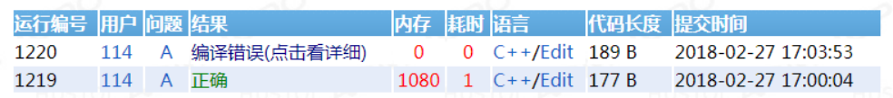

# C++ 实现学生信息管理系统

> [此笔记线更新地址](https://github.com/Eished/C-CPP/blob/master/C%2B%2B%E5%AE%9E%E7%8E%B0%E5%AD%A6%E7%94%9F%E4%BF%A1%E6%81%AF%E7%AE%A1%E7%90%86%E7%B3%BB%E7%BB%9F.md)
>
> [C++ 笔记和代码库](https://github.com/Eished/C-CPP)

## 考试题目：

### A：学生信息存储（40分）

1. **业务描述：**

   - 某学校的学生信息包括：学号、姓名、性别、学院。

   - 其中学号是整数；性别用单个大写字母表示，F 表示女性，M 表示男性；姓名是字符串类型。

   - 学生学号固定长度6位，前两位表示学院，例如计算机学院编码 11，则首两位编码是 11；

     中间两位表示入学年份，例如学生是 2019 年入学，则中间编码为 19：最后两位是自动按序编号，例如学生是 2019 年入学计算机学院的第56号学生，则学号为 111956。

   - 假设学校有三个学院：

     - 计算机学院编码 11， 
     - 管理学院编码 22，
     - 土木学院编码 33。

2. **程序开发要求：**

   1. 要求使用 C++ 语言与面对对象设计思想实现开发。
   2. 定义一个学生类，包含上述学生信息。
   3. 在学生类中，定义输出函数 `Print` ，输出一个学生对象的信息。
   4. 定义学号生成函数 `GenID`，根据学生所属的学院、入学年份、学院顺序号，生成学生的学号。
   5. 学生类中，可以根据需要增加成员函数，但不能增加数据成员。
   6. 在主函数中，创建三个对象数组，对应三个学院，分别存储三个学院的学生对象。

3. **输入：**

   1. 第一行输入t，表示有t个学生。
   2. 接着输入t行，每行输入一个学生信息共五个参数，包括姓名、性别、学院、入学年份和学院顺序号，数据之间用空格隔开。其中学院用缩写表示，CS 表示计算机学院，MA 表示管理学院，BU 表示土木学院。
   3. 每输入一个学生信息，就调用函数 `GenID` 生成学生学号，并创建一个新的学生对象。然后根据学院缩写，把新学生插入到对应对象数组的末尾。
   4. 数据输入的具体格式参考输入样例。

### B：学生信息操作（50分）

1. **业务描述：**

   - 在前一题的基础上：加入增加、删除、查询的信息操作
   - 某学核的学生信息包括：学号、姓名、性别、学院。其中学号是整数；性别用单个大写字母表示，F 示女性，M 示男性；姓名是字符串类型。假设学校有三个学院：计算机字院编码11，管理学院编码 22，土木学院编码 33。
   - 编写一个程序完成学生信息的插入、存储、输出、增加、删除、查询等功能

2. **程序开发要求：**

   1. 要求使用C++语言与面向对象设计思想实现开发。
   2. 定义一个学生类，不仅包含上述学生信息，还要增加静态数据成员 `total`，表示学生总数。要求静态数据成员必须是private。
   3. 在学生中定义输出函数 `Print`，输出一个学生对象的信息。
   4. 学生类中可以根据需要增加成员函数，但不能增加据成员

3. **在主函数中，完成以下要求：**

   1. 创建三个对象数组，对应三个学院，分别存储三个学院的学生对象

   2. 定义插入函数 `Ins`，先创建一个新学生对象，根据学院缩写把新学生插入到对应数组的指定位置；插入前，指定位置上的原学生对象以及后面的学生对象都要往后移动一位。

      提示：无需考虑插入位置非法的问题；题目的插入数组位置从 1 开始计算；每增加一个新学生，学生总数加 1。

   3. 定义删除函数 `Del`，根据提供的学号先找到学生对象，删除对应数组的对应学生对象；刪除后，刪除位置后面的学生对象都要往前移动一位。

      提示：每删除一个学生，学生总数减1。

   4. 定义查询函数 `Query`，根据提供的学号，查询学生是否存在，并调用输出的数 `Print` 信息作输出。

   5. 学生总数的所有操作都必须使用学生类的静态数据 `total` 来进行，不能在类外使用其他函数或变量进行统计。

### C：学生学号排序（10分）

1. **业务描述：**
   - 现在需要对学号进行排序。设有一个数组存储了所有学院所有学生的对象，采用简单选择排序法，实现所有学生对象学号从小到大排序。
   - 简单选择排序算法说明
     - 假设 `n` 为待排序记录数，每一趟（例如第 `i` 趟，`i=1,2,...,n-1`）有 `n-i+1` 个待排序记录，
     - 在第 `i` 趟中，通过 `n-i` 次比较，选出关键字最小的记录，与第 `i` 个记录交换。
2. **程序开发要求：**
   1. 必须使用简单选择排序实现学生排序。
   2. 不允许使用第三方对象或函数实现排序，学生必须写出完整的排序算法。
   3. 无需考虑学号相同的情况。

## 功能实现：

### A：输入文字模板

张三 M CS 2019 11

杨六 M CS 2018 11

胡七 M CS 2017 11

李四 M MA 2020 22

王五 F BU 2019 33


### B：功能设计

```C++
	cout << "1:输入学生信息\n" << endl;
	cout << "2:打印学生信息\n" << endl;
	cout << "3:插入学生信息\n" << endl;
	cout << "4:查找学生信息\n" << endl;
	cout << "5:修改学生信息\n" << endl;
	cout << "6:删除学生信息\n" << endl;
	cout << "7:读取学生信息\n" << endl;
	cout << "8:保存学生信息\n" << endl;
	cout << "9:按学号从小到大排序\n" << endl;
	cout << "0:退出\n" << endl;
	cout << "请输入对应的序号：" << endl;
```


### C：实现代码

#### 普通数组版：

- 要求静态数据成员必须是private。
- 不能在类外使用其他函数或变量进行统计。
- 不能增加数据成员。

##### Student.h

```C++
#pragma once
using namespace std;

class Student
{
private:
	static int total;
public:
	int studNum = 0;
	char name[20] = "0";
	char sex = '0';
	char college[3] = "0";
	int year = 0;
	int colNum = 0;
	Student() {};
	Student(char name[20], char sex, char college[3], int year, int colNum);
	void GenID(int count);
	void print();
	int Total();
	void setTotal(int total);
};
```

##### Student.cpp

```C++
#include "Student.h"
#include <iostream>
using namespace std;

int Student::total = 0;
Student::Student(char name[20], char sex, char college[3], int year, int colNum) {
	strcpy_s(this->name, name);
	strcpy_s(this->college, college);
	this->sex = sex;
	this->year = year;
	this->colNum = colNum;
	this->total++;
}

void Student::GenID(int count) {
	studNum = colNum * 10000 + year % 100 * 100 + count;
}
void Student::print() {
	cout << "学号：" << studNum << "  姓名：" << name << "  性别：" << sex << "  学院：" << college << "  入学年份：" << year << "  学院顺序号：" << colNum << endl;
}

int Student::Total() {
	return total;
}

void Student::setTotal(int total) {
	this->total = total;
}
```

##### StudIMS.cpp

```CPP
#include "Student.h"
#include <iostream>
#include <fstream>
#define M 30

using namespace std;

void display() {
	cout << "1:输入学生信息\n" << endl;
	cout << "2:打印学生信息\n" << endl;
	cout << "3:插入学生信息\n" << endl;
	cout << "4:查找学生信息\n" << endl;
	cout << "5:统计学生信息\n" << endl;
	cout << "6:删除学生信息\n" << endl;
	cout << "7:读取学生信息\n" << endl;
	cout << "8:保存学生信息\n" << endl;
	cout << "9:按学号从小到大排序\n" << endl;
	cout << "0:退出\n" << endl;
	cout << "请输入对应的序号：" << endl;
};

int main() {
	Student CSarr[M]; // 学生数组
	Student MAarr[M];
	Student BUarr[M];
	int CScount = 0; // 学号顺序号：只增不减
	int MAcount = 0;
	int BUcount = 0;
	int CSi = 0; // 学生数组下标位置
	int MAi = 0;
	int BUi = 0;
	while (true) {
		display();
		int cho;
		cin >> cho;
		switch (cho) {
		case 1: { // 输入学生信息
			system("cls");
			int t = 0;
			cout << "输入录入人数：" << endl;
			cin >> t;
			cout << "输入：名字 性别 学院字母 入学年份 学院代码" << endl;
			for (int i = 0; i < t; i++) {
				char name[20];
				char college[3];
				char sex;
				int year;
				int colNum;
				cin >> name >> sex >> college >> year >> colNum;
				Student stud(name, sex, college, year, colNum);
				switch (colNum) {
				case 11: {
					stud.GenID(++CScount);
					CSarr[CSi++] = stud;
					break;
				};
				case 22: {
					stud.GenID(++MAcount);
					MAarr[MAi++] = stud;
					break;
				};
				case 33: {
					stud.GenID(++BUcount);
					BUarr[BUi++] = stud;
					break;
				};
				default:
					break;
				}
			}
			system("cls");
			break;
		}
		case 2: { // 打印学生信息
			system("cls");
			for (int i = 0; i < M; i++) {
				if (CSarr[i].studNum > 0) {
					CSarr[i].print();
				}
				else {
					//break; // 打印插入位置非法的学生
				}
			}
			for (int i = 0; i < M; i++) {
				if (MAarr[i].studNum > 0) {
					MAarr[i].print();
				}
				else {
					//break;
				}
			}
			for (int i = 0; i < M; i++) {
				if (BUarr[i].studNum > 0) {
					BUarr[i].print();
				}
				else {
					//break;
				}
			}
			system("pause");
			system("cls");
			break;
		}
		case 3: { // 插入学生信息
			system("cls");
			cout << "输入插入位置：" << endl;
			int num;
			cin >> num;
			num = num - 1;
			cout << "输入：名字 性别 学院字母 入学年份 学院代码" << endl;
			char name[20];
			char college[3];
			char sex;
			int year;
			int colNum;
			cin >> name >> sex >> college >> year >> colNum;
			Student stud(name, sex, college, year, colNum);
			Student studTmp;
			switch (colNum) {
			case 11: {
				stud.GenID(++CScount);
				for (int i = num; i < M; i++) { // 插入位置超过当前输入队列长度，再次输入时会被覆盖；M改成CSi可解决
					studTmp = CSarr[i];
					CSarr[i] = stud;
					stud = studTmp;
				}
				CSi++; // 数组下标增加
				break;
			};
			case 22: {
				stud.GenID(++MAcount);
				for (int i = num; i < M; i++) {
					studTmp = MAarr[i];
					MAarr[i] = stud;
					stud = studTmp;
				}
				MAi++;
				break;
			};
			case 33: {
				stud.GenID(++BUcount);
				for (int i = num; i < M; i++) {
					studTmp = BUarr[i];
					BUarr[i] = stud;
					stud = studTmp;
				}
				BUi++;
				break;
			};
			default:
				break;
			}
			system("pause");
			system("cls");
			break;
		}
		case 4: { // 查找学生信息
			system("cls");
			cout << "输入查询学号：" << endl;
			int num;
			cin >> num;
			int colNum = num / 10000;
			switch (colNum) {
			case 11: {
				for (int i = 0; i < M; i++) {
					if (CSarr[i].studNum == num) {
						CSarr[i].print();
						break;
					}
				}
			}
			case 22: {
				for (int i = 0; i < M; i++) {
					if (MAarr[i].studNum == num) {
						MAarr[i].print();
						break;
					}
				}
			}
			case 33: {
				for (int i = 0; i < M; i++) {
					if (BUarr[i].studNum == num) {
						BUarr[i].print();
						break;
					}
				}
			}
			}
			system("pause");
			system("cls");
			break;
		}
		case 5: { // 统计学生信息
			system("cls");
			Student stud;
			cout << "总人数：" << stud.Total() << endl;
			cout << "计算机学院人数：" << CSi << endl;
			cout << "管理学院人数：" << MAi << endl;
			cout << "土木学院人数：" << BUi << endl;
			system("pause");
			system("cls");
			break;
		}
		case 6: { // 删除学生信息
			system("cls");
			Student stud;
			cout << "输入删除的学号：" << endl;
			int num;
			cin >> num;
			int colNum = num / 10000;
			switch (colNum) {
			case 11: {
				for (int i = 0; i < M; i++) {
					if (CSarr[i].studNum == num) {
						for (int j = i; j < M - 1; j++) {
							CSarr[j] = CSarr[j + 1];
						}
						CSi--;
						stud.setTotal(stud.Total() - 1);
						cout << "删除成功" << endl;
						break;
					}
				}
			}
			case 22: {
				for (int i = 0; i < M; i++) {
					if (MAarr[i].studNum == num) {
						for (int j = i; j < M - 1; j++) {
							MAarr[j] = MAarr[j + 1];
						}
						MAi--;
						stud.setTotal(stud.Total() - 1);
						cout << "删除成功" << endl;
						break;
					}
				}
			}
			case 33: {
				for (int i = 0; i < M; i++) {
					if (BUarr[i].studNum == num) {
						for (int j = i; j < M - 1; j++) {
							BUarr[j] = BUarr[j + 1];
						}
						BUi--;
						stud.setTotal(stud.Total() - 1);
						cout << "删除成功" << endl;
						break;
					}
				}
			}
			default:
				break;
			}
			system("pause");
			system("cls");
			break;
		}
		case 7: { // 读取学生信息
			system("cls");
			Student stud;
			int i = 0;
			// CS
			ifstream fileCS("CS.dat", ios::in | ios::binary);
			while (fileCS.read((char*)&stud, sizeof(Student))) {
				stud.print();
				CSarr[i] = stud;
				i++;
			}
			CScount = stud.studNum % 100;// 读最后一个对象的学号，作为起始值；乱序插入后有bug
			CSi = i;// 初始化数组下标
			i = 0;
			fileCS.close();
			// MA
			ifstream fileMA("MA.dat", ios::in | ios::binary);
			while (fileMA.read((char*)&stud, sizeof(Student))) {
				stud.print();
				MAarr[i] = stud;
				i++;
			}
			MAcount = stud.studNum % 100;
			MAi = i;
			i = 0;
			fileMA.close();
			// BU
			ifstream fileBU("BU.dat", ios::in | ios::binary);
			while (fileBU.read((char*)&stud, sizeof(Student))) {
				stud.print();
				BUarr[i] = stud;
				i++;
			}
			BUcount = stud.studNum % 100;
			BUi = i;
			stud.setTotal(CScount + MAcount + BUcount);
			fileBU.close();
			cout << "读取成功！" << endl;
			system("pause");
			system("cls");
			break;
		}
		case 8: { // 保存
			system("cls");
			ofstream fileCS("CS.dat", ios::out | ios::binary);
			for (int i = 0; i < M; i++) {
				if (CSarr[i].studNum > 0) {
					fileCS.write((char*)&CSarr[i], sizeof(Student));
				}
			}
			fileCS.close();
			ofstream fileMA("MA.dat", ios::out | ios::binary);
			for (int i = 0; i < M; i++) {
				if (MAarr[i].studNum > 0) {
					fileMA.write((char*)&MAarr[i], sizeof(Student));
				}
			}
			fileMA.close();
			ofstream fileBU("BU.dat", ios::out | ios::binary);
			for (int i = 0; i < M; i++) {
				if (BUarr[i].studNum > 0) {
					fileBU.write((char*)&BUarr[i], sizeof(Student));
				}
			}
			fileBU.close();
			cout << "保存成功！" << endl;
			system("pause");
			system("cls");
			break;
		}
		case 9: { // 按学号从小到大排序
			system("cls");
			Student studs[M * 3];
			int index = 0;
			for (int i = 0; i < M; i++) {
				if (CSarr[i].studNum > 0) {
					studs[index] = CSarr[i];
					index++;
				}
				if (MAarr[i].studNum > 0) {
					studs[index] = MAarr[i];
					index++;
				}
				if (BUarr[i].studNum > 0) {
					studs[index] = BUarr[i];
					index++;
				}
			}
			int less = 0;
			Student studTmp;
			Student studTmpSec;
			for (int i = 0; i < M * 3; i++) {
				if (studs[i].studNum > 0) {
					for (int j = i + 1; j < M * 3; j++) {
						if (studs[j].studNum > 0 && studs[i].studNum - studs[j].studNum > less) {
							less = studs[i].studNum - studs[j].studNum;
							index = j;
						}
					}
					if (less) {
						// 插入到i位置 然后后移
						studTmp = studs[i];
						studs[i] = studs[index];
						for (int j = i + 1; j < M * 3; j++) {
							studTmpSec = studs[j];
							studs[j] = studTmp;
							studTmp = studTmpSec;
						}
						// 删除 然后前移
						for (int j = index + 1; j < M * 3 - 1; j++) {
							studs[j] = studs[j + 1];
						}
						// studs[index].print();
						less = 0;
					}
				}
			}
			for (int i = 0; i < M * 3; i++) {
				if (studs[i].studNum > 0) {
					studs[i].print();
				}
			}
			system("pause");
			system("cls");
			break;
		}
		case 0: { // 退出
			cout << "已退出" << endl;
			return 0;
		}
		default: {
			cout << "输入不正确!" << endl;
			system("pause");
			system("cls");
			break;
		}
		}
	}
	return 0;
}
```


#### STL vector 动态数组版：

- 静态数据成员公有。
  - total 私有
- 增加数据成员学号。
  - 未改进：静态数据不会存入对象二进制文件中，写入文件存储更方便复原。
- 修改学生信息功能。

##### Student.h

```C++
#pragma once
using namespace std;

class Student
{
private:
	static int total;
public:
	static int csCount; // 学号，只增不减
	static int maCount;
	static int buCount;
	int studNum = 0;
	char name[20] = "1";
	char sex = 'F';
	char college[3] = "1";
	int year = 0;
	int colNum = 0;
	Student() {};
	Student(char name[20], char sex, char college[3], int year, int colNum);
	void GenID();
	void print();
	int Total();
	void setTotal(int total);
};
```

##### Student.cpp

```C++
#include "Student.h"
#include <iostream>
using namespace std;

int Student::total = 0;
int Student::csCount = 0;
int Student::maCount = 0;
int Student::buCount = 0;
Student::Student(char name[20], char sex, char college[3], int year, int colNum) {
	strcpy_s(this->name, name);
	strcpy_s(this->college, college);
	this->sex = sex;
	this->year = year;
	this->colNum = colNum;
	this->total++;
	switch (colNum) {
	case 11: {
		csCount++;
		break;
	};
	case 22: {
		maCount++;
		break;
	};
	case 33: {
		buCount++;
		break;
	};
	default:
		break;
	}
}

void Student::GenID() {
	int count = 0;
	switch (colNum) {
	case 11: {
		count = csCount;
		break;
	};
	case 22: {
		count = maCount;
		break;
	};
	case 33: {
		count = buCount;
		break;
	};
	default:
		break;
	}
	studNum = colNum * 10000 + year % 100 * 100 + count;
}
void Student::print() {
	cout << "学号：" << studNum << "  姓名：" << name << "  性别：" << sex << "  学院：" << college << "  入学年份：" << year << "  学院顺序号：" << colNum << endl;
}
int Student::Total() {
	return total;
}

void Student::setTotal(int total) {
	this->total = total;
}
```

##### myfunc.h

```C++
#pragma once

void input();
void display();
void printAll();
void Query();
void Del();
void Ins();
void modify();
void Sort();
void Save();
void Read();
```

##### stuInfoMS.cpp

```C++
#include <iostream>
#include <vector>
#include <fstream>
#include "Student.h"
#include "myfunc.h"

using namespace std;

vector<Student> CSarr;
vector<Student> MAarr;
vector<Student> BUarr;
int main() {
	while (true) {
		display();
		int cho;
		cin >> cho;
		switch (cho) {
		case 1: { // 输入学生信息
			input();
			system("cls");
			break;
		}
		case 2: { // 打印学生信息
			system("cls");
			printAll();
			system("pause");
			system("cls");
			break;
		}
		case 3: { // 插入学生信息
			Ins();
			system("cls");
			break;
		}
		case 4: { // 查找学生信息
			Query();
			system("pause");
			system("cls");
			break;
		}
		case 5: { // 修改学生信息
			modify();
			system("pause");
			system("cls");
			break;
		}
		case 6: { // 删除学生信息
			Del();
			system("cls");
			break;
		}
		case 7: { // 读取学生信息
			system("cls");
			Read();
			cout << "读取成功！" << endl;
			system("pause");
			system("cls");
			break;
		}
		case 8: { // 保存
			Save();
			cout << "保存成功！" << endl;
			system("pause");
			system("cls");
			break;
		}
		case 9: { // 按学号从小到大排序
			system("cls");
			Sort();
			system("pause");
			system("cls");
			break;
		}
		case 0: { // 退出
			cout << "已退出" << endl;
			return 0;
		}
		default: {
			cout << "输入不正确!" << endl;
			system("pause");
			system("cls");
			break;
		}
		}
	}
	return 0;
}

void display() {
	cout << "1:输入学生信息\n" << endl;
	cout << "2:打印学生信息\n" << endl;
	cout << "3:插入学生信息\n" << endl;
	cout << "4:查找学生信息\n" << endl;
	cout << "5:修改学生信息\n" << endl;
	cout << "6:删除学生信息\n" << endl;
	cout << "7:读取学生信息\n" << endl;
	cout << "8:保存学生信息\n" << endl;
	cout << "9:按学号从小到大排序\n" << endl;
	cout << "0:退出\n" << endl;
	cout << "请输入对应的序号：" << endl;
}
void input() {
	int t = 0;
	cout << "输入学生人数：";
	cin >> t;
	cout << "输入：名字 性别 学院字母 入学年份 学院代码" << endl;
	for (int i = 0; i < t; i++) {
		char name[20];
		char college[3];
		char sex;
		int year;
		int colNum;
		cin >> name >> sex >> college >> year >> colNum;
		Student stud(name, sex, college, year, colNum);
		stud.GenID();
		switch (colNum) {
		case 11: {
			CSarr.push_back(stud);
			break;
		};
		case 22: {
			MAarr.push_back(stud);
			break;
		};
		case 33: {
			BUarr.push_back(stud);
			break;
		};
		default:
			break;
		}
	}
}
void printAll() {
	Student stud;
	cout << "总人数：" << stud.Total() << endl;
	cout << "计算机学院人数：" << CSarr.size() << endl;
	cout << "管理学院人数：" << MAarr.size() << endl;
	cout << "土木学院人数：" << BUarr.size() << endl;
	cout << endl;
	// 输入学院 或 打印全部
	cout << "计算机学院:" << endl;
	for (int i = 0; i < CSarr.size(); i++) {
		CSarr[i].print();
	}
	cout << "\n管理学院:" << endl;
	for (int i = 0; i < MAarr.size(); i++) {
		MAarr[i].print();
	}
	cout << "\n土木学院:" << endl;
	for (int i = 0; i < BUarr.size(); i++) {
		BUarr[i].print();
	}
	cout << endl;
}

void Ins() {
	int t = 0, x = 0;
	cout << "输入插入位置：";
	cin >> x;
	cout << "输入学生人数：";
	cin >> t;
	cout << "输入：名字 性别 学院字母 入学年份 学院代码" << endl;
	for (int i = 0; i < t; i++) {
		char name[20];
		char college[3];
		char sex;
		int year;
		int colNum;
		cin >> name >> sex >> college >> year >> colNum;
		Student stud(name, sex, college, year, colNum);
		stud.GenID();
		switch (colNum) {
		case 11: {
			if (CSarr.size() >= x) {
				CSarr.insert(CSarr.begin() + x - 1, stud);
			}
			else {
				cout << "插入位置大于数组长度" << endl;
			}
			break;
		};
		case 22: {
			if (MAarr.size() >= x) {
				MAarr.insert(MAarr.begin() + x - 1, stud);
			}
			else {
				cout << "插入位置大于数组长度" << endl;
			}
			break;
		};
		case 33: {
			if (BUarr.size() >= x) {
				BUarr.insert(BUarr.begin() + x - 1, stud);
			}
			else {
				cout << "插入位置大于数组长度" << endl;
			}
			break;
		};
		default:
			break;
		}
	}
}
void Query() {
	int num;
	cout << "输入查询的学号:" << endl;
	cin >> num;
	int	colNum = num / 10000;
	switch (colNum) {
	case 11: {
		for (int i = 0; i < CSarr.size(); i++) {
			if (CSarr[i].studNum == num)
			{
				CSarr[i].print();
				return;
			}
		}
		cout << "未找到" << endl;
		break;
	};
	case 22: {
		for (int i = 0; i < MAarr.size(); i++) {
			if (MAarr[i].studNum == num)
			{
				MAarr[i].print();
				return;
			}
		}
		cout << "未找到" << endl;
		break;
	};
	case 33: {
		for (int i = 0; i < BUarr.size(); i++) {
			if (BUarr[i].studNum == num)
			{
				BUarr[i].print();
				return;
			}
		}
		cout << "未找到" << endl;
		break;
	};
	default:
		break;
	}
}
void Del() {
	int num;
	cout << "输入删除的学号:" << endl;
	cin >> num;
	int	colNum = num / 10000;
	switch (colNum) {
	case 11: {
		for (int i = 0; i < CSarr.size(); i++) {
			if (CSarr[i].studNum == num)
			{
				CSarr[i].setTotal(CSarr[i].Total() - 1);
				CSarr.erase(CSarr.begin() + i);
				return;
			}
		}
		cout << "未找到" << endl;
		break;
	};
	case 22: {
		for (int i = 0; i < MAarr.size(); i++) {
			if (MAarr[i].studNum == num)
			{
				MAarr[i].setTotal(MAarr[i].Total() - 1);
				MAarr.erase(MAarr.begin() + i);
				return;
			}
		}
		cout << "未找到" << endl;
		break;
	};
	case 33: {
		for (int i = 0; i < BUarr.size(); i++) {
			if (BUarr[i].studNum == num)
			{
				BUarr[i].setTotal(BUarr[i].Total() - 1);
				BUarr.erase(BUarr.begin() + i);
				return;
			}
		}
		cout << "未找到" << endl;
		break;
	};
	default:
		break;
	}
}

void modify() {
	int num;
	cout << "输入修改的学号:" << endl;
	cin >> num;
	int	colNum = num / 10000;
	switch (colNum) {
	case 11: {
		for (int i = 0; i < CSarr.size(); i++) {
			if (CSarr[i].studNum == num)
			{
				CSarr[i].print();
				cout << endl;
				char name[20];
				char college[3];
				char sex;
				int year;
				int colNum;
				cout << "输入：名字 性别 学院字母 入学年份 学院代码" << endl;
				cin >> name >> sex >> college >> year >> colNum;
				strcpy_s(CSarr[i].name, name);
				strcpy_s(CSarr[i].college, college);
				CSarr[i].sex = sex;
				CSarr[i].year = year;
				CSarr[i].colNum = colNum;
				CSarr[i].GenID();
				CSarr[i].print();
				return;
			}
		}
		cout << "未找到" << endl;
		break;
	};
	case 22: {
		for (int i = 0; i < MAarr.size(); i++) {
			if (MAarr[i].studNum == num)
			{
				MAarr[i].print();
				cout << endl;
				char name[20];
				char college[3];
				char sex;
				int year;
				int colNum;
				cout << "输入：名字 性别 学院字母 入学年份 学院代码" << endl;
				cin >> name >> sex >> college >> year >> colNum;
				strcpy_s(MAarr[i].name, name);
				strcpy_s(MAarr[i].college, college);
				MAarr[i].sex = sex;
				MAarr[i].year = year;
				MAarr[i].colNum = colNum;
				MAarr[i].GenID();
				MAarr[i].print();
				return;
			}
		}
		cout << "未找到" << endl;
		break;
	};
	case 33: {
		for (int i = 0; i < BUarr.size(); i++) {
			if (BUarr[i].studNum == num)
			{
				BUarr[i].print();
				cout << endl;
				char name[20];
				char college[3];
				char sex;
				int year;
				int colNum;
				cout << "输入：名字 性别 学院字母 入学年份 学院代码" << endl;
				cin >> name >> sex >> college >> year >> colNum;
				strcpy_s(BUarr[i].name, name);
				strcpy_s(BUarr[i].college, college);
				BUarr[i].sex = sex;
				BUarr[i].year = year;
				BUarr[i].colNum = colNum;
				BUarr[i].GenID();
				BUarr[i].print();
				return;
			}
		}
		cout << "未找到" << endl;
		break;
	};
	default:
		break;
	}
}

void Sort() {
	cout << endl;
	cout << "简单选择排序算法，从小到大排序:" << endl;
	vector<Student> studs;
	int temp = 0;
	int less = 0;
	for (int i = 0; i < CSarr.size(); i++) {
		studs.push_back(CSarr[i]);
	}
	for (int i = 0; i < MAarr.size(); i++) {
		studs.push_back(MAarr[i]);
	}
	for (int i = 0; i < BUarr.size(); i++) {
		studs.push_back(BUarr[i]);
	}
	if (studs.size() > 0) {
		for (int i = 0; i < studs.size(); i++) {
			for (int j = i + 1; j < studs.size(); j++) {
				if (studs[i].studNum - studs[j].studNum > less) {
					less = studs[i].studNum - studs[j].studNum;
					temp = j;
				}
			}
			if (less) {
				studs.insert(studs.begin() + i, studs[temp]);
				studs.erase(studs.begin() + temp + 1);
				less = 0;
			}
		}
	}
	else {
		cout << "没有数据" << endl;
	}
	cout << endl;
	for (int i = 0; i < studs.size(); i++) {
		studs[i].print();
	}
}

void Save() {
	ofstream fileCS("CS.dat", ios::out | ios::binary);
	for (int i = 0; i < CSarr.size(); i++) {
		fileCS.write((char*)&CSarr[i], sizeof(Student));
	}
	ofstream fileMA("MA.dat", ios::out | ios::binary);
	for (int i = 0; i < MAarr.size(); i++) {
		fileMA.write((char*)&MAarr[i], sizeof(Student));
	}
	ofstream fileBU("BU.dat", ios::out | ios::binary);
	for (int i = 0; i < BUarr.size(); i++) {
		fileBU.write((char*)&BUarr[i], sizeof(Student));
	}
	fileCS.close();
	fileMA.close();
	fileBU.close();
}
void Read() {
	Student stud;
	// CS
	ifstream fileCS("CS.dat", ios::in | ios::binary);
	while (fileCS.read((char*)&stud, sizeof(Student))) {
		stud.print();
		CSarr.push_back(stud);
	}
	Student::csCount = stud.studNum % 100; // 初始化学号起始位置；最后一个对象的学号，乱序插入后有bug
	// MA
	ifstream fileMA("MA.dat", ios::in | ios::binary);
	while (fileMA.read((char*)&stud, sizeof(Student))) {
		stud.print();
		MAarr.push_back(stud);
	}
	Student::maCount = stud.studNum % 100;
	// BU
	ifstream fileBU("BU.dat", ios::in | ios::binary);
	while (fileBU.read((char*)&stud, sizeof(Student))) {
		stud.print();
		BUarr.push_back(stud);
	}
	Student::buCount = stud.studNum % 100;
	stud.setTotal(CSarr.size() + MAarr.size() + BUarr.size());
	fileCS.close();
	fileMA.close();
	fileBU.close();
}
```


## 深大-20210123期-计算机信息管理课程实践-指导与真题练习-含答案

### 第一章 上机指导篇

#### 网站入门流程

1. 注册帐号（如果由内置账号的请忽略本步骤）
2. 进入实验
3. 完成实验题目
4. 查看结果

#### 注册帐号

1. 在浏览器登入网站172.1.21.90，下载本教程熟悉考试操作环境

2. 在浏览器登入网站172.1.21.90点击网页右上角的 【注册】

   

3. 进入注册页面，填写个人信息，注意：
   【用户名（学号）】框中必须输入学号，不能输入其他字符，将来评分都以学号为评分标识！！
   【昵称】框中填写你的姓名
   密码至少6位，以后如果忘记密码请联系老师更改密码

4. 点击Submit按钮完成注册

   

5. 完成注册会自动进入网站，右上角可以看到你登录的学号

   

6. 如果没有进入请刷新页面，或者输入网址重新登录

#### 进入实验

1. 点击中间蓝色菜单栏的第3项【测验】，就可以看到实验列表
   根据实验名称，点击进入相应的实验
   注意实验状态为Running表示实验可以进入，否则不能进入

   

2. 进入实验后，可以看到实验题目
   【Start Time】、【End Time】、【Current Time】表示实验的开始、截止时间和当前时间，在实验过程中要控制好时间
   点击进入第一道题目

   

#### 完成实验题目

1. 进入实验题目，看到题目内容，其中：

2. 【题目描述】介绍题目要求
   【输入】说明输入数据的格式
   【输出】说明输出数据的格式
   【样例输入】展示输入数据的示范，你在编程时要考虑如何接收这些数据
   【样例输出】展示输出数据的格式，你在编程时要考虑输出数据的格式
   【提示】对本题目求解方法的讲解

   

3. 第一题内容介绍：
   【题目描述】要求计算两个数字相加的结果
   【输入】告诉大家要输入两个整数
   【输出】告诉大家要输出两个整数相加的结果
   【样例输入】展示了输入的样例数据是1 2，注意1和2之间有个空格
   【样例输出】展示了输出结果是3，注意只输出3，没有其他多余输出

   

4. 第一题的实现
   在【提示】栏中可以看到用C++、C语言、JAVA实现的程序代码
   大家可以把代码复制到VC6中，在VC6中运行，然后输入1 2（注意1和2之间有个空格），回车后就可以看到输出结果是3
   当你的输入和输出与题目的【样本输入】【样本输出】相同时，就说明这道题做对了

   

5. 在VC6完成代码，并且输出结果和题目的【样本输出】相同后，就可以在网站上提交代码
   点击【提交】，进入提交页面

   

6. 在提交页面中
   1、在【Language】框中选择C（C语言就选择C）
   2、把VC6中的代码粘贴到代码框中
   3、点击Submit按钮，就完成提交

   

#### 查看结果

1. 在完成提交后，就会进入程序运行结果页面
   第一个图可以看到用户114，对问题A进行代码提交，当前结果是“等待”

   

   1. 大家稍等片刻，或者按F5刷新页面，当看到结果变成“正确”恭喜，这题答对了！
      如果结果是其他，那么点击结果可以看到错误的原因，大家可以在VC6中修改代码，再重新提交

   

2. 查看整个实验结果
   点击蓝色菜单条的【主页】返回上一层
   重复之前步骤，进入自己的实验
   在图中【Status】是查看自己提交的结果
   在图中【Standing】是查看整个实验结果

   

3. 在下图的实验结果中，可以看出：
   114正确完成了题目A，所以A题目结果为绿色
   其他题目没有提交，所以是灰色
   如果题目做错，则显示红色

   

   请大家继续完成整个实验

### 第二章 上机考试篇

登录网址172.31.221.90，按指导文档操作开始上机考试，以下为上机考试内容，考试时间14：30-16:30

#### 共3个考题


### 第三章 其他参考窗口


192人参加考试，结束时只有3个大佬完全做对A题，B、C题好像没有看到做出来的

### 第四章（完整考题程序代码）

```cpp
/**
 * 深大自考实践
 * 题目：问题A 学生信息存储
 * 分值： 40分
 * 考试时间：2021/1/23 14:30-16:30
 * 作者：wk240
*/
#include <iostream>
#include <string>
#include <vector>
using namespace std;
/**
 * 学生类
*/
class Student
{
private:
    //学号 固定长度6位
    string no;
    //姓名
    string name;
    //性别 F:女 M:男
    string sex;
    //学院 CS:11:计算机学院、MA:22:管理学院、BU:33:土木学院
    string college;
public:
    /**
     * 输出一个学生对象信息
    */
    void Print()
    {
        if (no != "")
        {
            cout << no << " " << name << " " << (sex == "F" ? "女" : "男") << " " << (college == "CS" ? "计算机学院" : college == "MA" ? "管理学院" : "土木学院") << endl;
        }
    };
 /**
     * 根据学生所属的学院、入学年份、学院顺序号，生成学生的学号
    */
    static string GenID(string college, string year, string num)
    {
        string collegeNum = college == "CS" ? "11" : college == "MA" ? "22" : college == "BU" ? "33" : "00";
        string yearCut = year.substr(2, 2);
        return collegeNum + yearCut + num;
    }
 /*
     * 根据需要增加成员函数
    */
    //...
    Student() {}
    Student(string &no, string &name, string &sex, string &college) : no(no), name(name), sex(sex), college(college) {}
    string getName()
    {
        return name;
    }
};
/**
 * 分割字符串
*/
vector<string> split(const string &str, const string &delimiter)
{
    vector<string> res;
 string strs = str + delimiter;
    int pos = strs.find(delimiter);
 while (pos != strs.npos)
    {
        string temp = strs.substr(0, pos);
        res.push_back(temp);
        strs = strs.substr(pos + 1, strs.size());
        pos = strs.find(delimiter);
    }
 return res;
};
/**
 * 新增
*/
void insertStudentToCollege(Student college[], int &pos, Student &stu)
{
    college[pos] = stu;
};
/**
 * 主函数，程序入口
*/
int main()
{
    //输入 学生个数t
    int t;
    cin >> t;
    cin.ignore();
    // int t = 6;                                                                                                                                          //调试代码，代替输入
    // string stuinfos[] = {"孙一 M CS 2021 01", "陈二 M CS 2021 02", "张三 M CS 2021 03", "李四 M MA 2021 04", "王五 M MA 2021 05", "赵六 M MA 2021 06"}; //调试代码，代替输入
 //创建三个对象数组，对应三个学院，分别存储三个学院的学生对象
    Student *csCollege = new Student[t];
    Student *maCollege = new Student[t];
    Student *buCollege = new Student[t];
    //学院数组指针位置
    int csPos = 0, maPos = 0, buPos = 0;
 //输入 学生信息，共t个学生
    for (int i = 0; i < t; i++)
    {
        string stuinfo;
        getline(cin, stuinfo);
        // string stuinfo = stuinfos[i]; //调试代码，代替输入
     vector<string> res = split(stuinfo, " ");
     string name = res.at(0);
        string sex = res.at(1);
        string college = res.at(2);
        string year = res.at(3);
        string num = res.at(4);
        string no = Student::GenID(college, year, num);
        //创建一个新的学生对象
        Student *stu = new Student(no, name, sex, college);
        //根据学院缩写，把新学生插入到对应的对象数组末尾
        if (college == "CS")
        {
            insertStudentToCollege(csCollege, csPos, *stu);
            csPos++;
        }
        else if (college == "MA")
        {
            insertStudentToCollege(maCollege, maPos, *stu);
            maPos++;
        }
        else if (college == "BU")
        {
            insertStudentToCollege(buCollege, buPos, *stu);
            buPos++;
        }
    }
 //输出
    string csCollegeStudent = "";
    string maCollegeStudent = "";
    string buCollegeStudent = "";
    for (int i = 0; i < t; i++)
    {
        if (csCollegeStudent != "")
        {
            csCollegeStudent += " ";
        }
        if (maCollegeStudent != "")
        {
            maCollegeStudent += " ";
        }
        if (buCollegeStudent != "")
        {
            buCollegeStudent += " ";
        }
        csCollegeStudent += csCollege[i].getName();
        maCollegeStudent += maCollege[i].getName();
        buCollegeStudent += buCollege[i].getName();
    }
 if (csCollegeStudent == "")
    {
        cout << "no student" << endl;
    }
    else
    {
        cout << csCollegeStudent << endl;
    }
 if (maCollegeStudent == "")
    {
        cout << "no student" << endl;
    }
    else
    {
        cout << maCollegeStudent << endl;
    }
 if (buCollegeStudent == "")
    {
        cout << "no student" << endl;
    }
    else
    {
        cout << buCollegeStudent << endl;
    }
 delete[] csCollege;
    delete[] maCollege;
    delete[] buCollege;
    
    system("pause");
 return 0;
}

```


```cpp
/**
 * 深大自考实践
 * 题目：问题B 学生信息操作
 * 分值： 50分
 * 考试时间：2021/1/23 14:30-16:30
 * 作者：wk240
*/
#include <iostream>
#include <string>
#include <vector>
using namespace std;
/**
 * 学生类
*/
class Student
{
private:
    //学号 固定长度6位
    string no;
    //姓名
    string name;
    //性别 F:女 M:男
    string sex;
    //学院 CS:11:计算机学院、MA:22:管理学院、BU:33:土木学院
    string college;
    //学生总数
    static int total;
public:
    /**
     * 输出一个学生对象信息
    */
    void Print()
    {
        if (no != "")
        {
            cout << no << " " << name << " " << (sex == "F" ? "女" : "男") << " " << (college == "CS" ? "计算机学院" : college == "MA" ? "管理学院" : "土木学院") << endl;
        }
    };
 /**
     * 根据学生所属的学院、入学年份、学院顺序号，生成学生的学号
    */
    static string GenID(string college, string year, string num)
    {
        string collegeNum = college == "CS" ? "11" : college == "MA" ? "22" : college == "BU" ? "33" : "00";
        string yearCut = year.substr(2, 2);
        return collegeNum + yearCut + num;
    }
 /*
     * 根据需要增加成员函数
    */
    //...
    Student() {}
    Student(string &no, string &name, string &sex, string &college) : no(no), name(name), sex(sex), college(college) {}
    ~Student()
    {
        no = "";
        name = "";
        sex = "";
        college = "";
    }
    string getName()
    {
        return name;
    }
    string getNo()
    {
        return no;
    }
    static int getTotal()
    {
        return total;
    }
    static void incrTotal()
    {
        total++;
    }
    static void decrTotal()
    {
        total--;
    }
};
int Student::total = 0;
/**
 * 分割字符串
*/
vector<string> split(const string &str, const string &delimiter)
{
    vector<string> res;
 string strs = str + delimiter;
    int pos = strs.find(delimiter);
 while (pos != strs.npos)
    {
        string temp = strs.substr(0, pos);
        res.push_back(temp);
        strs = strs.substr(pos + 1, strs.size());
        pos = strs.find(delimiter);
    }
 return res;
};
/**
 * 新增
*/
void insertStudentToCollege(Student college[], int &pos, Student &stu)
{
    college[pos] = stu;
    //total+1
    Student::incrTotal();
};
/**
 * 新增
*/
void Ins(Student college[], int &pos, int &len, Student &stu)
{
    //pos位置之后的学生先向后移一位
    for (int i = len - 1; i > pos; i--)
    {
        college[i] = college[i - 1];
    }
    //pos位置插入新学生
    college[pos] = stu;
    //total+1
    Student::incrTotal();
 //输出
    string names = "";
    for (int i = 0; i < len; i++)
    {
        if (names != "")
        {
            names += " ";
        }
        names += college[i].getName();
    }
    cout << names << endl;
};
/**
 * 删除
*/
void Del(Student college[], int &len, string &no)
{
    //查找并删除
    bool find = false;
    for (int i = 0; i < len; i++)
    {
        if (college[i].getNo() == no)
        {
            find = true;
            //i位置之后的学生向前移一位
            for (int z = i; z < len - 1; z++)
            {
                college[z] = college[z + 1];
            }
            college[len - 1].~Student();
            //total-1
            Student::decrTotal();
            break;
        }
    }
 //输出
    if (find)
    {
        string names = "";
        for (int i = 0; i < len; i++)
        {
            if (names != "")
            {
                names += " ";
            }
            names += college[i].getName();
        }
        cout << names << endl;
    }
    else
    {
        cout << "Delete no such ID" << endl;
    }
};
/**
 * 查询
*/
void Query(Student college[], int &len, string &no)
{
    //查找
    bool find = false;
    for (int i = 0; i < len; i++)
    {
        if (college[i].getNo() == no)
        {
            find = true;
            college[i].Print();
            break;
        }
    }
    //输出
    if (!find)
    {
        cout << "Query no such ID" << endl;
    }
};
/**
 * 主函数，程序入口
*/
int main()
{
    //输入 学生个数t
    int t;
    cin >> t;
    cin.ignore();
    // int t = 6;                                                                                                                                    //调试代码，代替输入
    // string stuinfos[] = {"112101 孙一 M CS", "112102 陈二 M CS", "112103 张三 M CS", "222104 李四 M MA", "222105 王五 M MA", "332106 赵六 M BU"}; //调试代码，代替输入
 //创建三个对象数组，对应三个学院，分别存储三个学院的学生对象
    Student *csCollege = new Student[t];
    Student *maCollege = new Student[t];
    Student *buCollege = new Student[t];
    //学院数组指针位置
    int csPos = 0, maPos = 0, buPos = 0;
 //输入 学生信息，共t个学生
    for (int i = 0; i < t; i++)
    {
        string stuinfo;
        getline(cin, stuinfo);
        // string stuinfo = stuinfos[i]; //调试代码，代替输入
     vector<string> res = split(stuinfo, " ");
     //学号
        string no = res.at(0);
        //姓名
        string name = res.at(1);
        //性别
        string sex = res.at(2);
        //学院
        string college = res.at(3);
        //创建一个新的学生对象
        Student *stu = new Student(no, name, sex, college);
        //根据学院缩写，把新学生插入到对应的对象数组末尾
        if (college == "CS")
        {
            insertStudentToCollege(csCollege, csPos, *stu);
            csPos++;
        }
        else if (college == "MA")
        {
            insertStudentToCollege(maCollege, maPos, *stu);
            maPos++;
        }
        else if (college == "BU")
        {
            insertStudentToCollege(buCollege, buPos, *stu);
            buPos++;
        }
    }
 //输入 命令个数k
    int k;
    cin >> k;
    cin.ignore();
    // int k = 6;                                                                                                                           //调试代码，代替输入
    // string commands[] = {"I 1 112111 插入1 M CS", "I 4 112144 插入4 M CS", "I 5 112155 插入5 M CS", "D 112101", "D 112100", "Q 112102"}; //调试代码，代替输入
 //输入 k行命令
    for (int i = 0; i < k; i++)
    {
        string command;
        getline(cin, command);
        // string command = commands[i]; //调试代码，代替输入
     vector<string> res = split(command, " ");
     //命令动作
        string action = res.at(0);
        if (action == "I")
        {
            //插入位置
            int insertPos = stoi(res.at(1)) - 1;
            //学号
            string no = res.at(2);
            //姓名
            string name = res.at(3);
            //性别
            string sex = res.at(4);
            //学院
            string college = res.at(5);
            //创建一个新的学生对象
            Student *stu = new Student(no, name, sex, college);
            //根据学院缩写，把新学生插入到对应的对象数组的指定位置
            if (college == "CS")
            {
                Ins(csCollege, insertPos, t, *stu);
            }
            else if (college == "MA")
            {
                Ins(maCollege, insertPos, t, *stu);
            }
            else if (college == "BU")
            {
                Ins(buCollege, insertPos, t, *stu);
            }
        }
        else if (action == "D")
        {
            //学号
            string no = res.at(1);
            string collegeNum = no.substr(0, 2);
            if (collegeNum == "11")
            {
                Del(csCollege, t, no);
            }
            else if (collegeNum == "22")
            {
                Del(maCollege, t, no);
            }
            else if (collegeNum == "33")
            {
                Del(buCollege, t, no);
            }
        }
        else if (action == "Q")
        {
            //学号
            string no = res.at(1);
            string collegeNum = no.substr(0, 2);
            if (collegeNum == "11")
            {
                Query(csCollege, t, no);
            }
            else if (collegeNum == "22")
            {
                Query(maCollege, t, no);
            }
            else if (collegeNum == "33")
            {
                Query(buCollege, t, no);
            }
        }
    }
 cout << "Total " << Student::getTotal() << " students" << endl;
 delete[] csCollege;
    delete[] maCollege;
    delete[] buCollege;
 system("pause");
 return 0;
}

```


```cpp
/**
 * 深大自考实践
 * 题目：问题C 学生学号排序
 * 分值： 10分
 * 考试时间：2021/1/23 14:30-16:30
 * 作者：wk240
*/
#include <iostream>
#include <time.h>
using namespace std;
class Student
{
public:
    int no;
};
/**
 * 简单选择排序算法
*/
void sort(Student college[], const int &n)
{
    for (int i = 0; i < n; i++)
    {
        for (int x = i; x < n; x++)
        {
            Student temp = college[i];
            if(temp.no > college[x].no)
            {
                college[i] = college[x];
                college[x] = temp;
            }
        }
    }
}
int main()
{
    srand((unsigned int)(time(NULL)));
 Student *college = new Student[10];
    for (int i = 0; i < 10; i++)
    {
        college[i].no = rand();
    }
 cout << "学生排序前：" << endl;
    for (int i = 0; i < 10; i++)
    {
        cout << college[i].no << ",";
    }
    cout << endl;
 //排序
    sort(college, 10);
 cout << "学生排序后：" << endl;
    for (int i = 0; i < 10; i++)
    {
        cout << college[i].no << ",";
    }
    cout << endl;
    
    
    system("pause");
    return 0;
}

```

