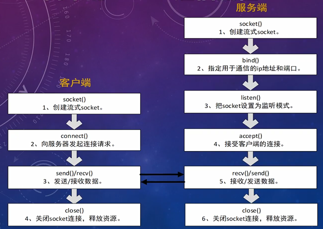

# C\C++网络编程，从socket到epoll

## socket的分类

- socket提供了流（stream）和数据报（datagram）两种通信机制，即流 socket和数据报 socket。
  - 流 socket基于TcP协议，是一个有序、可靠、双向字节流的通道，传输数据不会丟失、不会重复、顺序也不会错乱。
  - 数据报 socket基于UDP协议，不需要建立和维持连接，可能会丢失或错乱。UDP不是一个可靠的协议，对数据的长度有限制，但是它的效率比较高。
- 某些应用层协议，出于历史原因，受当时技术和网络条件限制，选择了基于UDP实现，其选择的理由现在很可能已经不再成立了。
- 实时的音视频聊天可能采用的是UDP，这种业务可以接受数据的丢失且不必重传。
- 本专题视频只介绍**流 socket**，数据报 socket的应用场景实在太少，以后可能更少。

## 简单的Socket通信流程

