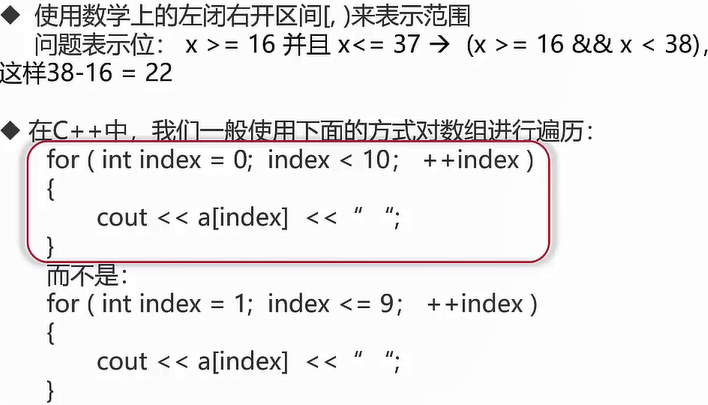
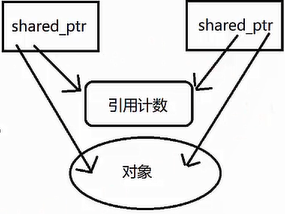
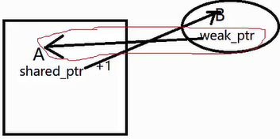
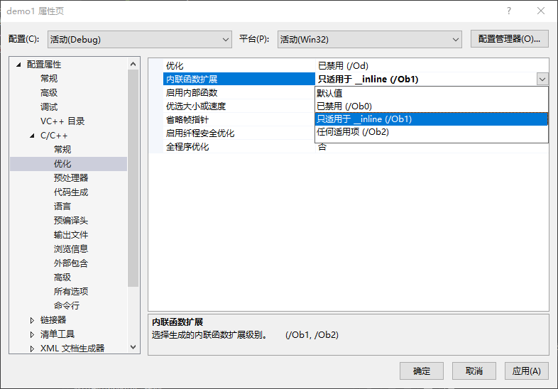

〖课程介绍〗:
        从学习角度看，C++是一门“见效慢”的语言；学习曲线陡峭，语言本身复杂。但，如果你想了解很多编程语言的思想源泉，想要一窥大型企业级开发工程的思路，想开发别人做不了的高性能程序，那C++就是你的不二之选。如果你想成为一名资深开发人员，想一窥底层细节，那么，这门课就是为你设计的。课程将从C++的发展史讲起，从知识与思想层面 从0带你构建C++知识框架，并会分享讲师亲历的大型项目实践思路，为你打下坚实的基础

〖课程目录〗:

[toc]


# 第1章 C++概括

了解C++的历史概况，C++语言的特点及C++语言作用，认识哪些场合下C++是无可替代的；

##  1-1 2020重C++ 课程导学

大型桌面应用

- Adobe Photoshop
- Google Chrome
- Microsoft offce

大型网站后台

- 搜索引擎

大型游戏后台

- 王者荣耀

大型游戏引擎

- Unreal、Unity

编译器/解释器

- LLVM/ClangGCC

- Java虛拟机

- javaScript引擎

视觉和只能引擎

- OpenCV
- TensorFlow

##  1-2 CPP的历史

1. C，C++发展历史
   - C++编程语言的历史可追溯到1979，Bjarne Stroustrup；创立了带类的G。顾名思义，这是C语言的超集：1983，语言的名字真正变成了C++
   - C++在最开始可以称作C语言的增强版，但在后来，C++又引入了很多新的功能，逐步增强了C++的可用性1998年伴随着STL标准库的诞生，一堆新的功能和特性的产生，C++标准委员会发布了第个国际标准C+++SO/EC1488：称为C++98；
2. C，C++发展历史（续）
   - 在2011年中期，C++标准（称为C++11）完成了新的标准Boost库项目对新标准产生了相当大的影响，一些新模块直接从相应的 Boost库中派生出来。
   - C++11—之后，C+以每三年一版的频度发布着新的语言标准，每一版都在基本保留向后兼容性的同时，提供着改进和新功能

##  1-3 CPP的特点

1. 为什么C++比C更好
   - 在中进行功能扩展会比较困难比如此例子里没有一个合适的位置来存储状态信息，一般而言，系统在不断增长过程中往往需要引入某些独一无二的东西，这样导致了在面对大型复杂系统是C的扩展非常的难以管理；
2. 优点
   1. **强大的抽象封装能力**：这让C+语言具备了强大的开发工程能力，时在封装的同时C+最大程度的保留了高性能；
   2. **高性能**：运行快，快并且占用资源少一直是C+语言的追求
   3. **低功耗**：特别适合在各种微型的嵌入式设备中运行高效的程序
3. 缺点
   1. 语法相对复杂，细节比较多，**习曲线比较陡**；
   2. 需要一些好的**规范和范式**，否则代码很**难维护**

##  1-4 CPP的应用

- 大型桌面应用程序如 Google Chrome和 Microsoft office
- 大型网站的后台，如 Google的搜索引擎
- 游戏和游戏引擎（如 Unity）
- 视觉库和AI引擎（如 Opencv和 ITensorflow）
- 数据库（Microsoft SQL Server和 Mongodb）
- 其他（如自动驾驶系统，嵌入式设备等）
- 总结
  - 总得来说，C++的适合：开发成本比较高；对于内存和CPU要很高，低功耗并且程序被调用非常频繁等场景中，目前来说C++语言是最合适的语言。

1-5 第一章课后练习题


# 第2章 C++基础语法

本章讲解编程语言的层次，编译语言的特点；深入学习C++常见的标识符，关键字，数据类型，变量，常量及；IDE Visual Studio的安装，使用和调试方法；

##  2-1 编译型语言

- 编程语言的层次和类型

  1. 机器（Machine）语言，汇编语言等
  2. 编译型语言，如C++，C等；
  3. 解释型语言，如 Basic，Python等；
  4. 脚本语言，如bash，csh等；

- 从上到下使用层次更接近于人类使用但运行效率逐渐降低

- 编译型语言一般需要经历**犏译和链接**的过程，才能变成真正可执行的程序

  

##  2-2 语言的数据类型

- C++中的每个变量都有其数据类型，数据类型决定这变量所占内存空间的大小和布局方式、该空间能存储的值的范围，以及变量能参与的运算。


```C++
// 常见数据类型的定义
char a[10]=a;
short int s= 97;
int m= 97;
long int n=97;
float f= 97.0f;
double d=97.0;
long double k=97.0;
bool b= true;
wchar_t w[10]=L"a";
```


##  2-3 开发环境的安装与使用1-安装

- 集成开发环境 Integrated Development Environment
  - 谈谈 Windows下的 `C++ IDE: Visual studio` 的安装与使用


2-4 开发环境的安装与使用2-使用于调试


##  2-5 语言的标识符和关键字

- C++中标识符是用来标识变量、函数、类、模块，或任何其他用户自定义项目的名字

  - 一个**标识符以字母 A-Z 或 a-z 或 下划线 开始**，后跟零个或多个字母、下划线和数字（0-9）；如 `button_emai1`
  - 一个标识符不允许使用数字开头，如 `1butn` 一个标识符内不允许出现标点字符，比如`@、&和%`
  - 不能将大小写混淆，C++是区分大小写的编程语言，比如，在C++ 中，Helloworld和 helloworld是两个不同的标识符
  - 不能使用C++关键字，原则上不允许长度超过32位

- 常见关键字（ keywords）

  | asm          | else      | new              | this     |
  | ------------ | --------- | ---------------- | -------- |
  | auto         | enum      | operator         | throw    |
  | bool         | explicit  | private          | true     |
  | break        | export    | protected        | try      |
  | case         | extern    | public           | typedef  |
  | catch        | false     | register         | typeid   |
  | char         | float     | reinterpret_cast | typename |
  | class        | for       | return           | union    |
  | const        | friend    | short            | unsigned |
  | const_cast   | goto      | signed           | using    |
  | continue     | if        | sizeof           | virtual  |
  | default      | inline    | static           | void     |
  | delete       | int       | static_cast      | volatile |
  | do           | long      | struct           | wchar_t  |
  | double       | mutable   | switch           | while    |
  | dynamic_cast | namespace | template         |          |

- 命名建议

  - 不要试图发明最好的命名规则，应该制定一个让大部分成员满意的命名规则，并且在项目组中贵彻执行
  - 标识符应该直观，可以望文知意，尽量使用英文单词组合的方式，不要使用汉语拼音；标
  - 识符的长度应当符合 `min-length&&max-information`原则，不是长度越长就越好，如 `maxVal` 比 `max Value UnitOverflow` 好；
  - 变量的名字尽量使用“名词”或“形容词+名词”，如vaue或newvalue，尽量**避免名字中出现数字**，如 value1，vaue2等，函数名可以使用“动词+名词”，如 DrawGraph

- 命名方式

  - Camel：驼峰
  - 匈牙利：类型+驼峰

##  2-6 变量与常量

- 变量定义的基本形式是：首先是型说明符随后紧跟由个或多个变量名组成的列表，其中变量名以逗号分隔，最后以分号结束。如：`int m=1，n=1；`

- 常量：

  - 在程序运行过程中，其值一直保持不变的量为常量常量也区分不同的类型如：

    - 2，1024为整数型
      20f，1024.0为实数型
    - `‘h’`为字符类型，
    - “hello world”为字符串类型，
    - true，false为boo类型等
    - 在编辑器中根据其表面形式即可判断其类型

  - C++中有两种简单的定义常量的方法：

    1. 使用#define，如：`#define p3.1415926；`

    2. 使用 const；如：`const double pl=3.1415926；`注明：尽量使用 const定义变量，

       > #define不会出现在编译器期
       > #define Aspect_ratio 1.653; // 在编译时出错，很难排错
       > const double Aspect_ratio=1.653；//在编译时出错，可以排错

  - 整数常量可以是十进制、八进制或十六进制的常量。

  - 前缀指定基数：0x或0X表示十六进制，0表示八进制，不带前缀默认表示十进制。

  - 整数常量也可以带一个后缀，后缀是∪和L的组合，U表示无符号整数（unsigned），L表示长整数（long）。后缀可以是大写，也可以是小写，∪和L的顺序任意。

    ```c++
    //整数常量
    212 //合法的
    215u //合法的
    0xfeel //合法的
    078 //非法的：8不是八进制的数字
    032UU //非法的：不能重复后缀
    ```

- 字符常量是括在单引号中。

  - 单引号表字符，双引号表字符串；
  - 如果常量以 L（仅当大写时）开头，则表示它是一个宽字符常量（例如L’x’），此时它必须存储在wchar_t类型的变量中。
  - 否则，它就是一个窄字符常量（例如x），此时它可以存储在char类型的简单变量中；
  - 字符常量可以是一个普通的字符（例如’x’）、一个转义序列（例如’\t’），或一个通用的字符（例如‘’\u02C0’)

2-7 语言的注释

```C++
/*123*/
//12342
```


2-8 第二章课后练习题

# 第3章 C++的运算符与表达式

理论结合实际，深入讲解C++表达式，表达式；分别讲解了算术运算符，关系运算符，逻辑运算符，位运算符，赋值运算符及杂项运算符及表达式，同时讲解了注释的用处和规范；

##  3-1 运算符表达式和基本语句

- 运算符是一种告诉编译器执行特定的数学或逻辑操作的符号C++内置了丰富的运算符。
- 在程序中，运算符是用来操作数据的，因此，这些数据也被称为操作数，使**用运算符将操作数连接而成的式子**称为：表达式表达式具有如下特点：
  - 常量和变量都是表达式，例如，常量3.14、变量i；
  - 运算符的类型对应表达式的类型，例如，算术运算符对应算术表达式
  - 每一个表达式都有自己的**值**，即表达式都有运算结果；

3-2 算术运算符


3-3 关系运算符


##  3-4 逻辑运算符

- 断言运算符，判断值是否符合预期：`assert(1 != 1);`

3-5 赋值运算符


3-6 位运算符


##  3-7 杂项运算符及运算符的优先级

- sizeof si2eof运算符返回变量的大小。
- Condition？X:：Y条件运篁符。如果 Condition为真？则值为X：否则值为Y。
- （点）和->（箭头）成员运篁符用于引用类、结构和共用体的成员
- Cast强制转换运篁符把一种欻据类型转换为另一种数据类型。例如，int(2.200)将返回2。
- &指针运符&返回变量的地址。
- 指针运篁符 `*` 指向一个变量。

## 3-8 语言的注释。

- 好的命名和代码本身就是最好的注释；如果代码本身很清楚，不需要额外加注释
- 在重要代码段，或复杂代码处先写注释再写代码，这样思路更清晰，同时可以保证代码和注释的一致性；
- 注释不是越多越好，它是对代码的提示，如果要写就要清楚，并且保证和代码一致，如果更新了代码，请更新相应的注释

3-9 第三章课后练习

## 3-10 补码


- 为什么要用补码

  - 我们在设计软件系统时总是希望软件系统尽可能得简单通用于是人们希望

  - 在只有加法运算器的情况下设计一种方法能计算减法现在是8点，3小时前是5点，9小时以后呢，还是5点。

  - 为什么？

  - 因为：8+9-12=5，还是5点这里实际上进行了模12操作，还有一个关键点，总共只有12个数；我们得到一个结论

    8-3和8+9的结果是一样的；

     用9去表示-3然后如果想计算减法8-3，就直接在计算器上输8+9


3-11 补码2

3-12 补码及位运算说明

# 第4章 C++基础容器

本章我们将深入剖析C++数组：传统的数组优缺点及STL中vector的使用和思想；剖析C++的字符串： 对比C的字符串，C++的字符串，Redis字符串的处理；

##  4-1 序列容器--数组

- 概念
  代表内存里组连续的同类型存储区可以用来把多个存储区合并成一个擊体1-234比如
  `int arr[10]={1,2,3,4,5,6,7,8}`
- 数组声明
  `int arr[10]`
  - 类型名称n表示数组里所有元素的类型
  - 名称arr是数组的名称
  - 整数10表示数组里包含的元素个数
  - 数组里元素个数不可以改变
- 使用
  - 每个元素都有下标通过下标可以直接访问任意一个元素
  - 下标从0开始到元素个数减一为
  - 超过范围的下标不可以使用
  - 数组名称和下标一起可以表示数组里的元素 a[4]
- 优点
  - 可以编写循环依次处理数组里的所有元系
  - 循环变量依次代表所有有效下标

##  4-2 off-by-one error数组下标


- 这里最容易出错就是`high-low+1;`




##  4-3 数组增删改查及二维数组

- 访问数组

  - 时间复杂度 O(1)
  - 下标：`a[1]=5;`
  - 指针：`int *p=a; *(p+2)=5;`

- **查找数组**

  - 时间复杂度 O(n)

  ```c++
    int a[] = {1, 2, 3, 4};
    int len = sizeof(a) / sizeof(a[0]); //得到数组容量
    for (int index = 0; index < len; ++index)
    {
      if (a[index] == 3)
      {
        cout << index << endl;
        return index;
      }
    }
  ```

- **删除数组元素**

  ```C++
  
  ```

- **修改数组元素**

  ```C++
  
  ```

- **二维数组：**

  - 包含行列两个维度的数组

  ```C++
    int a[2][4] = {{1, 2, 3, 4}, {5, 6, 7, 8}};
    for (int row = 0; row < 2; row++)
    {
      for (int col = 0; col < 4; col++)
      {
        cout << a[row][col] << " ";
      }
      cout << endl;
    }
  ```

  - tips：循环时尽可能要满足 “**空间局部性**”：
    - 在一个小的时间窗口内，**访问的变量地址越接近越好**，这样执行速度快；
    - 也就是说：一般来说，需要将**最长的循环放在最内层**，**最短的循环放在最外层**，以减少CPU跨切循环层的次数；

##  4-4 动态数组 Vector

4-5 动态数组vector2

- Vector **面向对象方式的动态数组**

  - 使用最简单的数组，无法实现动态扩容插入元素，因为容量有限

- **Vector 尾部添加操作**

  - 使用 Vector容器，轻松实现动态扩容插入元素，传统的C数组，容量有限，vector可以动态管理扩容；
  - `vec.push_back(5)`

  ```C++
  #include <vector>
    using namespace std; // 使用 vector之前的准备活动
    vector<int> vec = {1, 2, 3, 4};
    vec.push_back(5); // 在尾部进行元素插入操作
  ```

- **Vector 的遍历操作**

  - 可以使用 vec 的 `capacity` 和 `size` 方法来查看 vector当前的容量和已经存储的元素个数；

  ```C++
  #include <vector>
    using namespace std; // 使用 vector之前的准备活动
    vector<int> vec = {1, 2, 3, 4};
    cout << vec.capacity() << " " << vec.size() << endl; // 先查看大小，自动扩容
    vec.push_back(5);                                    // 在尾部进行元素插入操作
    for (int i = 0; i < vec.size(); i++)
    {
      cout << vec[i] << " " << vec.capacity() << " " << vec.size() << endl;
    }
  ```

- **Vector 的插入操作**

  - `vec.insert(--vec.end(),4);` 插入到最后一个元素之前

- **Vector 的删除操作**

  - `vec.pop_back();`  尾部删除
  - `vec.erase(vec.end()-1);` 删除尾部元素

```C++
  vector<int> vec = {1, 2, 3, 4};
  // 先查看大小，自动扩容
  for (int i = 0; i < vec.size(); i++)
  {
    cout << vec[i] << " " << vec.capacity() << " " << vec.size() << endl;
  }
  cout << "尾部插入" << endl;
  vec.push_back(5); // 尾部插入
  for (int i = 0; i < vec.size(); i++)
  {
    cout << vec[i] << " " << vec.capacity() << " " << vec.size() << endl;
  }
  cout << "尾部删除" << endl;
  vec.pop_back(); // 从尾部删除
  for (int i = 0; i < vec.size(); i++)
  {
    cout << vec[i] << " " << vec.capacity() << " " << vec.size() << endl;
  }
  cout << "指定位置插入" << endl;
  vec.insert(vec.end() - 1, 6); // 指定位置插入
  for (int i = 0; i < vec.size(); i++)
  {
    cout << vec[i] << " " << vec.capacity() << " " << vec.size() << endl;
  }
  cout << "指定位置删除" << endl;
  vec.erase(vec.end() - 2); // 指定位置删除
  for (int i = 0; i < vec.size(); i++)
  {
    cout << vec[i] << " " << vec.capacity() << " " << vec.size() << endl;
  }
```


##  4-6 字符串简介

- 字符串变量与常量

  - 字符串变量
    - 字符串是以空字符（`\0`）结束的字符数组
    - 空字符`'\0'`自动添加到字符串的内部表示中
    - 在声明字符串变量时，应该位这个空结束符预留一个额外元素的空间如：`char strHelloWorld1[11={"helloworld"}；`
  - 字符串常量
    - 字符串常量是一对双引号括起来的字符序列
    - 字符串中每个字符作为一个数组元素存储
    - 例如字符串"helloworld"

- 关于字符表示的说明

  - `0`，`'\0'`与 `‘0’`在计算机內部的机器码表示

    ```C++
    char c1=0   ;//0x00
    char c2='\0';//0x00
    char c3='0' ;//0x30
    ```

  - ASC码表

    - ASCII（American Standard Code for Information Interchange，美国信息交换标准代码）是基于拉丁字母的-套电脑编码系统，主要用于显示现代英语和其他西欧语言。
    - 它是最通用的信息交换标准，并等同于国际标准SO/EC646ASC码使用指定的7位或8位二进制数组合来表示128或256种可能的字符。
    - 编码表可以参考：
      0×41（十进制65）对应A；0x30（十进制48）对应字符“00×61（十进制97）对应a；0X7F（+进制127）对应字符DEL

  - Unicode编码最初的目的是把世界上的文字都映射到一套字符空间中；

    - 为了表示 Unicode字符集，有3种（确切的说是5种）Unicode的编码方式
      1. UTF8：1byte来表示字符，可以兼容ASC码特点是存储效率高，变长（不方便内部随机访问）无字节序问题（可作为外部编码）
      2. UTF-16：分为UTF16BE（big endian）
         UTF-16LE（little endian特点是定长（方便内部随机访问
         有字节序问题（不可作为外部编码）
      3. UTF-32：分为UTF-32 BE（big endian UTF-32LE（little endian特点是定长（方便内部随机访问，有字节序问题（不可作为外部编码）
    - 编码错误的根本原因在于编码方式和解码方式的不统一；
    - Windows的文件可能BOM（byte order mark）如要在其他平台使用，可以去掉BOM

## 4-7 Unicode编码

C++转义序列的编码

| 字符名称   | ASCII 符号 | C++代码 | 十进制 ASCII 码 | 十六进制 ASCII 码 |
| :--------- | :--------- | :------ | :-------------- | :---------------- |
| 换行符     | NL(LF)     | \n      | 10              | 0xA               |
| 水平制表符 | HT         | \t      | 9               | 0x9               |
| 垂直制表符 | VT         | \v      | 11              | 0xB               |
| 退格       | BS         | \b      | 8               | 0x8               |
| 回车       | CR         | \r      | 13              | 0xD               |
| 振铃       | BEL        | \a      | 7               | 0x7               |
| 反斜杠     | \          | \\      | 92              | 0x5C              |
| 问号       | ?          | \?      | 63              | 0x3F              |
| 单引号     | '          | \'      | 39              | 0x27              |
| 双引号     | "          | \"      | 34              | 0x22              |

**欧拉公式**

$e^{πi}+1=0$


**无符号数的编码**
用一个函数 B2Uw（Binary to Unsigned的缩写，长度为 w）来表示：


**有符号数的补码**
用函数 B2Tw(Binary to Two’s-complement 的缩写，长度为 w)来表示：


**字节序**

- Big Endian
- Little Endian

##  4-8 字符串的指针表示

1. 指针表示方法：`char*pstrhello Wrold helloworld` 
2. `char[]`和`char*`的区别，把握两点：
   - 地址和地址存储的信息；可变与不可变；
3. **值可变不可变取决于所指区间的存储区域是否可变**；
   - 取决于内存区间，只能修改变量区间的值。

##  4-9 字符串基本操作

4-10 字符串基本操作2

- 字符串基本操作，兼容C语言

  - 字符串长度：`strlen(s)`
    返回字符串的长度，实际长度
  - 字符串比较：`strcmp(1，S2)`
    如果s1和s2是相同的，则返回0；如果s1<s2则返回值小于0如果s1>s2则返回值大于0
  - 两个字符串自左向右逐个字符相比（按ASC值大小相比较），直到出现不同的字符或遇`'\0'`为止。如：`"A"<"B“"A"<"AB"；"Apple"<"Banana A"<"a"compare"<"computer"`
  - 字符串拷贝：`strcpy(s1，s2)`
    复制字符串s2到字符串s1；
  - 复制指定长度字符串：`strncpy（s1,s2,n)`，将字符串s2中前n个字符拷贝到s1中
  - 字符串拼接：`strcat（s1，s2）`
    将字符串s2接到s1后面
  - 查找字符串：`strchr（s1，ch）`
    指向字符串s1中字符ch的第一次出现的位置；
  - 查找字符串：`strstr（s1，s2）`
    指向字符串s1中字符串s2的第一次出现的位置；

- 去掉 API 警告：`_CRT_SECURE_NO_WARNINGS`

  

  - 会导致内存溢出问题，可以修改变量或语句
  - 新的安全 API
    - `strcpy_s()`
    - `strcat_s()`: `strcat_s(strHelloWorld2, STR LEN NUM, " Welcome to C++);`
  - 注请使用 `strlen_s，strcpy_s，strncpy_s，strcat_s`等AP函数，更安全

- Redis 字符串的设计https://redis.io

  

##  4-11 string的简介

- C++标准库中提供了 string类型专门表示字符串：

  ```C++
  #include <string>
  using namespace std;
  ```

- 使用 string可以更为**方便和安全**的管理字符串

- 定义字符串变量

  ```C++
  string s;//定义空字符串
  string s="helloworld";//G定义并初始化
  string s=("helloworld");
  string s= string("helloworld");
  ```

- 获取字符串的长度

  ```C++
  cout << s1.length() << endl;
  cout << s1.size() <<end;//本质和上面一样
  cout << s1 capacity()<< end;
  ```

- 字符串比较：`== != > >= < <=`

- 转换为C风格的字符串

  ```C++
  const char*c_str1 =s1.c_(); 
  cout <<The C-style string c_str1 is："<<c_str1<< endl;
  ```

- 随机访问（获取字符串中某个字符）：`[]`
  `string s="hello"; s[0]="h";//hello`

- 字符串拷贝：`=`
  `string s1="hello"`
  `string s2=s1`

- 字符串连接：`+、+=`

  ```C++
  string s1 ="hello", S2 =world;
  string s3=S1 +s2;//s3：helloworld 
  s1+=s2;//s1：helloworld
  ```

- 总结：string结合了C++的新特性，使用起来比原始的C风格方法更安全和方便，对性能要求不是特别高的常见可以使用。


# 第5章 彻底学会 C++ 指针，引用

指针是C++重点：深入讲解指针的概念，各种类型的指针，const指针，数组指针与指针数组；指针的指针，指向函数的指针；更高级的内容：如何避免野指针，各种指针的使用场景，及实际工程中必须避免的用法和相对好的做法；讲解引用与指针的关系： 会使用引用，知道实际工程中比较好的一些做法；...

## 5-1 指针的概念

- C++中内存单元内容与地址

  - 内存由很多内存单元组成。这些内存单元用于存放各种类型的数据
  - 计算机对内存的每个内存单元都进行了编号，这个输号就称为内存地址，地址决定了内存单元在内存中的位置
  - 记这些内容单元地址不方便，于是C++语言的编译让我们通过名字来访问这些内存位置

- C++中内存单元内容与地址

- 指针的定义和间接访问操作

  - 指针定义的基本形式：指针本身就是一个变量，其符合变量定义的基本形式，它存储的是值的地址。对类型T，`T*`是“到T的指针”类型，一个类型为`T*`的变量能保存一个类型T的对象的地址。

    ```C++
    int a=112;
    float c=3.14;
    int*d=&a;
    float*e=&c;
    ```

  - 通过一个指针访问它所指向地址的过程称为间接访问（indirection）或者引用指针（dereferencing the point）
    这个用于执行间接访问的操作符是单目操作符*
    `cout <<（*d）<< endl；cout <<（*e）<< endl；`


## 5-2 左值与右值

- 概念
  - 一般说法，编译器为其**单独分配了一块存储空间，可以取其地址的**，左值可以放在赋值运算符左边;
  - 右值指的是**数据本身；不能取到其自身地址，右值只能赋值运算右边**；
- 具体分析：
  - 左值最常见的情况如函数和数据成员的名字；
  - 右值是没有标识符、不可以取地址的表达式，一般也称之为"**临时对象**"。
    比如：`a=b+C；`
    `&a`是允许的操作，而`&（b+c）`不能通过编译，因此a是一个左值，而（b+C）是一个右值；


## 5-3 一般指针，数组指针和指针数组

- 一般类型指针`T*`
  T是一个泛型，泛指任何一种类型；如

  ```C++
  int i=4；int*ip=&i；
  cout <<（*ip）<< endl double d =3.14；
  double*dP=&d；
  cout <<（*dP）<< endl; 
  char c='a';
  char*cp=&c;
  cout <<（*cP）<< endl;
  ```

- 指针的数组（array of pointers）与数组的指针（a pointer to an array）

  - 指针的数组`T*t[]`
  - 数组的指针`T（*t）[]`

  ```C++
  如
  int*a[4]；指针类型的数组
  int（*b）[4]；注意：[]优先级比较高, 指向数组的指针
  ```

  

## 5-4 const与指针

- const 修饰指针变量时，优先匹配左侧

  - 唯一 `const` 位于符号 `*` 左侧, 表示指针所指数据为常量, 数据不能通过本指针改变, 但可以通过其它方式修改; 指针本身是变量, 可以指向其它内存单元

    - `const int *p = a; 等价于 int const *p=a;`

  - 唯一 const 位于符号 * 右侧, 表示指针本身是常量, 不能改变指针指向, 数据可以通过本指针改变

    - `int * const p = a`

  - 在符号 * 左右各一个 const 时, 表示指针和所指数据都是常量, 都不能改变

    - `const int * const p = a`

  - > 调用时变量前加 "&" -------返回该变量的地址
    >
    > 声明时变量前加 "基本类型 *" -------该指针变量表示另一个普通变量的地址  eg:int * 或 char *
    >
    > 调用时变量前加 "*"-------表示取该地址的内容
    >
    > 声明时变量前加 "基本类型 **"-------该二级指针变量表示另一个一级"基本类型 *"指针变量地址  


## 5-5 指向指针的指针


## 5-6 关于野指针

原始指针

- **未初始化和非法的指针**
  例子：

  ```C++
  int *a;  //注意：a这里指向哪里？
  *a=12;		//这里会发生什么？
  ```

  - 运气好的话：定位到一个**非法地址**，程序会出错，从而终止。
  - 最坏的情况：定位到一个可以访问的地址，无意修改了它这样的错误难以捕捉，引发的错误可能与原先用于操作的代码完全不相干！
  - **用指针进行间接访问之前，一定要非常小心，确保它已经初始化，并被怡当的赋值。**

- **NULL指针**

  - 一个特殊的指针变量，表不指向任何东西如
    - `int *a=NULL；`
  - NULL指针的概念非常有用
    - 它给了一种方法，来表示特定的指钍目前未指向任何东西
  - 使用的注意事项
    - 对于一个指针，如果已经知道将被初始化为什么地址，那么请赋给它这个地址值，否则请把它设置为NULL在对一个指针进行间接引用前，请先判断这个指针的值为否为NULL

- **杜绝“野”指针**

  - 指向“垃圾”内存的指针。if 等判断对它们不起作用，因为没有置 NULL；
  - 一般有三种情况
    1. 指针变量没有初始化
    2. 已经释放不用的指针没有置NULL，如 `delete`和`free`之后的指针
    3. 指针操作超越了变量的作用范围；
  - 指针使用的注意事项：**没有初始化的，不用的或者超出范围的指针请把值置为NULL**。


## 5-7 指针的基本操作

1. `&、* ` 操作符

   

   

2. `++、--` 操作符

   ```assembly
   #char* cp2=++cp;
   003716E2 mov eax, dword ptr [cp]
   003716E5 add ea×,1
   003716E8 mov dword ptr [cp],eax
   003716EB mov ecx, dword ptr [cp]
   00371 6EE mov dword ptr [cp2]ecx 
   
   #char* cp3= cp++;
   003716F1 mov eax, dword ptr [cp]
   003716F4 mov dword ptr [cp3],eax
   003716F7 mov ecx, dword ptr [cp]
   003716FA add ecx,1
   003716FD mov dword ptr [cp],ecx
   
   
   #char *cp4=--cp;
   00941700mov eax，dword ptr[cp]
   00941703 sub eax.1
   00941706mov dword ptr[cp]，eax
   00941709mov ecx，dword ptr[cp]
   0094170cmoV dword ptr[cp4]，ecx 
   
   #char*cp5= cp++;
   0094170FmoV eax，dword ptr[cp]
   00941712mov dword ptr[cp5]，eax
   00941715mov ecx，dword ptr[cp]
   00941718sub ecx.1
   0094171Bmov dword ptr[cp]，ecx
   ```

3. 关于`++++，----`等运算符：

   1. 编译器程序分解成符号的方法是：一个字符一个字符的读入，如果该字符可能组成一个符号，那么读入下一个字符，一直到读入的字符不再能组成一个有意义的符号。这个处理过程称为“贪心法”
      例如：

      ```C++
      int a=1，b=2,c；
      C=a+++b；//相当于a++ +b 
      d=a++++b；//相当于a++ ++b，error，a++ + ++b
        
        int a = 1, b = 2, c;
      	c = a++ + ++b;
      	std::cout << c << " " << b; // 4 3
      
      	int a[] = { 1,2,3,4 }, b = 2, c=0, * p = a;
      	//c = a++ + ++b;
      	++* ++p; // a={1, 3, 3, 4}
      	std::cout << c << " " << b; // 4 3
      ```

      ```assembly
      #++* ++p; // a={1, 3, 3, 4}
      004C22FF  mov         eax,dword ptr [p]  
      004C2302  add         eax,4  
      004C2305  mov         dword ptr [p],eax  
      004C2308  mov         ecx,dword ptr [p]  
      004C230B  mov         edx,dword ptr [ecx]  
      004C230D  add         edx,1  
      004C2310  mov         eax,dword ptr [p]  
      004C2313  mov         dword ptr [eax],edx 
      ```

      

5-8 指针的基本操作二

5-9 指针的基本操作三


## 5-10 CPP程序的存储区域划分

- 每行代码在内存单元中的地址位置

  ```C++
  #include <iostream>
  using namespace std;
  int a = 0;			// （GVAR)全局初始化区
  int* p1;			// （bss）全局未初始化区
  int main()
  {
  	int b = 1;				// （stack）栈区变量
  	char s[] = "abc";		// （stack）栈区变量
  	int* p2 = NULL;			// （stack）栈区变量
  	const char* p3 = "123456"; //123456\0在常量区，p3在（stack）栈区
  	static int c = 0;		// （GVAR全局（静态）初始化区
  	p1 = new int(10);		// （heap）堆区变量
  	p2 = new int(20);		// （heap）堆区变量
  	char* p4 = new char[7]; // （heap）堆区变量
  	strcpy_s(p4, 7, "123456");
  	c = 1;
  	return 0;
  }
  ```


5-11 CPP程序的存储区域划分总结

## 5-11 **内存分区模型**

- 代码区：存放函数体的二进制代码，由操作系统管理
- 全局区：存放全局变量、静态变量以及常量
- 栈区：由编译器自动分配释放，存放函数参数值、局部变量等
- 堆区：由程序员分配、翻译，若程序员不翻译，程序结束时由操作系统回收


## 5-12 CPP动态分配和回收原则

- 动态分配资源-**堆（heap）**

  1. 从现代的编程语言角度来看，使用堆，或者说使用动态内存分配，是一件很自然不过的事情。
  2. 动态内存带来了不确定性：内存分配耗时需要多久？失败了怎么办？
     在实时性要求比较高的场合，如一些嵌入式控制器和电信设备。
  3. 一般而言，当我们在堆上分配内存时，很多语言会使用new这样的关键字，有些语言则是隐式分配。在C++中new的对应词是 delete，因为C++是可以让程序员完全接管内存的分配释放的。

- 程序通常需要牵涉到三个内存管理器的操作

  1. **分配一个某个大小的内存块**

  2. **释放一个之前分配的内存块；**

  3. 垃圾收集操作，寻找不再使用的内存块并予以释放；

     这个回收策略需要实现性能、实时性、额外开销等各方面的平衡，很难有统一和高效的做法；

     C++做了1，2两件事；而Java则做了1，3两件事；

## 5-13 RAII初步

资源管理方案-**RAII（Resource Acquisition Is Initialization）**

- C++所特有的资源管理方式。有少量其他语言，如D、Ada和Rust也采纳了 RAII 。但主流的编程语言中，**C++是唯一一个依赖 RAII 来做资源管理的**。
- **RAII 依托栈和析构函数**，来对所有的资源——包括堆內存在内进行管理。对 RAII 的使用，使得C++不需要类似于Java那样的垃圾收集方法，也能有效地对內存进行管理。 RAII 的存在，也是垃圾收集虽然理论上可以在C++使用，但从来没有真正流行过的主要原因。
-  RAII 有些比较成熟的智能指针代表：如`std::auto_ptr`和 `boost:shared_ptr`

## 5-14 几种变量的对比

**栈和堆中的变量对比**

|                | 栈（stack）区                                                | 堆（heap）区                                             |
| -------------- | ------------------------------------------------------------ | -------------------------------------------------------- |
| 作用域         | 函数体内，语句块{}作用域                                     | 整个程序范围内，由 new，malloc 开始，delete，free 结束； |
| 编译间大小确定 | 变量大小范围确定                                             | 变量大小范围不确定，需要运行期间确定                     |
| 大小范围       | Windows 系统默认栈大小是 1M，Linux 常见默认的栈大小是 8M或10M（`ulimit-s` 查看，不同版本命令不同） | 所有系统的堆空间上限是接近内存（虚拟内存）的总大小的；   |
| 内存分配方式   | 地址由高到低减少                                             | 地址由低到高增加                                         |
| 内容是否可变   | 可变                                                         | 可变                                                     |

**全局静态存储区和常量存储区的变量对比**

|                      | 全局静态存储区     | 常量存储区 |
| -------------------- | ------------------ | ---------- |
| 存储内容             | 全局变量，静态变量 | 常量       |
| 编译期间大小是否确定 | 确定               | 确定       |
| 内容是否可变         | 可变               | 不可变     |


## 5-15 内存泄漏

- **内存泄漏（Memory Leak）**问题
  - 什么是内存泄漏问题：**指程序中己动态分配的堆内存由于某种原因程序未释放或无法释放，造成系统内存的浪费，导致程序运行速度减慢甚至系统崩溃等严重后果.**
  - 内存泄漏发生原因和排查方式：
    1. 内存泄漏主要发生在**堆内存分配**方式中，即“配置了内存后，所有指向该内存的指针都遗失了”。若缺乏语言这样的垃圾回收机制，这样的内存片就无法归还系统。
    2. 因为内存泄漏属于程序运行中的问题，无法通过编译识别，所以**只能在程序运行过程中来判别和诊断。**

## 5-16 智能指针auto_ptr

- 比指针更安全的解决方案
  使用指针是非常危险的行为，可能存在空指针，野指针问题并可能造成内存泄漏问题。
  可指针又非常的高效，所以我们希望以更安全的方式来使用指针。

  - 一般有两种典型的方案：
    1. **使用更安全的指针一智能指针；**
    2. 不使用指针，使用更安全的方式-引用；

- C++中推出了四种常用的智能指针
  `unique_ptr、shared ptr、weak_ptr` 和C++11中已经**废弃**`（deprecated）的 auto ptr`，在C++17中被正式删除；

- 这里，我们从应用方面来分析这几种智能指针

  1. 应用场景
     - 对象所有权
     - 生命周期；
  2. 性能分析；

-  **auto_ptr：**

  

  - 由 `new expression` 获得对象，在 `auto_ptr` 对象销毁时，他所管理的对象也会自动被 `delete` 掉。
  - 所有权转移：不小心把它传递给另外的智能指针，原来的指针就不再拥有这个对象了在拷贝/赋值过程中，会直接**剥夺指针对原对象对内存的控制权**，转交给新对象，然后再将原对象指针置为 `nullptr`。

  ```C++
  #include <iostream>
  #include <string>
  #include <memory>
  using namespace std;
  int a = 0;			// （GVAR)全局初始化区
  int* p1;			// （bss）全局未初始化区
  int main()
  {
  	int b = 1;				// （stack）栈区变量
  	char s[] = "abc";		// （stack）栈区变量
  	int* p2 = NULL;			// （stack）栈区变量
  	const char* p3 = "123456"; //123456\0在常量区，p3在（stack）栈区
  	static int c = 0;		// （GVAR全局（静态）初始化区
  	p1 = new int(10);		// （heap）堆区变量
  	p2 = new int(20);		// （heap）堆区变量
  	char* p4 = new char[7]; // （heap）堆区变量
  	strcpy_s(p4, 7, "123456");
  	c = 1;
  	auto_ptr<string>p9(new string("C++"));
  	std::cout << *p9;
  	return 0;
  }
  ```

  

## 5-17 智能指针 unique_ptr

- **`unique_ptr:`**

  

  - `unique_ptr`是专属所有权，所以 `unique_ptr`管理的内存，**只能被一个对象持有，不支持复制和赋值。**
  - 移动语义：`unique_ptr`禁止了拷贝语义，但有时我们也需要能够转移所有权，于是提供了移动语义，即可以使用`std::move()`进行控制所有权的转移。

  ```C++
  #include <iostream>
  #include <string>
  #include <memory>
  using namespace std;
  int main()
  {
  	// unique_ptr
  	auto w = std::make_unique<int>(10);
  	cout << *(w.get()) << endl;
  	//auto w2 = w; // 编译错误如果想要把w复制给w2，是不可以的。
  	//因为复制从语义上来说，两个对象将共享同一块内存
  
  	//unique ptr只支持移动语义，即如下
  	auto w2 = std::move(w);
  	cout << ((w.get() != nullptr) ? (*w.get()) : -1) << endl;
  	cout << ((w2.get() != nullptr) ? (*w2.get()) : -1) << endl;
  	return 0;
  }
  ```

  - 以大括号为有效范围，超出失效。块作用域。

## 5-18 shared_ptr 和 weak_ptr 理论讲解

- **`shared_pt`** 通过一个引用计数共享一个对象。

  

  - `shared_ptr`是为了解决 `auto_ptr`在对象所有权上的局限性，在使用**引用计数的机制**上提供了可以共享所有权的智能指针，当然这需要额外的开销。
  - 当引用计数为`0`时，该对象没有被使用，可以进行**析构**。

- 循环引用：**引用计数会带来循环引用的问题**

  - 循环引用会导致堆里的内存无法正常回收，造成内存泄漏。

  

- **`weak_ptr`** 被设计为与 `shared_ptr` 共同工作，**用一种观察者模式工作**。

  

  - 作用是协助 `shared_ptr` 工作，可获得资源的观测权像旁观者那样观测资源的使用情况。
  - 观察者意味着`weak_ptr`只对 `shared_ptr` 进行引用，而不改变其引用计数，当被观察的 `shared_ptr`失效后，相应的 `weak_ptr`也相应失效。

- `shared_ptr` 支持`std::move()`

**5-19 shared_ptr 和 weak_ptr 代码演示**

```C++
	{
		auto wA = shared_ptr<int>(new int(20));
		{
			auto wB = wA;
			cout << ((wA.get() != nullptr) ? (*wA.get()) : -1) << endl; //20
			cout << ((wB.get() != nullptr) ? (*wB.get()) : -1) << endl; //20
			cout << wA.use_count() << endl; //2
			cout << wB.use_count() << endl; //2
		}
		//cout << wB.use_count() << endl;
		cout << wA.use_count() << endl;
	}
```

**避免循环引用代码**

```C++
#include <iostream>
#include <string>
#include <memory>
using namespace std;

struct B;
struct A {
	shared_ptr<B>pb;
	~A() {
		cout << "~A" << endl;
	}
};
struct B
{
	shared_ptr<A>pa;
	~B() {
		cout << "~B" << endl;
	}
};
struct BW;
struct AW {
	shared_ptr<BW>pb;
	~AW() {
		cout << "~AW" << endl;
	}
};

struct BW
{
	weak_ptr<AW>pa;
	~BW() {
		cout << "~BW" << endl;
	}
};
// pa和pb存在着循环引用，根据 shared_ptr引用计数的原理，pa和pb都无法被正常的释放
// weak ptr是为了解决 shared ptr双向引用的问题
void Test() {
	cout << "Test shared_ptr and shared_ptr:" << endl;
	shared_ptr<A>tA(new A());
	shared_ptr<B>tB(new B());
	cout << tA.use_count() << endl; // 1
	cout << tB.use_count() << endl; // 1
	tA->pb = tB;
	tB->pa = tA;
	cout << tA.use_count() << endl; // 2
	cout << tB.use_count() << endl; // 2
};

void Test2() {
	cout << "Test weak_ptr and shared_ptr:" << endl;
	shared_ptr<AW>tA(new AW());
	shared_ptr<BW>tB(new BW());
	cout << tA.use_count() << endl; // 1
	cout << tB.use_count() << endl; // 1
	tA->pb = tB;
	tB->pa = tA;
	cout << tA.use_count() << endl; // 1
	cout << tB.use_count() << endl; // 2
};
int main()
{

	Test();
	Test2();
}
```


## 5-20 引用

- 引用是什么？
  - 是一种特殊的指针，**不允许修改的指针。**
- 使用指针有哪些坑:
  - 空指针;
  - 野指针；
  - 不知不觉改变了指针的值，却继续使用；
- 使用引用，则可以:
  - **不存在空引用；**
  - **必须初始化;**
  - **一个引用永远指向它初始化的那个对象;**
- 有了指针为什么还需要引用？
  - Bjarne stroustrup的解释
  - 为了支持**函数运算符重载**；
- 有了引用为什么还需要指针？
  - Bjarne Stroustrup的解释
  - 为了**兼容C语言**；
- 补充，关于函数传递参数类型的说明
  1. 对内置**基础类型**（如 int，double等）而言，在函数中传递时 **传值(pass by value)** 更高效
  2. 对OO**面向对象**中自定义类型而言，在函数中传递时 **传引用(pass by reference to const)** 更高效；


# 第6章 C++基础句法

深入讲解基本语句：赋值语句，判断语言，循环语言for, while；深入讲解基本数据与结构，枚举，结构体和联合体；深入讲解函数，递归函数的来龙去脉；浅析类与面向对象的概念；谈谈命名空间的使用。

6-1 图灵机与三种基本结构


6-2 if语句基础


6-3 if语句的例子


6-4 switch分支基础


6-5 switch和if的对比


6-6 自定义类型--枚举


6-7 自定义类型--结构体与联合体


6-8 结构体的内存布局


6-9 三种循环的基本使用与比较


6-10 for循环的一个优化实例


6-11 函数基础


## 6-12 函数重载overload与Name Mangling

- 返回类型：一个函数可版回一个值
- 函数名称：这是函数的实际名称，**函数名和参数列表一起构成了函数签名**。
- 参数：参数列表包括函数参数型、顺序、数量参数是可选的也就是说，函数可能不包含参数
- 函数主体：函数主体包含一组定义函数执行任务的语句


## 6-13 指向函数的指针与返回指针的函数

- 指向函数的指针

  ```C++
  int (*p)(int);
  p=func;
  ```

  

## 6-14 命名空间。

```C++
using namespace std;

std::cout<<"";
```


6-15 函数体的Hack过程


## 6-16 内联函数。

- 如果一个函数是内联的，那么在编译时，编译器会把该函数的代码副本放置在每个调用该函数的地方。
- 引入内联函数的目的是为了解决程序中函数调用的效率问题（空间换时间）
  - 注意：内联函数内部不能有太复杂的逻辑，编译器有时会有自己的优化策略，所以内联不一定起作用




## 6-17 数学归纳法与递归

- 从数学归纳法说起

  数学归纳法是证明当n等于任意一个自然数时某命题成立证明步骤分两步：

  1. 证明当n=1时命题成立；
  2. 假设n=m时命题成立，那么可以推导出在n=m+1时命题也成立（m代表任意自然数）；

- 证明世界上所有的人都是秃子：

  我们知道：

  1. 0根头发的人是秃子，有1根头发的人也是秃子
  2. 假设有n根头发的人是秃子；那么有n+1根头发的人也是秃子；所以，所有人都是秃子；


- 重复运算，时间和空间大量浪费

- 递归的四个基本法则

  1. 基准情形：无须递归就能解出；
  2. 不断推进：每一次递归调用都必须使求解状况朝接近基准情形的方向推进
  3. 设计法则：假设所有的递归调用都能运行；
  4. **合成效益法则（compound interest rule）**：求解一个问题的同一个实例时，切勿在不同的递归调用中做重复性的工作；

  由此可见，使用递归来计算诸如斐波那契数列数列并不是一个好主意；

  

## 6-18 递归的特点和Hack过程

- 递归是一种重要的编程思想：
  1. 很多重要的算法都包含递归的思想；
  2. 递归最大的缺陷：
     1. 空间上需要开辟大量的栈空间；
     2. 时间上可能需要有大量重复运算；
- 递归的优化
  1. **尾递归**：所有递归形式的调用都出现在函数的末尾；
  2. **使用循环替代；**
  3. **使用动态规划，空间换时间；**

6-19 尾递归的优化


## 6-20 递归的动态规划思路


# 第7章 C++高级语法

深入剖析C++类型转换：显式转换的四种常见的方式，隐式转换类型转换的影响； 用通俗易懂的方式深入浅出讲解异常，IO，文件，线程，模版编程，这些很难难用的部分；

## 7-1 从抽象到面向对象编程

- C++使用 struct、cass来定义一个类：

  - **struct 的默认成员权限是 public，**

  - **class 的默认成员权限是 private**，

    除此之外，二者基本无差别

7-2 面向对象的抽象法则1-具体类型的抽象


7-3 对象的属性


## 7-4 运算符重载

```C++
#include <iostream>
using namespace std;
class myComplex //复数类
{
private:
  double real, imag; //复数的实部和虚部
public:
  myComplex();
  myComplex(double r, double i);
  myComplex addCom(myComplex c);                                        //成员函数, 调用者对象与参数对象c相加
  void outCom();                                                        //成员函数, 输出调用者对象的有关数据
  myComplex operator-(const myComplex &c);                              //成员 重载函数
  friend myComplex operator+(const myComplex &c1, const myComplex &c2); //友元 重载函数
};
myComplex::myComplex(double r, double i)
{
  real = r;
  imag = i;
}
myComplex::myComplex()
{
  real = 0;
  imag = 0;
}
myComplex myComplex::addCom(myComplex c)
{
  return myComplex(real + c.real, imag + c.imag);
}
void myComplex::outCom()
{
  cout << "(" << real << "," << imag << ")";
}
myComplex myComplex::operator-(const myComplex &c)
{
  return myComplex(this->real - c.real, this->imag - c.imag); //返回一个临时对象
}
myComplex operator+(const myComplex &c1, const myComplex &c2)
{
  return myComplex(c1.real + c2.real, c1.imag + c2.imag); //返回一个临时对象
}

int main()
{
  myComplex c1(1, 2), c2(3, 4), res;
  c1.outCom();
  cout << "operator+";
  c2.outCom();
  cout << "=";
  res = c1 + c2;
  res.outCom();
  cout << endl;
  c1.outCom();
  cout << "operator-";
  c2.outCom();
  cout << "=";
  res = c1 - c2;
  res.outCom();
  cout << endl;
  return 0;
}
```


## 7-5 拷贝构造及临时对象的优化

```C++
Complex Complex operator+(const Complex& x)
{
	Complex tmp;
	tmp.real real + x.real;
	tmp image = image + x image;
	return tmp;
}

// 优化, 去掉调用复制构造函数的临时对象
Complex Complex operator+(const Complex& x)
{
return Complex(real + x.real, image +x.image);
}
```


7-6 前置与后置操作符


## 7-7 标准输入输出IO重载

1. 传统的 C 中 I/O 有 printf，scanf，getch，gets 等函数，它们的问题是

   1. 不可编程，仅仅能识别固有的数据类型；
   2. 代码的可移植性差，有很多的坑；

2. C++中的 I/O 流 istream，ostream 等  

   1. 可编程，对于类库的而设计者来说很有用；
   2. 简化编程，能使得 I/O 的风格一致；

   

   

## 7-8 IO流基础

7-9 IO缓存区

1. 标准O提供的三种类型的缓存模式：

   1. 按**块缓存**：如文件系统；
   2. 按**行缓存**：\n；
   3. **不缓存**；

   

2. 缓存区

   1. `cin.ignore(numeric_limits<std::streamsize>max(),'\n'); // 清空 cin 缓存区脏数据` 清空缓存区最大值

## 7-10 文件操作基础

1. 输入流的起点和输出流的终点都可以是磁盘文件；
   1. 文件：C++把每个文件都看成是一个有序的字节序列，每个文件都以**文件结束标志**结束。
   2. 按照文件中数据的组织形式可把文件分成为：
      1. **文本文件**：文件中信息形式为ASCⅡ 码文件，每个字符占一个字节；
      2. **二进制文件**：文件中信息的形式与其在内存中的形式相同
2. 文件操作步骤，对于文件操作要做以下事情：
   1. 打开文件用于读和写 `open`；
   2. 检查打开是否成功 `fail`
   3. 读或者写 `read，write`
   4. 检查是否读完 `EOF`（end of file）；
   5. 使用完文件后关闭文件 `close`；
3. 文本文件的操作
4. 二进制文件的操作


7-13 Complex其他运算符重载


## 7-14 头文件重复包含问题

1. 为了避免同一个文件被 include多次，有两种方式

   `#ifndef Somefile_H_`

   `#define Somefile_H_`
   `#endif` 使用宏来防止同一个文件被多次包含；

   - 优点：可移植性好；
   - 缺点：**无法防止宏名重复，难以排错**；

2. `#pragma once` 

   使用**编译器**来防止同一个文件被多次包含；

   - 优点：**可以防止宏名重复，易排错**；
   - 缺点：可移植性不好；

7-15 关于前七章的练习题及答案


## 7-16 深拷贝浅拷贝及move语义的优化

- 浅拷贝：
  - 只拷贝指针地址，C++默认拷贝构造函数与赋值运算符重载都是浅拷贝；
  - 节省空间，但容易引发多次释放；
- 深拷贝：
  - 重新分配堆內存，拷贝指针指向内容。
  - 浪费空间，但不会导致多次释放；
- 怎么兼有二者的优点？
  - 方案一：引用计数；
  - 方案二：C++新标准的移动语义；
    - `move` 资源让渡

7-17 面向对象的抽象法则2


7-18 Hack对象模型和虚函数


## 7-19 面向对象三大特性及总结

1. **封装性**：
   - 数据和代码捆绑在一起，避免外界干扰和不确定性访问，封装可以使得代码模块化；
2. **继承性**：
   - 让某种类型对象获得另一个类型对象的属性和方法，继承可以扩展已存在的代码；多
3. **多态性**：
   - 同一事物表现出不同事物的能力，即向不同对象会产生不同的行为，多态的目的则是为了接口重用；

- 面向对象到底是什么
  - 面向对象是软件工程发展到一定阶段为了**管理代码和数据**提出的一种方法，它没有解决以前解决不了的问题，不是万能的；
  - 面向对象不是对现实世界的映射；但它的**封装性可以把问题简化**，便于抽象它的继承可以**减少代码重复**，避免重新发明轮子它的多态可以实现灵活的功能扩充，提升开发效率；
  - 面向对象为我们便捷的开发出能适应变化的软件提供了可能，但还不够


# 第8章 C++编程思想

深入再谈Class；深入再谈面向对象模式，23种设计模式的思路和最常用的单例，观察者模式等在工程中的实际使用；分析C++模版编程范式；

## 8-1 软件的设计模式

- 个模式描述了一个不断发生的问题及这个问题的解决方案；
  - 模式是前人的设计经验上总结出来的对于一些普遍存在的问题提供的通用的解决方案；
  - 比如单例模式，观察者模式等；
- 软件中有很多模式：
  - 面向对象的常见23种设计模式；
  - 反模式；
  - 企业应用架构模式等；

《设计模式：可复用面向对象软件的基础（GOF》


## 8-2 单例模式 Singleton

- 有些时候，我们需要整个程序中有且只有一个实例

  - 常见场景：如系统日志，Windows资源管理器窗口，数据库分配主键操作等；
  - 实现思路
    1. **Singleton 拥有一个私有构造函数，确保用户无法通过 new 直接实例**
    2. 包含一个静态私有成员变量 `Instance` 与静态公有方法 `Instance()`；

- `static` 和单例模式的实现：

  ```C++
  // Singleton.cpp:
  #include "Singleton.h"
  Singleton* Singleton::This = nullptr;
  const Singleton* Singleton::getInstance() {
  	if (!This)
  	{
  		This = new Singleton;
  	}
  	return This;
  }
  ```

  ```C++
  #pragma once
  #include<iostream>
  using namespace std;
  class Singleton
  {
  public:
  	static const Singleton* getInstance();
  	static void Do() {
  		cout << "DO" << endl;
  	}
  private:
  	// 将构造和析构函数私有化，防止外部访问
  	Singleton() {};
  	~Singleton() {};
  
  	static Singleton* This; // 使用静态变量帮助解决资源的分配和释放
  };
  
  ```

  ```C++
  // demo.cpp
  #include"Singleton.h"
  int main()
  {
  	Singleton::getInstance()->Do();
  }
  ```


## 8-4 观察者模式 Observer

- 在观察者模式中，观察者需要直接订阅目标事件；在目标发岀内容改变的事件后，直接接收事件并作出响应对象常是一对多关系
- 常见场景：各种MVC的框架中，Model的变化通知各种类型的 view 时几乎都存在这种模式；
- 实现思路
  - 将问题的职责**解耦和**，将 Observable 和 Observer 抽象开，分清抽象和实体；


## 8-5 list 的使用和观察者模式的实现

- Lists将元素按顺序储存在链表中.与向量（vectors）相比它允许快速的插入和删除，但是随机访问却比较慢。


8-6 观察者模式的实现


## 8-7 void*, NULL 和 nullptr

```C++
// 在C语言中
#define NULL(void*)O)

// 在C++语言中
#ifndef null
	#ifdef cplusplus
		#define NULL 0
	#else
		#define NULL(void*)O)
	#endif
#endif
```

- 在C++11中，`nullptrk` 用来替代 `(void*)0`，`NULL` 则只表示 `0`


## 8-8 const_cast的使用

- C语言：
  - 隐式类型转换
    - 比如：`double f=1.0/2；`
  - 显式类型转换：
    - (类型说明符)(表达式)
    - 比如：`double f= double（1）/double（2）`
- C 类型转换的问题：
  1. 任意类型之间都可以转换，编译器无法判断其正确性；
  2. 难于定位：在源码中无法快速定位；
- **`const_cast`**:
  - 用于转换**指针**或**引用**，**去掉类型的 const 属性；**

## 8-9 reinterpret_cast的使用

- **`reinterpret_cast`**：很危险！
  - **重新解释类型**，既**不检査指向的內容**，也**不检査指针类型本身**；
  - 但要求转换前后的类型**所占用内存大小一致**，否则将引发编译时错误。

## 8-10 static_cast 和 dynamic_cast 的使用

- **`static_cast`**：
  - 用于**基本类型转换**，有继承关系类对象和类指针之间转换，由程序员来确保转换是安全的，它不会产生动态转换的类型安全检查的开销
  - 不进行安全检查。
- **`dynamic_cast`**：
  - **只能用于含有虚函数的类，必须用在多态体系中**，用于类层次间的**向上和向下转化**；
  - 向下转化时，如果是非法的对于指针返回`NULL`；

```C++
// 虚函数 动态类型转换
class Base {
public:
	Base() :_i(0) { ; }
	virtual void T() { cout << "Base" << endl; }
private:
	int _i;
};
class Derived :public Base
{
public:
	Derived() :_j(0) { ; }
	virtual void T() { cout << "Derived" << endl; }
private:
	int _j;
};
int main()
{
	double a = 1.1;
	int b = int(a);
	double c = double(b + a);
	cout << b << endl;
	cout << b + 0.1 << endl;
	cout << c << endl;

	Base cb;
	Derived cd;
	Base* pcb;
	Derived* pcd;

	// 子类——> 父类
	pcb = static_cast<Base*>(&cd);
	pcb = dynamic_cast<Base*>(&cd);
	if (pcb == NULL)
	{
		cout << "unsafe dynamic_cast D to B" << endl;
	}
	// 父类——> 子类
	pcd = static_cast<Derived*>(&cb);
	pcd = dynamic_cast<Derived*>(&cb);
	if (pcd == NULL)
	{
		cout << "unsafe dynamic_cast B to D" << endl;
	}
return 0;
}
```


## 8-11 Adapter模式和多重继承

- 适配器将类接转换为客户端期望的另一个接口；
- 使用适配器可防止类由于接口不兼容而一起工作；
- 适配器模式的动机是，如果可以更改接口，则可以重用现有软件

8-12 Adapter组合方式实现


## 8-13 设计模式总结

- 23种面向对象设计模式从分类上大致有创建型，结构型和行为型模式；
- 设计模式不是万能的，它建立在系统**变化点**上，哪里有变化哪里就可以用；
- 设计模式为了解耦和，为了扩展，它通常是演变过来的，需要演变才能准确定位；
- 设计模式是一种软件设计的方法，不是标准，面前大部分的框架中都已经包含了大量设计模式的思想；

## 8-14 泛型编程之泛型函数1

- 如果说面向对象是一种通过间接层来调用函数，以换取一种抽象，那么泛型编程则是更直接的抽象，它不会因为间接层而损失效率；
- 不同于面向对象的动态期多态，泛型编程是一种**静态期多态**，通过编译器生成最直接的代码；
  - 模板编程的难点很大程度上在于对**编译器**的理解，我们需要知道怎么帮助编译器提供需要生成代码的信息
- 泛型编程可以将算法与特定类型，结构剥离，尽可能复用代码；

8-15 泛型编程之泛型函数2


8-16 泛型编程的递推过程及总结


# 第9章 C++进阶编程

深入讲解STL思想，细致讲解容器，算法，C++内存分配，迭代器等STL编程方法，String类等，讲解Boost库的使用技巧；

## 9-1 STL标准库简介


- **STL（Standard Template Library ）**
  - STL 算法是**泛型的（generic）**，不与任何特定数据结构和对象绑定，不必在环境类似的情况下重写代码；
  - STL 算法可以**量身定做**，并且具有很高的效率；
  - STL 可以迸行扩充，你可以**编写自己的组件**并且能与STL标准的组件进行很好的配合；
- 容器用于存放数据；STL的容器分为两大类
  - **序列式容器（Sequence Containers）**
    - 其中的元素都是可排序的 （ordered），ST提供了 `vector，list，deque`等序列式容器，而 `stack，queue，priority_queue`则是容器适配器；
  - **关联式容器（Associative containers）**：
    - 每个数据元素都是由一个键（key）和值（vaue）组成，当元素被插入到容器时，按其键以某种特定规则放入适当位置；常见的STL关联容器如：`set，multiset，map，multimap；`

## 9-2 序列型容器和函数对象基本使用

-  `vector，list，deque`
-  `stack，queue，priority_queue`

## 9-3 关联容器map的基本使用和查找

- `set，multiset，map，multimap；`

9-4 关联容器的插入删除及迭代器失效问题


## 9-5 从函数指针到仿函数模板

- 仿函数一般不会单独使用，主要是为了搭配STL算法使用。
  - 函数指针不能满足STL对抽象性的要求，不能满足软件积木的要求，无法和STL其他组件搭配；
  - **本质就是类重载了一个 `operator()`，创建一个行为类似函数的对象**

## 9-6 算法transform和lambda表达式

- 算法（algorithm）
- STL中算法大致分为四类：包含于`< algorithm>，< numeric>，< functional>`
  1. **非可变序列算法**：指不直接修改其所操作的容器内容的算法；
  2. **可变序列算法**：指可以修改宫们所操作的容器内容的算法
  3. **排序算法**：包括对序列进行排序和合并的算法、搜索算法以及有序序列上的集合操作
  4. **数值算法**：对容器内容进行数值计算；
- 最常见的算法包括：
  - 查找，排序和通用算法，排列组合算法数值算法，集合算法等算法；

9-7 STL容器的统计与二分查找


9-8 从手写全排列到STL的实现


## 9-9 迭代器基本使用

- 是一种 `smart pointer`，用于访问顺序容器和关联容器中的元素，相当于容器和操纵容器的算法之间的中介；
- 迭代器按照定义方式分成以下四种：
  1. **正向迭代器**：`iterator`;
  2. **常量正向迭代器**：`const_iterator`;
  3. **反向迭代器**：`reverse_iterator`;
  4. **常量反向迭代器**：`const_reverse_iterator`;


9-10 手写GC与异常


9-11 自定义迭代器与手写GC


## 9-12 容器适配器

- 容器适配器（adapter）
  - `stack` 堆栈：一种”先进后出”的蓉器，底层数据结构是使用的dequ
  - `queue` 队列：
    - 一种”先进先出”的容器，底层数据结构是使用的 deque
  - `priority_queue` **优先队列**：
    - 种特殊的队列，它能够在队列中进行排序（堆排序），底层实现结构是 `vector`或者 `deque`；

## 9-13 空间配置器初步

- 空间配置器 allocator
  - 《STL 源码剖析》侯捷，SGI STL版本的可读性较强；
  - 从使用的角度来看，allocator 隐藏在其他组件中默默工作，不需要关心但是从理解STL实现角度来看，它是需要首先分析的组件；
  - allocator的分析可以体现C++在性能和资源管理上优化思想；

9-14 自定义空间配置器


## 9-15 STL空间配置器源码剖析与STL总结

- STL总结
  - STL的六大组件给软件编程带来了新的多态和复用，是现代C++语言高效的精髓；
  - 泛型和STL的学习路线很陡，建议初学者先学会基本使用和简单扩展；
  - 掌握了一定基础的情况下可以通过进一步学习和分析源码，编写自己的组件来提升能力；

## 9-16 关于Boost库

- 关于Boos库
  - Boost库是为C++语言标准库提供扩展的一些C++程序库的总称，由 Boost社区组织开发、维护，Boost库可以与C++标准库完美共同工作，并且为其提供扩展功能
  - Boost可为大致为20多个分类：**字符串和文本处理库容器库**，**算法库**，**函数对象和高阶编程库**，**综合类库**等等
  - 具体见：www.boost.org  https://dl.bintray.com/boostorg/release


## 9-17 CPP多线程基础

- C++多线程
  - C++11中 Thread 的使用
  - mutex 等锁的使用；
  - 进程与线程，同步与异步
  - 线程的交换与移动

9-18 多线程银行存取款案例


9-19 多线程小结


# 第10章 桌面应用项目实战：设计项目的架构和标准

项目的实现效果介绍及项目使用的技术框架；

## 10-1 慕影项目的效果展示


## 10-2 项目环境的安装和部署


## 10-3 项目的基本架构和pro文件


## 10-4 项目中用到的大致QT知识


# 第11章 实现项目《慕影》的通用组件模块：

介绍QT项目的基本类库，字符串类，智能指针类及调试信息等；

## 11-1 QT和VS的项目使用


## 11-2 QT项目的基础架构类和UI类


## 11-3 QQString的基本使用


## 11-4 QDebug的基本使用


## 11-5 QT的智能指针QScopedPointer


## 11-6 QThread的使用


# 第12章 《慕影》播放器UI模块开发

实现项目UI部分，qml与C++的交互方式，换肤模块的开发；

## 12-1 项目的整体UI架构


## 12-2 项目资源和UI加载的流程


## 12-3 qml的最基本使用和项目绑定


## 12-4 修正一个bug和框架调整


## 12-5 qml属性的基本使用


## 12-6 项目的换肤实现1


## 12-7 项目的换肤实现2


## 12-8 项目的换肤实现3


## 12-9 项目的换肤实现4


# 第13章 实现《慕影》音视频模块开发

实现项目PCM, 核心音频模块功能，核心视频模块功能，了解开源架构ffmpeg的设计和使用；

## 13-1 音视频采样编码的基本原理


## 13-2 ffmpeg的基本情况


## 13-3 PCM过程的一些基本参数


## 13-4 读取PCM音频文件进行播放1


## 13-5 读取PCM音频文件进行播放2


## 13-6 视频的封装格式及播放的基本流程


## 13-7 ffmpeg的解码大致流程


## 13-8 ffmpeg程序的环境配置


## 13-9 ffmpeg编写解码程序1


## 13-10 ffmpeg编写解码程序2


## 13-11 ffmpeg编写解码程序3


## 13-12 ffmpeg编写解码程序4


# 第14章 《慕影》播放器项目总结

项目整体的代码讲解，分析与总结

## 14-1 项目总结


## 14-2 项目UI功能总结


## 14-3 项目播放功能总结1


## 14-4 项目播放功能总结2


# 第15章 C++的陷阱和经验

通过剖析C++常见经典著作和对一些大牛的经验解读，排除大家学习C++的坑，为大家将来成为C++技术大牛铺设一条基本路线；

## 15-1 谈谈个人的学习工作经历
## 15-2 谈谈个人学习工作的一点感悟
## 15-3 推荐几本CPP的书籍
## 15-4 谈谈CPP的陷阱

# 第16章 课程总结

总结C++基础知识在项目中的应用，项目中可能的坑和存在改善的问题；

 16-1 课程总结

推荐书籍：

入门：

《C++ Primer》 Stanley B.Lippman

最佳实践：

《C++高质量编程》 林锐

《Effective C++》侯捷（译）

《More Effective C++》侯捷（译）

《Effective STL》潘爱民（译）

《The C++ Programming Language》 Bjarne Stroustrup

深入：

《STL 源码剖析》侯捷

《COM 本质论》Don Box

《Exeptional C++》Addsion. Wesley

《Inside the C++ Object Model》Stanley B.Lippman

《The Design and Evolution of C++》Bjarne Stroustrup

 

Source Insight

http://download.qt.io/official_releases/qt/


编译：`Tokenization -> Syntax analysis -> Semantic analysis -> Intermediate code generation -> Optimization -> Machine code generation`

```shell
# 生成待编译源码，这一步骤不进行语法检查，对宏定义的内容进行简单替换
g++ -E main.cpp
# 编译为对象文件
g++ -c main.cpp
# 查看编译对象文件
nm -C main.o
g++ -std=c++11 main.cpp # 使用 C++ 11标准
g++ -I头文件
g++ -L链接文件
\033[xx;xxm # 设置颜色、背景
\033[0m # 重置
```

Google测试框架：https://github.com/google/googletest


**一段说明运算符重载、友元函数、类、构造函数、析构函数、指针、引用、浅拷贝、深拷贝等内容的示例代码：**

```C++
#include <iostream>
using namespace std;
 
// 自定义整型类
class MyInteger{
    // 友元函数声明
    friend ostream& operator<<(ostream& cout, MyInteger myInt);
public:
    // 无参构造函数
    MyInteger(){
        mNum = 0;
    }
    // 有参构造函数
    MyInteger(int num) {
        mRefNum = new int(num);
    }
    // 析构函数，清空堆区空间
    ~MyInteger(){
        if(mRefNum !=NULL){
            delete mRefNum;
            mRefNum = NULL;
        }
    }
    // 重载前置运算符++，需返回引用，这样才能兼容++(++myInt)这样的形式
    MyInteger& operator++(){
        mNum++;
        return *this;
    }
    // 重载后置运算符++
    MyInteger operator++(int){
        MyInteger temp = *this;
        mNum++;
        return temp;
    }
    // 重载赋值运算符（默认为浅拷贝，重载为深拷贝，避免析构函数释放堆区空间导致的报错）
    MyInteger& operator=(MyInteger &m);
    int* mRefNum; // 公有成员变量，指针变量位于堆区，由程序员自行管理空间释放
 
private:
    int mNum; // 私有成员变量，普通变量位于栈区，程序运行结束释放空间
 
};
 
// 全局函数重置运算符<<
ostream& operator<<(ostream& out, MyInteger myInt){
    out << myInt.mNum;
    return out;
}
// 类内声明、类外定义
MyInteger& MyInteger::operator=(MyInteger &m){
    // 释放原有堆区空间
    if(mRefNum!=NULL){
        delete mRefNum;
        mRefNum = NULL;
    }
    mRefNum = new int(*m.mRefNum); // 新开辟一段堆区空间
    return *this;
}
 
void test(){
    MyInteger myInt;
    cout << myInt++ << endl;
    cout << myInt << endl;
    cout << ++(++myInt) << endl;
    cout << myInt << endl;
    MyInteger myInt2(20);
    MyInteger myInt3(30);
    MyInteger myInt4(40);
    myInt3 = myInt4 = myInt2;
    cout << "myInt3 mRefNum: " << *myInt3.mRefNum << endl;
}
 
int main() {
    test();
    system("read"); // macOS下无 system("pause")，使用它按Enter键后退出程序
    return 0;
}
```

 